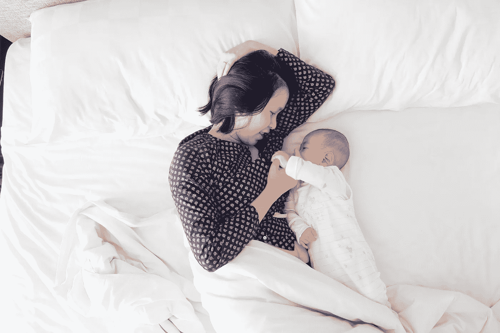

# 产后妇女教会了我尊重身体

> 原文：<https://medium.com/swlh/postpartum-women-taught-me-body-respect-7b231468db96>

Photo by K[evin Liang](https://unsplash.com/photos/xBLv_ddXr8k?utm_source=unsplash&utm_medium=referral&utm_content=creditCopyText) on [Unsplash](https://unsplash.com/search/photos/breastfeeding?utm_source=unsplash&utm_medium=referral&utm_content=creditCopyText)

我从来没有过孩子。我 27 岁了，从我还是个小女孩的时候，每个人都知道我不是那种有母性的类型。“一旦你变老，事情就会改变，”他们总是说；但是母性本能还没有发挥作用，所以我怀疑它是否会发生。从我记事起，我就有一个身体问题。我还记得第一次觉得自己有问题的时候。我在幼儿园的班级里。我…