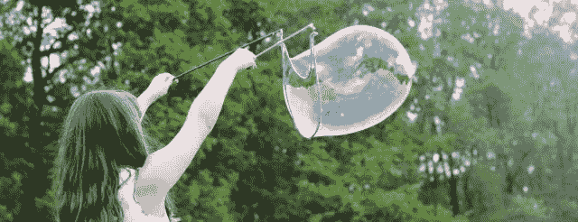
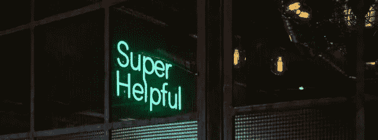
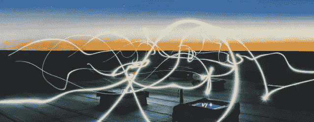

# 创意人员工作时使用的强大而高效的词汇

> 原文：<https://medium.com/swlh/powerful-and-productive-words-for-creatives-to-work-by-d2a78959524>

## 美好一天的三个词食谱

Photo by [Brooke Cagle](https://unsplash.com/photos/g1Kr4Ozfoac?utm_source=unsplash&utm_medium=referral&utm_content=creditCopyText) on [Unsplash](https://unsplash.com/search/photos/work?utm_source=unsplash&utm_medium=referral&utm_content=creditCopyText)

单词主题。你可能见过这种现象。

在这一年的开始，你选择一个词来激励和体现你对未来几个月的期望。

*希望。光。进步。乔伊。实力。和平。爱情。*

这是一个很好的想法，我尝试过，但成功有限。随着一年时光的飞逝，我忘记了我的承诺和美好的愿望。

今年，作为一名编辑和作家，我为自己的工作生涯想到了一个三个字的主题——三个 c。

这三人组已经在我的脑海中扎根，当我感到失落或不安时，我会召唤他们来指引我。我可以回到他们身边，让自己踏实下来，提醒自己为什么要做这项工作，并告诉我前进的方向。

在每个星期的开始，我会在我的计划的顶部写下这三个字。

Photo by [Maxime Bhm](https://unsplash.com/photos/6cQHvjzmZOU?utm_source=unsplash&utm_medium=referral&utm_content=creditCopyText) on [Unsplash](https://unsplash.com/search/photos/create?utm_source=unsplash&utm_medium=referral&utm_content=creditCopyText)

> “想象是创造的开始。你想象你所渴望的，你将实现你所想象的，最后你将创造你所希望的。”——乔治·萧伯纳

# **1。创建**

临近的截止日期。几天的待办事项？外部和内部期望。当压力越来越大时，我会忘记自己有多爱这个创作过程。

我正在创造一些东西——有时是从无到有。

它很脏，但也很有趣，我很幸运有一份需要我的创造力和挑战我的大脑和能力的工作。所以我回到这个词来激发我的想象力，并提醒自己无论结果如何都要享受成为一名创造者的乐趣。

当我这样做的时候，我的大脑也从压力循环中解放出来，我可以做得更好。

Photo by [Jonas Jacobsson](https://unsplash.com/photos/MLSS52p0ze4?utm_source=unsplash&utm_medium=referral&utm_content=creditCopyText) on [Unsplash](https://unsplash.com/search/photos/help?utm_source=unsplash&utm_medium=referral&utm_content=creditCopyText)

> "你的真正价值取决于你付出的价值比你得到的回报多多少。"——鲍勃·伯格，“积极进取者”

# **2。投稿**

在办公室环境中，我与才华横溢的同事一起在创意团队中工作。每一天，我都告诉自己我是来做贡献的，这意味着它不总是需要成为我的想法，甚至是我的项目。

我能帮什么忙？我能为你做些什么？在会议中，我的一个想法或主意有助于讨论吗？

作为一名编辑和作家，我还想为我的读者和客户提供价值。这意味着确定某样东西是否对作品、项目、过程和人有贡献？如果没有，我应该把它编辑出来，或者想出一个让它有价值的方法。

当我从事我自己的激情项目时，一个关于让家务变得更有趣的古怪的生产力博客，我要求自己贡献有益的想法和灵感。

我在那里不是为了炫耀或自娱自乐，尽管我可能对两者都感到内疚。我想创造一些内容，为他人提供一些东西，并帮助他们以愉快和可行的方式改善他们的生活。

Photo by [Federico Beccari](https://unsplash.com/photos/ahi73ZN5P0Y?utm_source=unsplash&utm_medium=referral&utm_content=creditCopyText) on [Unsplash](https://unsplash.com/search/photos/connection?utm_source=unsplash&utm_medium=referral&utm_content=creditCopyText)

> “最终一切都联系在一起——人、想法、物品。连接的质量是质量本身的关键。”—查尔斯·伊姆斯

# **3。连接**

多亏了我最亲近的人之一，我找到了这个词。

我的儿子在一家顶级科技公司工作，他鼓励我做一个核心价值观练习，因为我们对个人发展有着共同的兴趣。在本练习中，您将从一个包含 220 多个值的列表开始，然后将范围缩小到前三个值。

不容易。一点都不容易。

最终，*联系*——一个我根本不知道的词——与*创意*和*激情*一起进入了前三名。我游说我的儿子允许我拥有五种核心价值观，这样我也能获得诚实和真实。他说他知道这很难…但是，“那是欺骗，妈妈。”

然而，我的那些本质部分，至少是我最想成为的人，怎么会不在我的候选名单上呢？然后，我意识到为什么诚实和真实对我如此重要——因为我如此重视与他人的联系。我想出了一个也能涵盖这些的词。(耶！我没有作弊就赢得了比赛。)

在我的工作生活中,“联系”有很多层含义。我想与我的同事和客户沟通——把他们当作人来关心，让他们的日子过得更好。作为一名作家和编辑，我希望我的作品与他人联系在一起，并以积极的方式影响他们。

回到创造的快乐，我想以解决问题或带来快乐的方式，与想法、文字和图像建立联系。我相信这些连接能量的火花是创造性思维和生活的核心。它们对我来说是纯粹的魔法。

创造。投稿。连接。我的朋友们，今天是个好日子。

## 这篇文章发表在 [The Startup](https://medium.com/swlh) 上，这是 Medium 最大的创业刊物，拥有+443，678 名读者。

## 在此订阅接收[我们的头条新闻](https://growthsupply.com/the-startup-newsletter/)。

