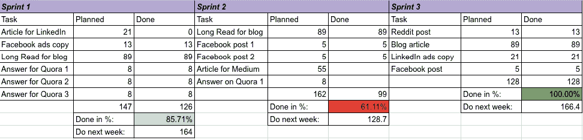
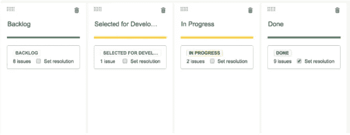
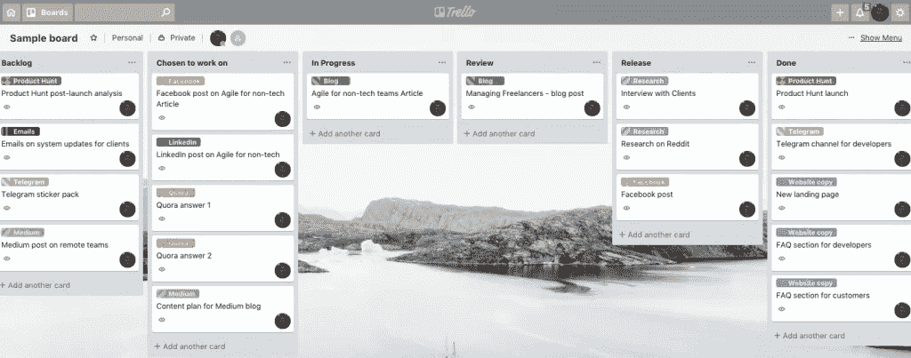
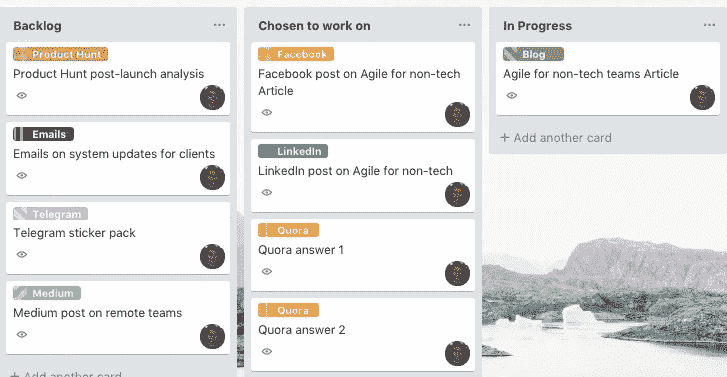
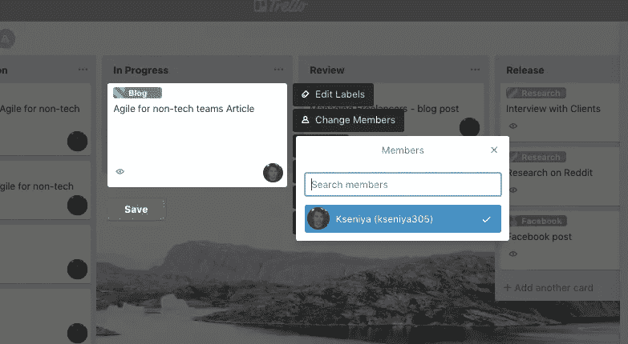
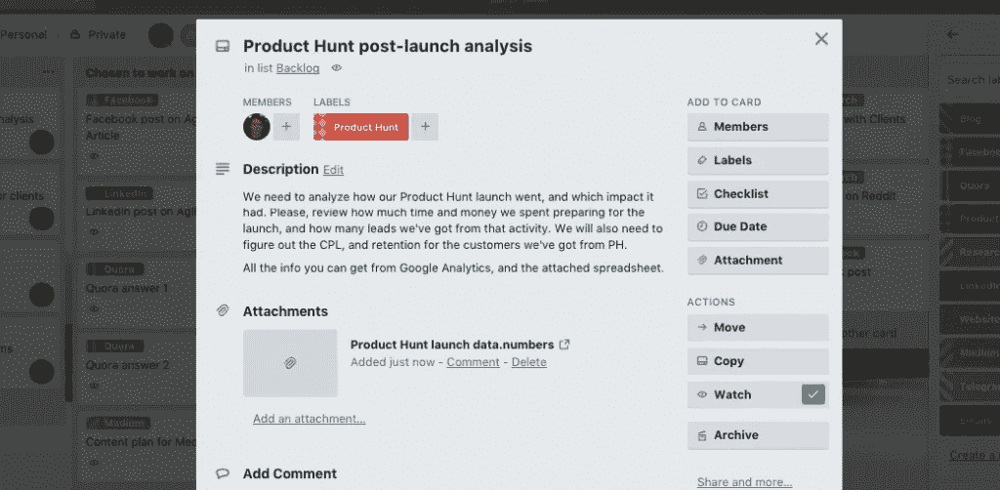

# 与创业公司的非技术团队一起实践敏捷——值得吗？

> 原文：<https://medium.com/swlh/practicing-agile-with-non-tech-teams-of-a-startup-is-it-worth-it-496377aca4f>

# 什么是敏捷？

现在是 1986 年。复古未来主义的 80 年代正处于全盛时期。美国和苏联陷入了太空竞赛，青少年爱上了马蒂·小飞侠和医生的德罗宁，切尔诺贝利爆发了灾难性的核灾难，奥普拉首次在全国播出。所有这些事件都对我们和我们的文化产生了巨大的影响。

但还有一件重要的事，当时没人注意到。这改变了 90%的技术团队管理工作流程的方式，并提高了工作效率。全能的 SCRUM 诞生了。

首先由 Hirotaka Takeuchi 和 Inkujiro Nonaka 在他们的 HBR 文章 [*中介绍了新的新产品开发游戏*](https://hbr.org/1986/01/the-new-new-product-development-game) *，* Scrum 后来被 Jeff Sutherland 大量接受和影响，Jeff Sutherland 可能在普及和教育大众敏捷方法方面做得最多。

Jeff 的书 [SCRUM:用一半的时间做两倍的工作的艺术](https://www.amazon.com/Scrum-Doing-Twice-Work-Half/dp/038534645X)成为任何试图让他们的团队进入敏捷程序的人的手册。我们忍不住强烈推荐它开始。

但是敏捷方法只对开发人员有效吗？或者，你能为你的非技术团队充分利用这些管理技术吗？

我不会抓住阴谋不放:敏捷是管理营销、运营和销售团队的黄金。我们已经通过自己的经历证明了这一点，并决定为了那些还没有跳上 m *agial* 列车的人而写下这篇文章。

# SCRUM 入门

在[编码忍者](http://codingninjas.co/)我们一直和开发者打交道。毕竟，我们是一个招聘经过审查的开发人员的市场！因此，自然地，为了找到管理工作流程和改善客户体验的最佳方式，我们学习了敏捷。

起初，我们开始遵循与开发和管理自由职业者项目相关的一切的框架。在那之后不久，我们看到了我们不能忽视的好处。

作为一家初创公司，我们不能不尝试让我们团队的其他人得到同样的结果。

进入任何新的常规都是相当困难的。尤其是当你需要学习很多你以前从未听说过的东西的时候。有了 Scrum，事情会变得更加复杂和混乱，因为你必须决定哪些事情是你应该关心的，哪些是与你的营销团队无关的。

犯了错误之后，我们决定分享我们的清单，这是你在组建营销 Scrum 团队时需要知道的关于敏捷的 8 件事。这是对我们最有效的 8 件事，也是我们唯一决定继续做的事。我们已经尝试了一些更高级的技术，但结果是它们只会让框架更复杂，而且没有任何额外的优势。

# 非技术 SCRUM 团队的 8 个步骤

# 1.短距离赛跑

Sprints 是在一系列任务上工作的短期迭代，持续相同的特定时间。

在我们的例子中，每次冲刺持续一周。对于大多数非技术团队来说，一周是短跑的最佳时期，尽管有些人更喜欢长达一个月的时间。我们想坚持一周短跑，因为我们觉得这有助于提高效率。但是请随意尝试，选择适合你的。

另一个建议是从周二开始冲刺。这样，你仍然有一周中压力最大的一天，也就是周一，来整理你上周一直在做的事情，为每周的计划做准备。

# 2.冲刺规划

当计划下一次冲刺时，永远记住只包括那些可以在一周内完成的任务，不管你的冲刺有多长。

如果你需要做一些需要更多时间的大项目，把它分成小块。

总是包括比你觉得自己身体能完成的更多的任务。这个策略不仅会帮助你变得更有效率，还会让你的计划更有意义。

最佳实践是计划比上周完成的任务多 30%的任务。为了记录我们在 sprint 中完成了多少，我们使用故事点。

# 3.故事要点

故事点用于任务评估。这是一种直观的方法，可以根据任务的难度和耗时程度对任务进行评级。

敏捷团队中有许多不同的评估技术，但是我们决定坚持使用的是故事点系统，它复制了斐波那契数列:

> 1 2 3 5 8 13 21 34 55 89

这个序列通常用来代替线性 1 到 10，因为它使人脑更容易进行估计。

有些任务从第一次开始就很难正确估计，你会发现自己在调整最初的猜测。没关系！因为毕竟大多数人的任务通常都是重复的，所以渐渐地你会用一些标准的故事点来设置它们。比如，在我的情况下，我写的任何长篇阅读得 89 分，我写的任何 Quora 回答得 8 分。

在我们的团队中，有一件事我们从来不做，那就是在员工或整个部门之间比较故事情节。重要的是要明白，Scrum 和敏捷方法不是用来在任何奇怪的生产率竞赛中选择赢家的，在这个问题上，你唯一应该与之竞争的人是你自己。

Scrum 的要点是充分发挥你的生产力潜力。只要你觉得还有成长的空间，我强烈建议你记录你的故事点。

最初几周，我把我的工作放在一个基本的谷歌表单中，直到我觉得可以说我们已经优化了工作流程，以至于我无法在 sprint 中完成更多的任务。我建议你也这样做。这是我的桌子的样子:

正如我之前提到的，最好计划比你之前实际完成的多 30%的任务。

以下是判断你的计划有多好的方法:

**<**-70%—超额计划或非生产周

**70–100%**——刚刚好！

**100%**——几乎总是糟糕计划的标志

# 4.验收准则

只能为 100%完成的任务分配故事点。

但是你怎么知道任务完成了呢？当你接到为新邮件模板写文本的任务时，有一件事是不言自明的:验收标准是书面文本。

但是如果你做一个项目，比如创建一个新的登陆页面，会怎么样呢？它是在你准备好了文案和设计之后完成的，还是你需要确保它已经发布并准备好投入下一个营销活动？这时*验收标准*开始发挥作用！

# 5.回顾的

Sprints 回顾，在我们的例子中，基本上意味着营销团队和创始人之间每周举行一次会议，我们在会上讨论在最后一次 sprint 中已经做了什么。

如果我们觉得我们可以做得更好，我们会努力找出到底发生了什么，让我们无法展示全部的荣耀，以及如何修复它。

这种会议的主要目的是找出是什么阻碍了我们的进步，并消除这个因素。一旦我们这样做了，重要的是要看看这种淘汰的结果是否如我们所料。

回顾的最佳时间是在计划之前，因为讨论实际上可能会影响计划本身。

# 6.看板法

看板可以保护你的团队免于精神崩溃和过载。

这是一个工具，允许可视化您的团队的工作流程，并设置安全开关。下面是经典的最低要求看板的样子:

但是我们发现它们不太方便，所以我们根据现有的工作流程定制了色谱柱:

待办事项**—*所有你想在未来努力的想法和事情的地方。你不必过滤或优先处理这张单子上的卡片。Backlog 应该在每个 sprint 计划之前修改，我们可以在这个 sprint 的待办事项列表中抓取任何我们认为属于你的任务。*

**选择进行**——*你在冲刺阶段想要进行的一切都属于这里。一个很好的建议是与任何可能需要你帮助的团队核实一下。这将允许你摆脱任何在敏捷中应该避免的意外任务。*

**进行中的**—**进行中的*列表中每人不能同时包含两个以上的任务。这样做是为了确保你的同事能够专注于一件事，而不是从一个任务跳到另一个任务。这是确保[制造商进度](http://www.paulgraham.com/makersschedule.html)的安全开关。*

**回顾* *—* 所有已经在制造商一方完成但正在等待其他人的任何反应或批准的任务列表。*

**发布* *—* 当前冲刺阶段完成的所有任务。我们将它们与其他任务分开，因为这样更容易回顾和计算故事点。*

**完成* *—* 所有在过去的 sprint 中 100%完成的任务。*

# *7.每日站立*

*每日站立是与整个团队同步的机会。因为我们有一个分散的团队，我们从日常视频通话开始。但我们很快注意到，这些花费了太多的时间，需要一些团队成员打破常规，破坏了我们灵活安排的整个想法。*

*因此，我们转而在一个专用的 Slack 频道上写每日更新。*

*每个人每天都要发布三件至关重要的事情:*

1.  *你昨天完成了什么任务*
2.  *你今天要做什么*
3.  *你在完成任何任务的道路上有什么障碍，团队如何帮助你*

# *8.管理工具*

*有大量的管理工具支持 Scrum、看板和敏捷团队的其他需求。我们在之前关于如何管理远程团队的文章中已经提到了其中的一些。*

*我们通过实验发现，虽然大多数技术团队更喜欢使用 [Atlassian 的吉拉](https://www.atlassian.com/software/jira)进行敏捷任务管理，但结果证明这对我们小型的非技术团队来说太复杂了，他们更喜欢免费版的 [Trello](https://trello.com/) 和敏捷工具扩展。*

*但是不管你决定坚持使用哪种管理工具，这里有几个小贴士可以让你的团队协作更加有效:*

## *清除任务命名*

*尽量选择简短但不言自明的任务名称。*

**

## *选择标签*

*标签使任务的导航和优先级排序变得更容易，特别是如果你的看板是一个团队板。*

**

## *指定执行者*

*你需要知道谁负责这个项目。也有助于区分个人工作量。*

**

## *描述任务*

*如果您正在为其他人分配任务，请添加任务描述，明确说明需要完成的任务。附上你的队友完成任务可能需要的任何文件或链接。*

**

## *请求审查*

*任何时候，当你完成了任务，但仍然需要别人检查它或对它做任何其他事情，在你可以完成它之前，在任务的评论中请求他们检查。在评论中标记它们，添加具体的行动号召，并提供所有需要的材料。*

**

# *结论*

*实施敏捷、Scrum 和看板的元素对于每个团队来说都是很好的第一步，不管他们在做什么。*

*这些技术有助于可视化工作流程，更好地跟踪个人和团队的效率，在需要时提供反馈，并改变让您慢下来的错误流程。如果您需要一个旨在帮助您的企业快速发展的系统，请尝试一下。*

*从一个已经在我们的日常工作中实施了敏捷团队管理元素的非技术团队的角度来看，我们最大的建议是研究基础，试验并提出适合您特定需求的框架，而不是强调试图遵循不适用的指南。*

> *这篇关于营销团队中的[敏捷实践的文章是由 k senia Larina——coding ninjas 的内容主管撰写的。最初发布于](https://codingninjas.co/blog/agile-for-non-tech-teams-8-things-you-need-to-know/) [CodingNinjas 博客](https://codingninjas.co/blog/)。*

**

## *这篇文章发表在[《创业](https://medium.com/swlh)》上，这是 Medium 最大的创业刊物，有+418，678 人关注。*

## *在这里订阅接收[我们的头条新闻](http://growthsupply.com/the-startup-newsletter/)。*

**