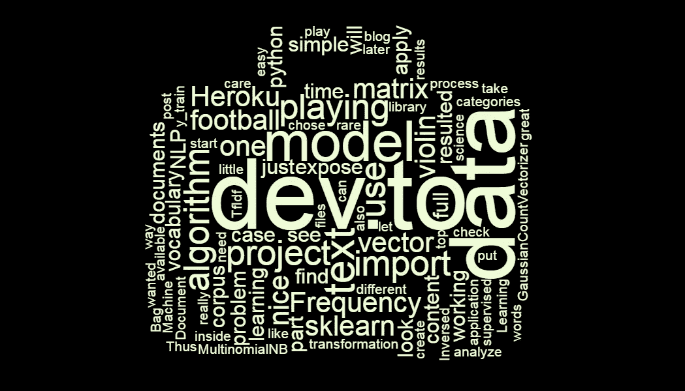
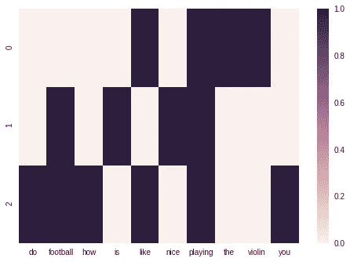
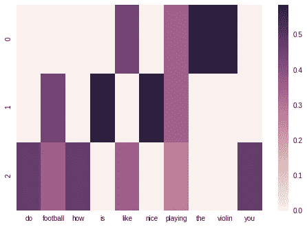

# 预测开发到职位的类别

> 原文：<https://medium.com/swlh/predicting-categories-of-dev-to-posts-a681b3996cbf>



以下是我为自己选择的完整小型端到端数据科学项目的简短描述。我一直想玩文本数据，所以我选择创建自己的语料库。我稍后将使用它在其上应用一些机器学习。看看我如何预测一些博客文章的类别。

# 目标

最近我学习了机器学习(ML)。有很多可能的应用领域:分析视频、图像、语音和文本。最后一个似乎最吸引我。在线内容每天都在增长。我们要读的东西太多了。自然语言处理(NLP)是数据科学对这个问题的回应。我这个小项目的内容来自一个很棒的开发者社区博客: **dev.to** 。为了显示基本的 ML，我将根据 *dev.to* post 内容猜测标签。因此，我将运行监督学习。简而言之:我正在粘贴一个帖子的内容，它应该会告诉我这是关于“java”还是“python”。我作品的效果是一个 web app，在这里随意摆弄[。为了简单起见，我只使用了 4 个主要类别。看看这个生活演示 GIF:](http://guess.lukaszkuczynski.usermd.net/)


# 文集

什么是*文集*？在 NLP 世界中，它是一组文档。我们稍后将分析这些文档。做任何一个 ML 项目，你都必须从一些要分析的东西开始。用一些数据。在自然语言处理中，你必须得到一些文本。从一些互联网门户网站上抓取它们并不是强制性的。你可以从内置语料库开始，因为它们是这里描述的`nltk`库[的一部分](https://www.nltk.org/book/ch02.html)。在我的例子中，我想使用`dev.to`数据，所以我将使用他们公开的 API。我将创建自己的语料库。数据采集的过程是我的 GitHub 项目的一部分。用 Python 做这件事太简单了，我可以使用很棒的库，比如`BeautifulSoap`和`requests`。

# 弓

*BoW* 首字母缩写代表*单词包*。这是一个简单的*矢量化*文本的方法。它的名字来源于这样一个想法:有一个袋子可以放所有的单词。我们不关心它们是如何排序的。我们只需要将我们的文本矢量化。这是在对文本应用任何 ML 算法之前的先决条件。那么这个向量对于一个简单的句子来说是什么样的呢？把`CountVectorizer`作为 Scikit 学习库的一部分，让我们看看它是如何把文本转换成矢量的。

结果将是:

```
vocabulary is: [('do', 0), ('football', 1), ('how', 2), ('is', 3), ('like', 4), ('nice', 5), ('playing', 6), ('the', 7), ('violin', 8), ('you', 9)] 
matrix resulted is: [[0 0 0 0 1 0 1 1 1 0] [0 1 0 1 0 1 1 0 0 0] [1 1 1 0 1 0 1 0 0 1]]
```

让我们看看当我们把它想象成热图时是什么样子:



由于我们将很快生产一个模型，我们希望它质量好。我们将执行一个 *Tf-Idf* (术语频率—逆文档频率)转换。这意味着我们要考虑这个词在文档中出现的频率(TF)和在其他文档中出现的频率(IDF)。在`sklearn`中应用这种变换会产生一个与我们之前看到的略有不同的矩阵:

```
vocabulary is: [('do', 0), ('football', 1), ('how', 2), ('is', 3), ('like', 4), ('nice', 5), ('playing', 6), ('the', 7), ('violin', 8), ('you', 9)] 
TfIdf matrix resulted is: [[0\. 0\. 0\. 0\. 0.44451431 0\. 0.34520502 0.5844829 0.5844829 0\. ] [0\. 0.44451431 0\. 0.5844829 0\. 0.5844829 0.34520502 0\. 0\. 0\. ] [0.4711101 0.35829137 0.4711101 0\. 0.35829137 0\. 0.27824521 0\. 0\. 0.4711101 ]]
```

和视觉化



输出矩阵现在有点不同了。这是因为我们关心术语在整个数据集中出现的频率。在我们这里， *TfIdf* 推崇稀有的如*小提琴*，贬低流行的如*演奏*。

# 机器学习

准备好向量后，我们可以在此基础上应用数学。在监督学习中，我们必须找到一个将输入向量 X 与标签 y 相匹配的函数。有了我们处理的数据的结构和种类，就需要应用正确的算法，而不仅仅是随机算法。如果你正面临这个问题，找到这个`[sklearn](http://scikit-learn.org/stable/tutorial/machine_learning_map/index.html)` [备忘单](http://scikit-learn.org/stable/tutorial/machine_learning_map/index.html)。在我的例子中，我正在对文本数据进行分类。我发现许多有经验的数据科学家倾向于使用朴素贝叶斯。经过几次尝试，我发现它也很有用。你可以在这里查看我的笔记本。记住，对于文本数据，我们使用多项式而不是高斯算法。这是模型训练过程中的一个片段。

请在我的报告中找到[完整的代码库。](https://github.com/lukaszkuczynski/guess)

# 部署

一旦你的模型准备好了，就可以和别人分享了！用 Azure 或者 AWS 都可以。他们通常有现成的 Docker 容器，你只需要把你的模型放在里面，他们神奇地把它公开为一个 REST 服务。然而，当我第一次展示一些模型时，我希望一切都在掌控之中。这就是为什么我决定自己在 web 应用程序中构建我的模型。这就像将构建块序列化为文件，然后将这些文件上传到服务器一样简单。你可以去那里查看[我的 app 部署](http://guess.lukaszkuczynski.usermd.net/)。

# 经验教训

我认为这个项目并不完美。我测量了模型的准确性，它在 80%左右。为了获得更好的结果，我们可以:

*   使用另一种算法，即集成算法，或调整现有算法
*   拥有比数百个条目更多的数据(更多的数据总是意味着:更好)
*   更好地清理数据

我很高兴看到用`sklearn`处理数据是多么美好的体验。Python 提供了必备的 ML 工具带。我也尝到了 ML 问题的全栈。我收集、分析、拟合模型，并最终部署它。

*原载于 2019 年 2 月 18 日*[*lukaszkuczynski . github . io*](https://lukaszkuczynski.github.io/BoW_devto/)*。*

[](https://medium.com/swlh)

## 这篇文章发表在 [The Startup](https://medium.com/swlh) 上，这是 Medium 最大的创业刊物，拥有+429，678 读者。

## 在此订阅接收[我们的头条新闻](https://growthsupply.com/the-startup-newsletter/)。

[](https://medium.com/swlh)