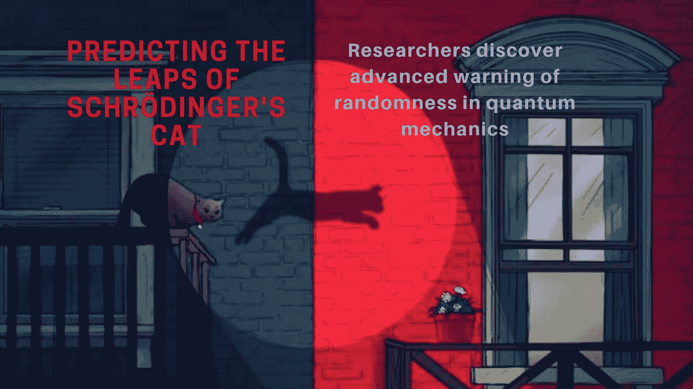

# 预测薛定谔的猫的跳跃

> 原文：<https://medium.com/swlh/predicting-the-leaps-of-schr%C3%B6dingers-cat-advanced-warning-of-randomness-in-quantum-mechanics-c8071ca3a662>

Credit: Kat Stockton

## 研究人员已经解开了量子力学的一个关键谜团——预测系统状态的突然“跳跃”。从而设计出一种方法来最终拯救科学史上最著名的猫。