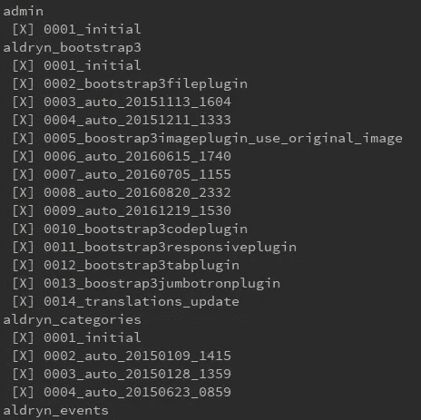
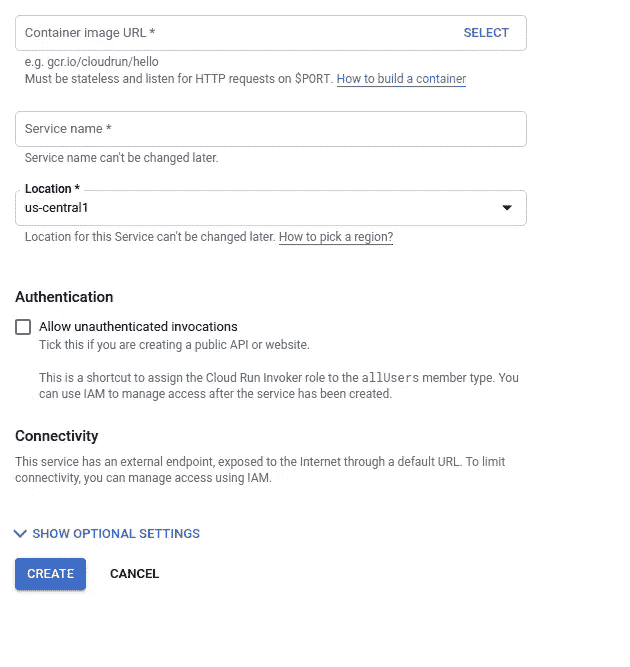

# 为 Google Cloud Run 准备 Django 应用程序

> 原文：<https://medium.com/swlh/preparing-your-django-application-for-google-cloud-run-7c8cb7b7464b>

最近谷歌在他们的云平台上发布了一款名为 [Cloud Run](https://cloud.google.com/run/) 的新产品。该产品有可能减少开发人员的工作量和早期开发实验成本，因为它弥合了无服务器云功能和 kubernetes 引擎之间的差距:无服务器为您带来了在云上运行简单工作负载的按使用付费，而 Kubernetes 为您带来了运行自定义映像的协调工作负载。Cloud Run 为您提供了两全其美的优势:在一个可扩展至零的系统上运行您的定制 Docker 映像和所有内置库:不再有设置基础架构的麻烦，也不再需要为闲置的虚拟机付费。

你只需要满足几个条件:

1.  您的应用程序必须响应 HTTP 调用。
2.  你的应用程序必须是完全无状态的。与 kubernetes 引擎不同，您不能将卷附加到您的工作负载。所有持久的、非静态的数据都必须在容器之外。
3.  显然，你的应用程序必须是集装箱化的。
4.  您的容器应该侦听 Cloud Run 可以在启动时定义的端口上的流量。因此，当启动容器内的 web 服务器时，确保它监听由`PORT`环境变量定义的端口。

一个非常好的用例是个人主页。它们基本上是网络上的名片，不需要存在，除非有人在看它们。

在下面的例子中，我们将使用 Django-CMS 和 Postgres 数据库创建个人主页，并对其进行修改，使其在云上运行，数据库托管在云 SQL 上，所有媒体和静态图像托管在 GCP 存储桶上。这些说明假设您熟悉云 SQL，因此我们不会详细介绍最基本的步骤，尽管我会介绍一些以前让我犯过错误的问题。

# 当它和歌剧相遇


Photo by [Manuel Nägeli](https://unsplash.com/@gwundrig?utm_source=medium&utm_medium=referral) on [Unsplash](https://unsplash.com?utm_source=medium&utm_medium=referral)

我自学 Django 的方法之一是用 Django-CMS 为我的朋友制作主页。起初，由于我对服务器和 nginx 一无所知，我在 [Djangoeurope](https://djangoeurope.com/) 上建立了网站:这是一个非常好的 Django 托管网站，有敬业和乐于助人的员工，价格也非常友好。

1.5 年前，当我的歌剧歌手朋友 [Kristian Lindroos](http://kristianlindroos.fi/en/biography/) 需要一个主页时，我决定利用这个机会再次学习一些新东西:nginx 和 AWS 上的主机。不幸的是，在我意识到这一点之前，我在 AWS 上的试用期结束了，我不得不为 T2.micro 实例买单。


Kristian preparing for a performance, photo by Markku Pihlaja.

当谷歌宣布 Cloud Run 时，我意识到这将是托管网站的最佳地点:我总是在 GCP 上运行一个 Cloud SQL 实例，用于个人项目，这样我就可以把 Postgres 数据库放在那里，其他一切都在 Cloud Run 上运行。

为了让我们的应用程序在云上运行，我们需要完成以下步骤。

1.  通过从启动脚本中删除所有耗时的任务来减少启动时间。
2.  从本地数据库切换到云 SQL。
3.  让云运行服务于应用。
4.  从磁盘存储切换到存储桶。
5.  让云运行服务于正确域下的应用。

# 减少启动时间

Django 应用程序的一个非常常见的惯例是将所有东西都塞进启动脚本:首先运行迁移，然后运行 collectstatic，然后启动应用服务器。事实上，我的 **run.sh** 启动文件看起来是这样的:

```
**#!/bin/bash** *python* manage.py migrate

*python* manage.py collectstatic

# Start the server
*/usr/local/bin/gunicorn* kristian.wsgi:application -w 2 -b :$PORT
```

如果您使用的是 VM，并且您的应用程序一直处于运行状态，那么这种方法是可行的。有了云运行，您的应用程序每次在一段时间内没有收到流量时都会从头开始运行，并且您不希望您的用户等待迁移和收集静态文件。特别是当我们切换到使用 bucket 作为存储后端时，复制单个文件会慢得令人痛苦:即使是运行**python manage . py collect static**的这个简单的 Django-CMS 应用程序也要花费 2 分多钟！我们将注释掉这两行，因此我们的启动脚本如下所示:

```
**#!/bin/bash** *# python* manage.py migrate

*# python* manage.py collectstatic

# Start the server
*/usr/local/bin/gunicorn* kristian.wsgi:application -w 2 -b :$PORT
```

# 从本地数据库切换到云 SQL

## 创建云 SQL 实例并激活云 SQL 代理

首先，我们需要创建一个云 SQL 实例。简单明了的说明可以在官方文档页面[这里](https://cloud.google.com/sql/docs/postgres/quickstart)找到。
**Pro 提示:**在撰写本文时，Cloud Run 仅在 **us-central1** 地区可用，因此请将您的数据库实例放在那里。一开始我没有，后来证明是个错误。稍后会详细介绍。

接下来，我们需要在您的云 SQL 实例上创建一个新用户。为了简单起见，我们可以使用与原始设置相同的用户名和密码，一旦一切正常，我们就可以更改它们。

之后，我们需要让云 SQL 代理从我们的本地设置(最终是云运行)连接到数据库。我们需要执行以下步骤中的[:](https://cloud.google.com/sql/docs/postgres/quickstart-proxy-test)

1.  启用云 SQL API 以启用远程连接。
2.  创建一个服务帐户，并授予其云 SQL 客户端权限。
3.  下载服务账户凭证文件，姑且称之为 **db-proxy.json** 。
4.  下载代理。
5.  使代理可执行。
6.  使用正确的实例连接名称和正确的端口号启动代理。

实例连接名称可以在实例的 overview 选项卡上找到，并且将始终采用以下形式

```
PROJECT_ID:REGION:INSTANCE_NAME
```

至于端口，我们可以使用任何可用的东西。我已经有 Postgres 在本地运行，所以 **5432** 已经被占用，但 **6543** 工作正常。运行代理的命令如下所示:

```
./cloud_sql_proxy -instances=<PROJECT_ID:REGION:INSTANCE_NAME>=tcp:6543 -credentials=/path/to/credentials/db-proxy.json
```

让我们运行该命令，然后进入下一部分。

## 创建和填充数据库

接下来，我们需要在云 SQL 上创建一个新的数据库。不幸的是，我们不能为此使用 Cloud SQL Google Cloud Console，因为数据库所有权将自动分配给 **postgres** ，这将弄乱 Django 所需的所有表和序列权限。相反，我们可以使用我们的 open Cloud SQL 代理连接来连接到我们的数据库实例并创建新的数据库。

运行以下命令，并在系统提示时输入 postgres 密码:

```
psql -U postgres -h 127.0.0.1 -p 6543 -d postgres
```

接下来，将之前创建的用户授予 postgres 并创建数据库

```
-- necessary so postgres has permission to set your user as owner.
GRANT <USERNAME> TO postgres;CREATE DATABASE <DATABASE_NAME> OWNER <USERNAME>;
```

完成了。你猜怎么着？现在我们准备运行我们的第一个测试！我让所有东西都在本地运行，并且它连接到本地 postgres 服务器上的一个测试数据库。现在我只需要在我的**设置中将端口号从 5432 更改为 6543。py**和 Django 应该可以连接到新的数据库。

测试的一个好方法是运行**python manage . py show migrations**。事实上，因为数据库是空的，所以我看到了大量尚未运行的迁移:


下一步是将我们的数据库复制到云 SQL。我已经使用 **pg_dump** 转储了数据库，所以现在我可以使用仍然打开的代理连接来恢复数据库。因为我们使用重定向来填充数据库，所以不能让 psql 提示我们输入密码。我们可以通过在命令开始时将密码设置为环境变量来解决这个问题:

```
PGPASSWORD=<PASSWORD> psql -U <USERNAME> -h 127.0.0.1 -p 6543 -d <DATABASE_NAME> < dump.sql
```

运行**python manage . py show migrations**让我们看到导入成功了！



# 让云运行服务于应用

我坚信定期测试。也就是说，每当从事一个项目并准备好一个阶段时，看到您的应用程序在该阶段的限制内工作得如何总是好的。例如，现在如果我们在 Cloud Run 上运行我们的应用程序，我们应该能够在某种程度上中断的状态下启动它:应用程序应该工作，HTML 应该存在，静态文件也应该存在，但是我们会丢失所有的媒体文件，并且应该不可能上传任何新的媒体文件。

为了能够测试这一点，我们需要执行以下操作:

1.  在项目中启用云运行。
2.  将云 SQL 代理嵌入到我们的应用程序中。
3.  授予云运行服务访问数据库实例的权限。
4.  构建 docker 图像，并将其上传到我们项目的 Google 容器库中。
5.  创建使用我们映像的云运行服务。

第一步很简单。在云控制台中，找到“云运行”选项卡，然后单击“尝试云运行”。

在第二步中，我们需要让 Dockerfile 执行我们在本地运行应用程序时执行的相同步骤:下载云 SQL 代理并将其转换为可执行文件。为此，我们将修改 docker 文件。修改之前，docker 文件如下所示:

```
FROM python:3.6.4

RUN apt-get install bash
RUN mkdir -p /usr/src/app
WORKDIR /usr/src/app
COPY requirements.txt /usr/src/app/
RUN pip install --no-cache-dir -r requirements.txt

RUN ln -sf /dev/stdout /var/log/access.log && \
    ln -sf /dev/stderr /var/log/error.log

ADD . /usr/src/app
CMD ["./run.sh"]
```

现在我们只需添加两行，工作就完成了。

```
FROM python:3.6.4

RUN apt-get install bash
RUN mkdir -p /usr/src/app
WORKDIR /usr/src/app
COPY requirements.txt /usr/src/app/
RUN pip install --no-cache-dir -r requirements.txt

# download the cloudsql proxy
RUN wget https://dl.google.com/cloudsql/cloud_sql_proxy.linux.amd64 -O /usr/src/app/cloud_sql_proxy# make cloudsql proxy executable
RUN chmod +x /usr/src/app/cloud_sql_proxy

RUN ln -sf /dev/stdout /var/log/access.log && \
    ln -sf /dev/stderr /var/log/error.log

ADD . /usr/src/app
CMD ["./run.sh"]
```

有几个选项可以完成第三步，为云运行提供足够的权限:

1.  将之前下载的 **db-proxy.json** 放入容器中，将云 SQL 代理作为一个单独的进程运行，使用代理命令中定义的端口进行连接(这种方法的功劳归于 [**彼得·马利纳**](/@petomalina) 和[这篇中帖](/@petomalina/connecting-to-cloud-sql-from-cloud-run-dcff2e20152a))。
2.  授予云运行服务帐户**云 SQL 客户端**权限，作为单独的进程运行云 SQL 代理，使用代理命令中定义的端口进行连接。
3.  即将推出的一项功能将为 Cloud Run 带来直接的云 SQL 支持。这将允许直接连接到代理的 unix 套接字，该代理可能会在您的容器之外运行，这将进一步缩短您的冷启动时间。**更新**:这个功能刚刚进入测试版，如何使用的说明可以在[这里](https://cloud.google.com/run/docs/configuring/connect-cloudsql)找到。

就我个人而言，我更喜欢第一个选项，尤其是现在我是云运行的新手。如果我们将凭证放在容器中，我们应该能够在 Cloud Run 上运行容器之前从本地设置中运行容器。这样，我们可以在部署到云运行之前立即发现任何配置错误，而不是部署它，看到应用程序失败，然后试图找出原因是云运行还是我们的配置。在对云运行更加熟悉之后，我会选择第二个选项，一旦第三个选项可用，我肯定会选择第三个选项。

但首先要做的是。让我们在我们的应用程序根目录中创建一个名为 secrets 的文件夹，并将 **db-proxy.json** 文件添加到其中。然后，让我们打开之前编辑的 **run.sh** 文件，并添加启动代理的命令。

```
**#!/bin/bash** *# python* manage.py migrate*# python* manage.py collectstatic*./cloud_sql_proxy* -instances=<PROJECT_ID:REGION:INSTANCE_NAME>=tcp:6543 -credential_file=secrets/db-proxy-central.json &# wait for the proxy to spin up
*sleep* 1# Start the server
*/usr/local/bin/gunicorn* kristian.wsgi:application -w 2 -b :$PORT
```

在第四步中，我们只需要导航到包含 docker 文件的目录，并运行构建和推送命令:

```
docker build -t gcr.io/<YOUR_PROJECT_ID>/<YOUR_IMAGE_NAME>:latest -f Dockerfile .
docker push gcr.io/<YOUR_PROJECT_ID>/<YOUR_IMAGE_NAME>:latest
```

但是等一下！既然我们已经将代理和凭证添加到了我们的共同容器中，我们可以在尝试部署之前进行本地测试。一旦构建操作完成，我们就可以用

```
docker run -e “PORT=8888” -p 8888:8888 gcr.io/<YOUR_PROJECT_ID>/<YOUR_IMAGE_NAME>:latest
```

注意，我们将 PORT 环境变量传递给容器，这样服务器就知道要监听哪个端口。这与云运行执行的操作相同。通过导航到 127.0.0.1:8888，我们可以确认应用程序确实在运行，静态文件和图像可以工作，但媒体文件不能。大获成功！

最后，让我们将我们有些不完整的映像部署到 Cloud Run。再次导航到“云运行”选项卡，然后选择“创建服务”



由于我们已经在上一步中推送了图像，因此可以在第一个下拉列表中选择它。然后，我们给我们的图像一个名称，并允许未经验证的调用，因为我们正在部署一个网站。完成后，我们单击创建。

过了一会儿，我们看到服务变绿了，可以通行了。下面是 Cloud Run 的一些最棒的功能。它会自动为我们生成一个 URL，甚至会让我们为它加密 https 证书。太棒了。


现在我们只需点击网址就可以看到我们美丽的…内部服务器错误？让我们检查一下日志，看看哪里出了问题。我们不需要滚动很远就能找到罪魁祸首:

```
Invalid HTTP_HOST header: ‘django-cms-wfyujfe4wa-uc.a.run.app’. You may need to add ‘django-cms-wfyujfe4wa-uc.a.run.app’ to ALLOWED_HOSTS.
```

**settings.py** 文件中的 ALLOWED_HOSTS 已经是这样了

```
ALLOWED_HOSTS = [os.environ.get('CURRENT_HOST', 'localhost'), '127.0.0.1', 'kristianlindroos.fi',                 'www.kristianlindroos.fi', ]
```

我们只需要将自动生成的 URL 作为一个 CURRENT_HOST 环境变量来传递，就万事大吉了。首先让我们复制自动生成的 URL，然后点击**部署新版本**来更新我们的设置。这将显示一些可配置的选项以及添加环境变量的选项，这是我们要做的，然后单击“deploy”。


大约十秒钟后，过程完成，我们可以重新加载页面，它的工作！


在下一节中，我们将从磁盘存储——在云运行上不工作——切换到使用存储桶。然而，如果您不需要持久存储，并且正在部署一个简单的 Django Rest 框架后端，那么只需跳到最后一节，标题为**让云运行服务于正确域下的应用**。

# 从磁盘存储转换到存储桶

当从文件存储转移到静态存储时，我们需要添加一些依赖项，然后修改我们的配置。首先，让我们安装必要的依赖项并更新我们的需求

```
pip install django-storages[google]
pip freeze > requirements.txt
```

接下来，让我们再次转到我们在 GCP 控制台上的项目，做三件事:

1.  创建一个服务帐户来访问我们的 bucket，下载凭证，将它们重命名为 **bucket-admin.json** ，将该文件放在我们之前创建的应用程序的 **secrets** 文件夹中。
2.  为**静态**内容创建一个 bucket，并为其添加两种不同的权限:我们刚刚创建的**服务帐户**获得了**存储管理员**权限，因此它可以读取、写入和列出 bucket 中的对象， **allUsers** 标识符获得了**存储对象查看器**权限，有效地将 bucket 公开。
3.  为**媒体**内容创建一个桶，并为其添加两种不同的权限:我们刚刚创建的**服务帐户**获得**存储管理**权限，因此它可以读取、写入和列出桶中的对象，而 **allUsers** 标识符获得**存储对象查看器**权限，从而有效地使桶成为公共的。

在此之后，我们将根据[这个栈溢出回答](https://stackoverflow.com/questions/34247702/configure-django-and-google-cloud-storage/50116653#50116653)继续修改我们的 **settings.py** 文件。

首先，在项目根目录下创建一个名为 config 的 python 文件夹和一个名为 **storage_backends.py** 的新文件，其内容如下:

```
*"""
GoogleCloudStorage extensions suitable for handing Django's
Static and Media files.

Requires following settings:
MEDIA_URL, GS_MEDIA_BUCKET_NAME
STATIC_URL, GS_STATIC_BUCKET_NAME

In addition to
https://django-storages.readthedocs.io/en/latest/backends/gcloud.html
"""* from django.conf import settings
from storages.backends.gcloud import GoogleCloudStorage
from storages.utils import setting
from urllib.parse import urljoin

class GoogleCloudMediaStorage(GoogleCloudStorage):
    *"""GoogleCloudStorage suitable for Django's Media files."""* def __init__(self, *args, **kwargs):
        if not settings.MEDIA_URL:
            raise Exception('MEDIA_URL has not been configured')
        kwargs['bucket_name'] = setting('GS_MEDIA_BUCKET_NAME')
        super(GoogleCloudMediaStorage, self).__init__(*args, **kwargs)

    def url(self, name):
        *""".url that doesn't call Google."""* return urljoin(settings.MEDIA_URL, name)

class GoogleCloudStaticStorage(GoogleCloudStorage):
    *"""GoogleCloudStorage suitable for Django's Static files"""* def __init__(self, *args, **kwargs):
        if not settings.STATIC_URL:
            raise Exception('STATIC_URL has not been configured')
        kwargs['bucket_name'] = setting('GS_STATIC_BUCKET_NAME')
        super(GoogleCloudStaticStorage, self).__init__(*args, **kwargs)

    def url(self, name):
        *""".url that doesn't call Google."""* return urljoin(settings.STATIC_URL, name)
```

这将消除在构建 URL 时对桶的一些不必要的调用，这将使我们的 GCP 使用成本得到更好的控制。添加之后，我们的 Django 项目看起来有点像这样:


将以下几行添加到您的 **settings.py** 文件中，用您自己的名称替换存储桶名称:

```
# add the correct application credentials
os.environ["GOOGLE_APPLICATION_CREDENTIALS"] = "secrets/bucket-admin.json"# define the default file storage for both static and media
DEFAULT_FILE_STORAGE = 'config.storage_backends.GoogleCloudMediaStorage'
STATICFILES_STORAGE = 'config.storage_backends.GoogleCloudStaticStorage'# add the names of the buckets
GS_MEDIA_BUCKET_NAME = '<MEDIA_BUCKET_NAME>'
GS_STATIC_BUCKET_NAME = '<STATIC_BUCKET_NAME>'# define the static urls for both static and media
STATIC_URL = 'https://storage.googleapis.com/{}/'.format(GS_STATIC_BUCKET_NAME)
MEDIA_URL = 'https://storage.googleapis.com/{}/'.format(GS_MEDIA_BUCKET_NAME)
```

如果我们在本地重新构建并重新启动 docker 应用程序**，我们会看到一切都像预期的那样工作，但是我们错过了静态和媒体。通过在容器中运行**python manage . py collect static**，我们应该将所有的样式和静态图像放入新创建的桶中。**

```
docker exec <YOUR_RUNNING_DOCKER_NAME> python manage.py collectstatic --noinput
```

**出于某种原因，GCP 桶使得显示字体比其他静态资产更困难(如果你知道为什么，请在评论中告诉我)。这意味着，如果我们引用位于我们的 bucket 中的字体，当访问 Django-CMS admin 时，我们将得到类似这样的内容:**

****

**您可以看到作为字体的图标显示不正确。这是因为 CORS 的水桶政策。为了允许从任何目的地访问字体文件，让我们以[这个堆栈的建议为标题，创建一个 **cors.json** 文件，其内容如下:](https://stackoverflow.com/a/39758208/3193371)**

```
[
    {
      "origin": ["*"],
      "responseHeader": ["Content-Type"],
      "method": ["GET"],
      "maxAgeSeconds": 3600
    }
]
```

**然后设定 CORS 政策为**

```
gsutil cors set cors.json gs://<STATIC_BUCKET_NAME>
```

**结果将会是:**

****

**同时，让我们也为我们的媒体桶设置 CORS 策略，否则我们在使用 Django-CMS admin 时将无法看到图像缩略图。**

```
gsutil cors set cors.json gs://<MEDIA_BUCKET_NAME>
```

**最后，让我们将应用程序的最终版本推送到 GCR，并在 Cloud Run 上创建应用程序的新版本。**

# **让云运行服务于正确域下的应用**

**现在，我们要做的最后一件事是给云运行一个它可以使用的自定义域。在主云运行视图中，我们单击**管理自定义域**，并在**下添加映射****

****

**让我们选择我们想要映射的服务，然后键入我们想要附加到它的域名。**

****

**接下来，您将被要求选择一个域名提供商。Kristian 的域名是从一家名为 Zoner 的芬兰域名提供商处购买的，显然它不会出现在列表中，但在大多数情况下，验证过程是相同的:您只需在 DNS 配置中添加一条 TXT 记录，这样 google 就知道您控制了该域名。无论域名提供商是谁，TXT 记录的内容几乎都是一样的，所以我只选择 name price 作为域名提供商，然后继续添加记录 TXT 记录。**

****

**验证名称后，您将获得 IP4 和 IP6 地址，这是您的云运行服务的网关。复制这些地址，并将它们作为 A 和 AAA 记录添加到您的 DNS 配置中。给 DNS 一些时间来解决。对我来说，流量成功路由到新服务需要半个小时，但 DNS 缓存刷新可能需要 4 到 24 小时。**

**你完了！您已经将 Django 应用程序迁移到使用 Cloud Run！**

# **常见问题解答**

## **Cloud Run 表现如何？**

**一旦您的映像启动并运行，它将运行得非常好。这项服务位于美国中部的**,我仍然看到从芬兰一路访问网站时有大约 500 毫秒的延迟。不利的是，我得到的冷启动时间大约是 11 秒，这对于个人网站来说还是可以的，但如果我能把它降低到 5 秒以内，那就更好了。我猜主要的问题是我使用了一个普通的 Debian 镜像作为基本的 docker 镜像。如果我有时间，我会尝试切换到阿尔卑斯山，看看是否有所不同。****

## ****便宜点吗？****

****是的，也不是。这肯定比运行一个完整的虚拟机来托管一个 docker 映像要便宜，但我没有得到我希望的免费搭车:因为这项服务只在**美国-中心 1** 可用，我不能使用我在**欧洲-北方**运行的常规 Postgres 数据库实例，而是必须在**美国-中心 1** 创建一个新的 **db-f1-micro** 实例，其成本大约是每月 8 欧元。(我的意思是，从技术上讲，我可以把我的数据库实例放在芬兰，但是当我尝试的时候，SQL 查询在大西洋上跳跃，我变得*疯狂*延迟:冷启动 30 秒，每个后续请求 5-7 秒)。****

****如果我们忽略运行数据库的成本，那么到目前为止，我在云上运行这个网站的成本正好是 0€。我认为在 Cloud Run 上运行一个个人网站甚至不会耗尽免费层的显著部分，所以这个项目的实际 Cloud Run 成本将保持在 0€。****

## ****值得吗？****

****肯定！对于运行流量相对较小的容器来说，这是一项很好的技术，因此最好的用例是个人网站、原型制作，以及——一旦 Cloud Run 退出测试——试图向市场推销的初创公司的生产实例。您只需为您使用的东西付费，而且您的基础架构成本几乎为零。****

# ****结论****

****我希望你发现这篇文章信息丰富。如果你有任何改进的建议，请在下面的评论中留下，我会努力解决它们，让这篇文章尽可能有用。****

****干杯！****