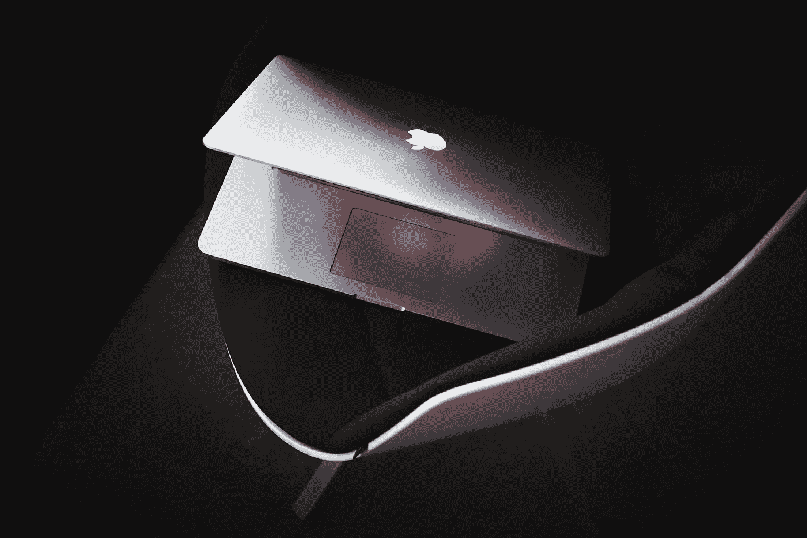

# 为你的 Kickstarter 成功做准备！(340 万美元营销活动的教训，第一部分)

> 原文：<https://medium.com/swlh/prepping-your-kickstarter-for-success-lessons-from-a-3-4m-campaign-part-1-bad3062fe947>

Photo by [Luca Bravo](https://unsplash.com/photos/I4ywJmImdPM?utm_source=unsplash&utm_medium=referral&utm_content=creditCopyText) on [Unsplash](https://unsplash.com/search/photos/startup?utm_source=unsplash&utm_medium=referral&utm_content=creditCopyText)

# 2014 年，我们在 Kickstarter 上筹集了 340 万美元，并收到了近 12，000 份预订单！

这篇文章的第一部分概述了我们在 Kickstarter 上推出微型 3D 打印机的所有关键步骤。把它当作 TLDR 对整个过程的概述。在随后的文章中，我将更详细地探究每个基本元素。

每个项目都是不同的，所以要对我们所有的学习有所保留，把它当作众多案例研究中的一个。根据产品的性质、时间表、预算和客户的需要进行调整！

# 开始之前

> 在你开始寻求发起世界上最成功的众筹运动之前，请记住这一点。一场运动的成功可能在 30 天内发生，但它所依赖的基础需要更长的时间来建立。下面列出的每件事都需要时间和努力，所以如果你在争分夺秒或需要第一个上市，就把这一点考虑进去。你会不知疲倦地打造你的产品，但别忘了打造你的营销活动！

# 1.建立一个社区

这可以说是最关键的组成部分。在你发起运动之前，建立一个忠实支持者的社区。这些人会在你上线的第一时间为你提供资金。**你不知疲倦地打造你的产品和活动。不要让你的资金成功靠运气。** 发起你的运动，祈祷它会成功是你能做的最愚蠢的事情。你希望成千上万的人等待着，渴望按下预订键。

甚至在我们有原型之前，我们就在 Makerfaire 设立了一个摊位来会见兴奋的未来支持者。在我们开展活动的几个月前，我们在纽约的 3D 打印展上引起了极大的轰动。当我们的活动开始时，我们的邮件列表上已经有了成千上万的潜在支持者，他们急切地等待着我们的活动上线。

找到你未来的支持者，亲自与他们见面。找到他们聚集的商展。和他们握手，给他们看你的原型，让他们足够兴奋，他们会当场买你的 janky 原型。

# 2.找一个会指导你的公司

由于我们正在制造 3D 打印机，我们联系了 3Doodler 的可爱的人们，他们在今年早些时候在 Kickstarter 上筹集了 230 万美元。因为他们的产品足够相似，但不是直接竞争对手，所以他们愿意指导我们。

我们得到的指导是无价的。我们了解了重要的贸易展览和会议，在那里我们遇到了许多未来的支持者。他们将我们与我们最终使用的公关公司联系起来，信任原型制作公司，甚至有能力生产我们产品的当地制造商。

如果可能的话，找一家平行行业中已经成功众筹了他们产品的公司。更多的时候，别人(比如我自己！)会很高兴地分享他们一路上的学习，并会高兴地大声谈论他们面临的所有挑战。

# 3.设计一个你可以信任的活动

2014 年，一台看起来那么好、价格那么低(200 美元)的消费级 3D 打印机好得令人难以置信。我们如何让人们为一个他们从未听说过的团队，为一个他们甚至一年都不会看到的产品，支付数百美元？我们需要潜在的支持者对我们的工作有充分的信心，并相信我们团队的交付能力。我们 Kickstarter 页面的每个部分对于培养这种信任都至关重要。

**透明度是关键。我们尽可能多地分享我们的研发成果。分享你的概念草图，工厂参观，数百个原型，和你有才华，有经验，露齿而笑的团队。别忘了投资你的设计原型。除了你的工程原型，你的支持者还想看到他们会为拥有的精心设计的产品而自豪。**

**雇佣人才来打造你的 Kickstarter 页面。**从内容质量到文案，一切都在你的品牌的合法性和吸引力方面发挥着关键作用。这意味着投资你能负担得起的最好的视频制作和摄影。

**确保你的时间表切合实际**并考虑到发货前的每个关键阶段。过于雄心勃勃的时间表很可能会被有见识的支持者提出来，导致你失去可信度。

# 4.策略性地制造炒作

在我们参加的每一场活动中，我们都给我们的潜在支持者留下了一个继续关注的理由。我们带来了优惠券，前 250 名支持者可以用 200 美元购买我们的打印机。在 2013 年，这是闻所未闻的。成千上万的人看到了我们神奇的小打印机，不仅惊讶地走开了，而且不顾一切地以如此低的价格抢到一台。他们拿了一把优惠券，不仅是为了自己，也是为了与朋友、社区、学校和创客空间分享。当我们的活动开始时，我们已经有了成千上万的热心支持者，争着按下预购键。

这就是你如何在 12 分钟内为你的活动筹集资金，在第一天筹集 100 万美元，并保证你的产品出现在 Kickstarter 的首页。

# 5.雇佣一家公关公司。他们会帮助你的活动“病毒式传播”

这对营销和媒体领域的任何人来说都是常识，但作为一名工程师，我第一次认识到，事情不会简单地“病毒式传播”。在正式发布前几个月，我们雇佣了一个很棒的小公关公司。他们为我们联系了许多大型媒体，从 Engadget 和 Cnet 到福布斯和 BBC。文章提前一个月就写好了，并实施了新闻禁运。这意味着在商定的日期和时间(我们竞选的早晨)，所有的新闻来源集体发表他们的文章。

这些文章不仅仅是你宣传活动的渠道，也有助于增加背后的信任和合法性。在消费者看来，每个新闻来源都是另一个可信度的标志。你想让你的广告出现在所有他们喜欢的、信任的新闻来源上。

# 6.发起您的活动并保持这一势头！

如果你很快达到(并超过)你的筹资目标，恭喜你！但是不要把脚支起来就说完成了。你有大约 30 天的竞选时间。事实上，你会在第一周收到大部分资金，你的流量会很快减少。为了最大限度地利用这 30 天，你需要战略性地利用你的媒体。希望你能做得足够好，获得一些令人印象深刻的头条新闻，如“几天内筹集了 X 百万美元！”或者“X 分钟全额资助！”。在第 2 或第 3 周出现的文章会带来新一波的支持者。

# 容易的部分已经过去了

我希望你们所有人都有非常成功的竞选活动，这些经验有助于为生活带来一些惊人的创新。如果你已经走了这么远，简单的部分已经结束了。请继续关注本系列的后续文章，在这些文章中，我将更深入地讨论每个阶段。点击下面的链接！

# [订阅本系列未来的文章](https://upscri.be/a54645/)

如果你有任何问题，请联系我们，如果你在旧金山，打个招呼！

# 在 [LinkedIn](https://www.linkedin.com/in/syed-hemu-rahman-a115a294/) 、 [Instagram](https://www.instagram.com/shapingelements/) 和 [Youtube](https://www.youtube.com/user/syed8rahman) 上找到我

## 这篇文章发表在 [The Startup](https://medium.com/swlh) 上，这是 Medium 最大的创业刊物，拥有+409，714 名读者。

## 在这里订阅接收[我们的头条新闻](http://growthsupply.com/the-startup-newsletter/)。

