# 电子商务的隐私硬币是密码领域的下一个大事件——原因如下

> 原文：<https://medium.com/swlh/privacy-coin-for-e-commerce-is-the-next-big-thing-in-crypto-heres-why-1e8b07f949fa>

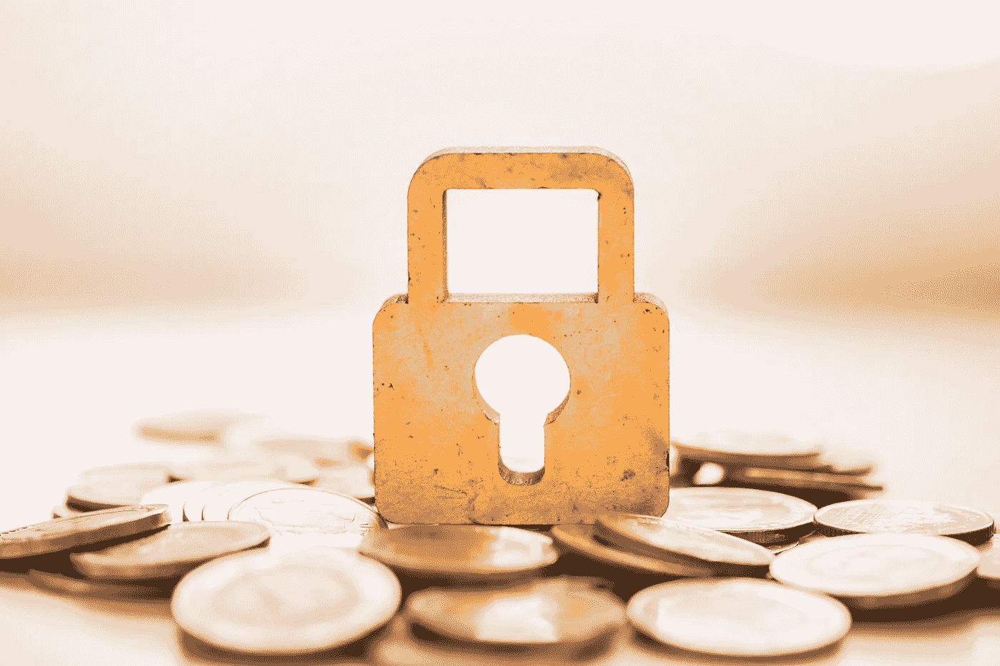

Privacy Coin

当我已经有比特币的时候，为什么我还需要一个用于电子商务的 T2 隐私币？

对于任何密码爱好者来说，这都是一个完全合理的问题。毕竟，世界上最初的加密货币**应该**为我们提供不受外部干扰的安全匿名支付。

然而，随着时间的推移，越来越明显的是，比特币有几个缺点，使其不太适合电子商务。其中一个弱点就是隐私。

> 隐私是有选择地向世界展示自己的力量。—埃里克·休斯

**为什么隐私很重要？**此处阅读👇

 [## 一个赛博朋克的宣言

### 在电子时代，隐私对于一个开放的社会是必要的。隐私不是秘密。私事是…

www.activism.net](https://www.activism.net/cypherpunk/manifesto.html) 

# 比特币的不足之处

比特币不是隐私币。对于电子商务来说，这是一个大问题。这是因为比特币网络上的所有交易对任何想要追踪它们的人来说都是可见的。

本质上，当你用比特币、以太坊或数百种其他加密货币支付时，你使用的是公钥形式的**别名**。当有人将你的真实身份与你的公钥联系起来时，你曾经拥有的任何隐私都将不复存在。

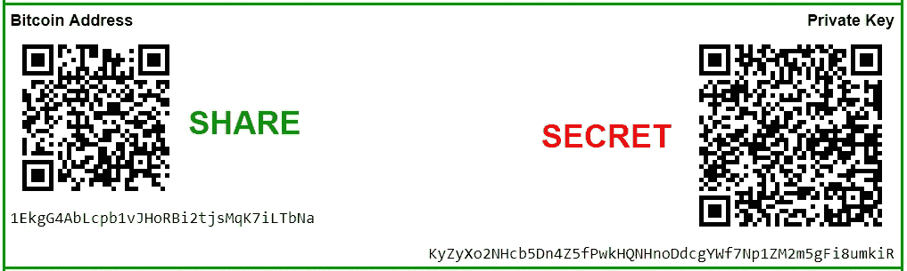

Public key is your bitcoin address

那时，他们可以看到你在网络上的每一笔交易。他们还可以看到你钱包里到底有多少比特币。

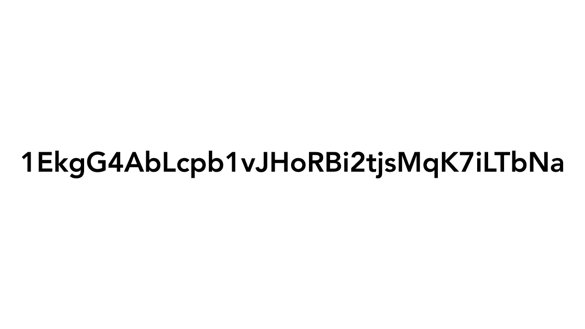

具有讽刺意味的是，一旦人们识别出你在 BTC 的地址，你实际上比用菲亚特支付时拥有的隐私要少得多。事实上是零。如果有人知道你有多少钱，你就立刻成为目标。我们都不希望自己处于那种境地。

美国**告密者** [爱德华·斯诺登](https://sh.wikipedia.org/wiki/Edward_Snowden)——向记者披露了数千份美国国家安全局机密文件——强调了比特币的隐私问题。斯诺登大力提倡加密货币，尤其是隐私币。正如他在这条推文中所说，比特币很棒，**但它不安全，因为它不是私有的**。

# “如果你没有做任何违法的事情，你就没有什么好隐瞒的”

极权主义者喜欢这种推理方式。这里的假设是**只有罪犯想要隐私**这样他们才能避免被抓。

**这当然是垃圾**。想象一下，你在家和家人一起吃晚饭，你注意到**有人透过窗户盯着你。你让那个人走开，他们说:**

> “怎么了？这并不是说你在做什么尴尬或违法的事情。”

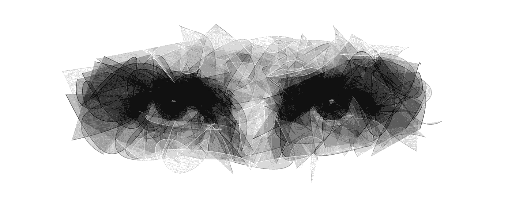

当然，吃晚餐是**完全正常的行为**。你大概不会介意别人知道你昨晚 7 点晚餐吃了鸡肉。但是这并不意味着这个令人毛骨悚然的陌生人有权利在你做的时候看着你。

这同样适用于你的在线隐私。你可能会用你的加密货币购买一些完全正常的东西，比如你的食品杂货，或者一些尴尬的东西，比如一张贾斯汀比伯亲笔签名的海报。

 [## 贾斯汀比伯海报

### 在₹299.以 0%的折扣购买男女通用的 Bravado 贾斯汀比伯海报 7 天退货|购买多张纸质海报…

www.limeroad.com](https://www.limeroad.com/multi-colored-paper-bravado-p11028904) 

无论哪种方式，**你都不必担心人们会跟踪你的付款，并计算出你买了什么。如果你没有在电子商务中使用隐私币，这些信息就有风险。**

至于你是否与其他人和公司分享你的信息，这应该是你的决定。如果你还不担心大企业会如何处理你的个人数据，请继续读下去。

# 他们比你自己更了解你

当电子商务刚刚兴起时，像亚马逊这样的公司需要收集某些个人数据来运营他们的业务。没有你的姓名、地址和信用卡信息，**亚马逊** **将无法销售和交付其产品。**

然而，**亚马逊已经变得** **远不止是一个网上商店。2016 年，[亚马逊 CEO **杰夫·贝索斯**受邀加入五角大楼国防顾问委员会](https://www.businessinsider.com/amazon-ceo-jeff-bezos-joins-pentagon-defense-advisory-board-2016-8)。前谷歌首席执行官埃里克·施密特领导着同一个董事会。尽管后来有消息称，迫于公众压力，贝佐斯从未正式接受这个角色，但一想到一个拥有如此多公民私人信息的**的人身居高级防务职位，就令人感到恐惧。****

现在，随着 Alexa**的发布，[亚马逊正在收集一系列全新的私人信息](https://coinedtimes.com/blockchain-the-next-step-in-the-evolution-of-online-shopping/)。虚拟家庭助手**会听你的对话**，回答你的问题，了解你的习惯。对于一个想向你出售产品的公司来说，这些信息是非常有价值的。**

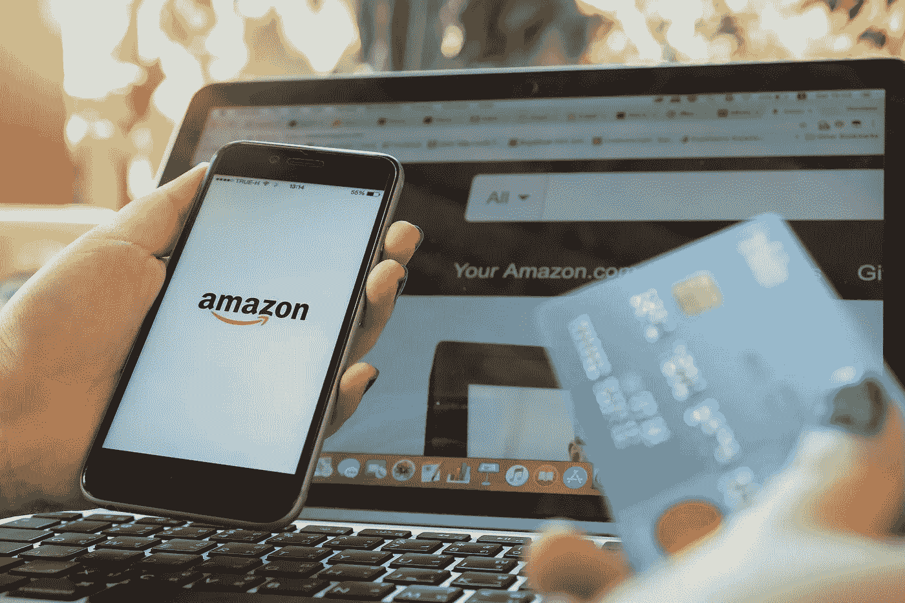

想象一下，如果亚马逊是一家实体零售店，比如说一家卖床垫的。你走进前门，一名销售人员对你直呼其名。

> “嘿，格雷格，你今天好吗？我们建议你试试这款新床垫——它非常适合你和莎莉，因为她背部不好，而且你还会打鼾。既然你在这里，为什么不拿一块防水布来帮助小提米尿床呢？嘿，我们注意到你已经五年没买过电热毯了。你不觉得该升级了吗？”

在现实生活中，那将是极其令人毛骨悚然的。但是当我们的电脑给出这些建议时，我们倾向于不去想它。在我们开始在一个分散的系统中使用电子商务隐私币之前，我们将不得不应对这种间谍活动。

# 不安全的时代

在亚马逊这样的中央集权系统中，个人数据总是容易受到攻击。即使黑客无法通过网站的安全措施，雇员在黑市上出售你的信息的风险还是存在的。是的，**2018 年的几份报告**表明亚马逊员工确实这么做了。毕竟，当低层员工收到高达 2000 美元的信息报价时，这种诱惑是难以抗拒的。

在这里你可以看到亚马逊和谷歌这样的科技公司保留了多少私人用户数据:

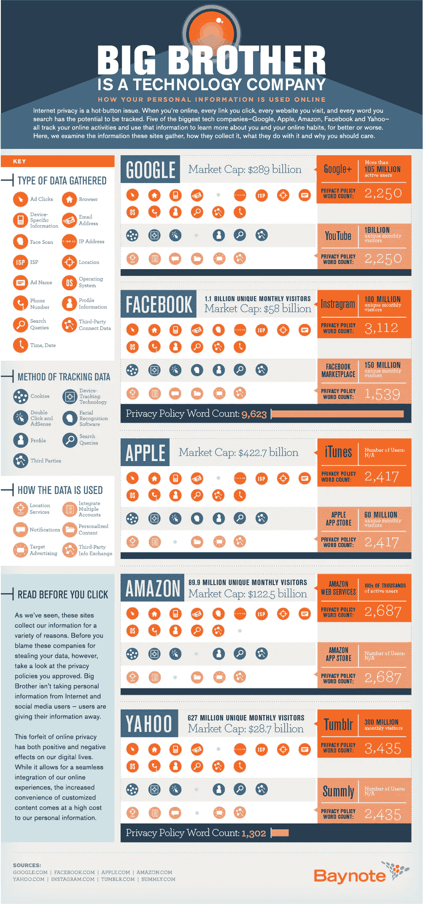

[https://datafloq.com/read/what-data-do-the-five-largest-tech-companies-colle/427](https://datafloq.com/read/what-data-do-the-five-largest-tech-companies-colle/427)

想象一下如果这些数据落入坏人手中会发生什么。这在数字上相当于有人用枪指着你的头。

当然，面对当前电子商务系统问题的不仅仅是买家。对于受挫的在线企业来说，电子商务的隐私币可能正是医生所要求的。

# 亚马逊如何击败小企业

作为一家企业，保持你的**敏感财务信息的私密性**至关重要。而且，正如我们所知，在集中式平台上，你不可能**100%确定**你的数据是安全的。

但是**亚马逊可以访问这些信息**的事实不仅仅是一个安全问题。通过在亚马逊上销售，你实际上是给了这个跨国巨头一大块你企业的私人财务数据。

毫无疑问，像亚马逊和阿里巴巴这样的网站会利用这些信息来对付你。

请看一下亚马逊上一位卖家的投诉。👇

 [## 亚马逊对小卖家不公平

### 好的，我是亚马逊上的新卖家，目前我在另一个销售平台上销售并取得了一定的成功…

sellercentral-europe.amazon.com](https://sellercentral-europe.amazon.com/forums/t/amazon-unfair-to-small-sellers/184247) 

据卖家称，亚马逊意识到有一款产品销售成功。因此，亚马逊决定以低 20%的价格提供同样的产品，来削弱这个单人生意。这个大公司利用它的购买力来排挤它的小竞争对手，使他们无法继续销售他们的产品，哪怕利润微乎其微。

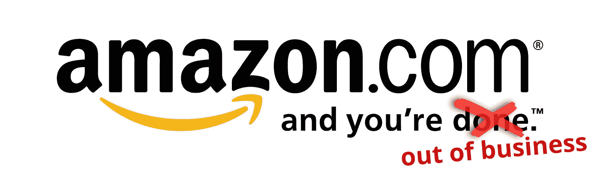

为什么你会和一个**行为像**那样的网站做生意？嗯，到现在为止，你没有其他选择。但是，有了电子商务的正确的隐私硬币，网上购物可能处于一场巨大变革的风口浪尖。

# 那么，有什么解决办法呢？

2019 年，你在网上购物时可能不会用**隐私币**支付。如果你像 99%的人一样，**你仍然使用信用卡**并通过像亚马逊这样的网站购物。

即使你拥有 crypto，你仍然很有可能使用 BTC 或 ETH 进行网上交易。而且，正如我们所知，这些硬币在隐私方面远非完美。

当然，最早的**加密采用者已经囤积了**许多可开采的加密货币，如 BTC 和 ETH。当这些硬币第一次出现时，用最少的努力获得它们要容易得多。现在，随着它们的价格飞涨，许多人选择持有这些硬币作为价值储存手段，而不是将其作为支付手段。

为了佐证这一点，只要看看比特币财富的[分布就知道了。超过 95%的流通比特币属于 3%的人。这太**不均衡的分配**来迎合全球网购行业。](/decentralized-commerce/bitcoin-might-not-be-the-future-of-cryptocurrency-but-what-is-c242ea5abfec)

鉴于我们对这些硬币的隐私问题的了解，我们会天真地认为它们提供了完美的解决方案。相反，我们需要一枚用于电子商务的隐私币，它可以保护我们的数据，并给予我们网上购物的最终自由。这就是 [**Safex**](https://safex.io/) 出现的原因。

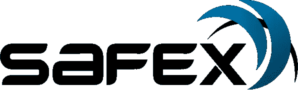

# Safex:电子商务的隐私硬币

在所有解决这些问题的加密货币中，Safex 提供了最佳解决方案。这个平台运行在一个区块链上，使每个人都能使用一个专门为电子商务制造的保密硬币来买卖商品和服务。鉴于数据安全在电子商务中的重要性， **Safex 团队已经找到了确保用户隐私的解决方案**。在 Safex Cash 的创建中使用了“[隐形地址](https://www.investopedia.com/terms/s/stealth-address-cryptocurrency.asp)”和“[环密交易](https://www.researchgate.net/publication/311865049_Ring_Confidential_Transactions)”等技术，**使交易在网络上无法追踪**。

Safex Cash 不仅**隐藏你的交易**不被偷窥，而且它还有自己专门打造的**分散市场**。

> 想象一下，亚马逊、Upwork 和 Shopify 在区块链上整合成一个平台，拥有自己的电子商务隐私币。那是 Safex。

在市场中，你可以**创建自己的商店**，购买商品，或者作为自由职业者提供服务。而且你可以做所有那些**而不必提供任何** **不必要的数据**。

Safex 的美妙之处在于**没有人**——甚至是市场背后的团队— **可以看到**你买了什么或者你从谁那里买的。这与亚马逊和阿里巴巴形成鲜明对比，它们都是个人数据的金矿。

这两张图片**展示了 Safex 与其基于菲亚特的竞争对手之间的鲜明差异**:

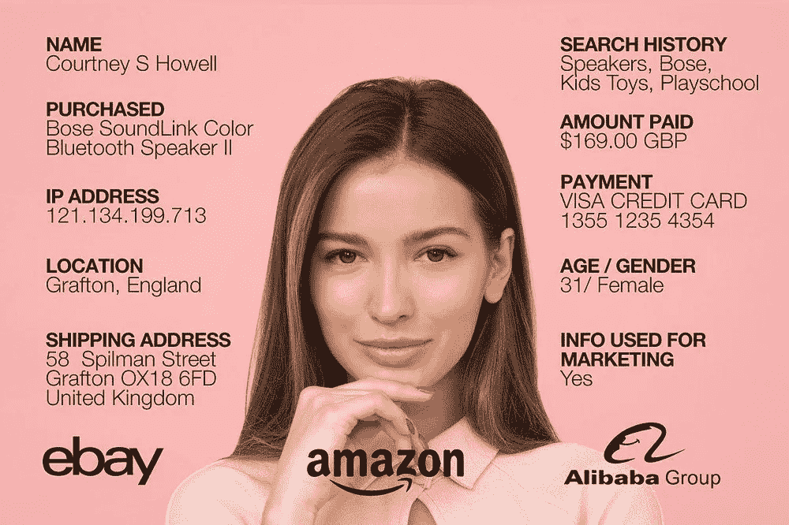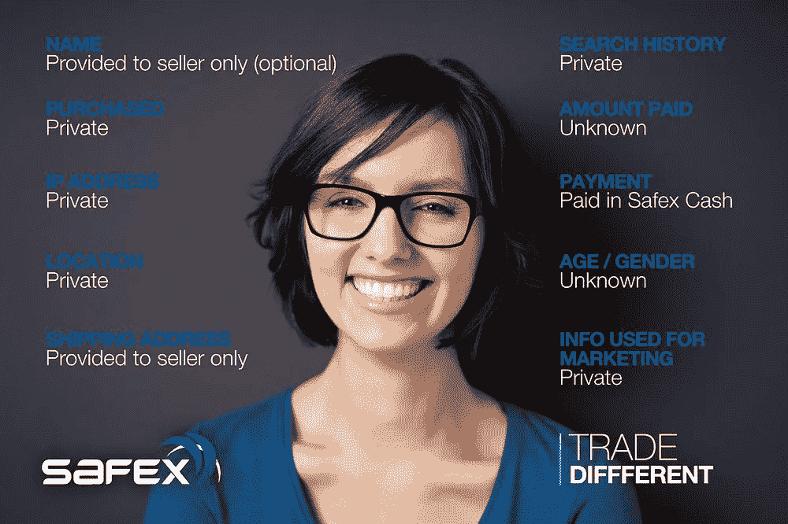

与亚马逊不同，亚马逊可以**监控其用户的基本一切**，Safex 的团队无法访问买家或卖家的信息。这意味着**不再有数据泄露**或山寨产品将小卖家挤出市场。

> 如果你是一个日常购物者，就不会再有枪指着你的头了。

# 现在你可以加入货币的进化了

因为是去中心化的， **Safex Marketplace** 提供了真正的、**铁一般的数据安全性**。黑客没有单一的入口可以进入；所有的**信息都保存在安全的区块链**中。由于 Safex 使用自己的隐私币进行电子商务，你可以期待**比现有的电子商务平台**低得多的费用。

Safex Marketplace 上唯一的费用是每笔交易 5%的固定费用。相比之下，亚马逊对大多数商品收取大约 15%的平均费用**，如果你是一个列出了 40 多种产品的卖家，还要加上 39.99 美元的月订阅费**。这不是唯一的好处。你在 Safex Marketplace 上支付的费用会在参与者之间进行分配。****

> 与其说这是一项支出，不如说是对用户参与的一种激励。

Safex 团队还旨在鼓励**大规模采用加密货币**。考虑到这一点，他们开发了一个应用程序，让每个人**甚至你的奶奶**都能参与到金钱的进化。

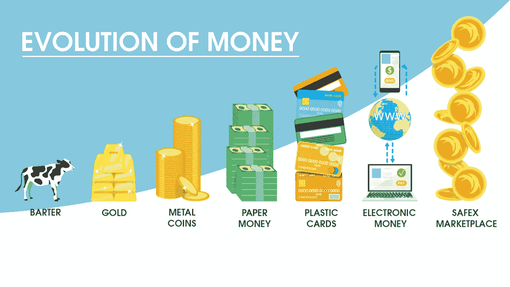

[**Safex 一键式矿工 App**](https://blog.goodaudience.com/safex-oneclick-miner-one-step-closer-to-mass-adoption-of-cryptocurrencies-13bb138fac12) ，顾名思义，让你**只需轻轻一点**就能参与到密码行业。点击*按钮*你就可以**成为矿工并创造硬币**，你可以用这些硬币在平台上购买商品和服务。该应用程序针对 CPU 挖掘进行了优化，所以你不需要任何笨重或昂贵的机器。

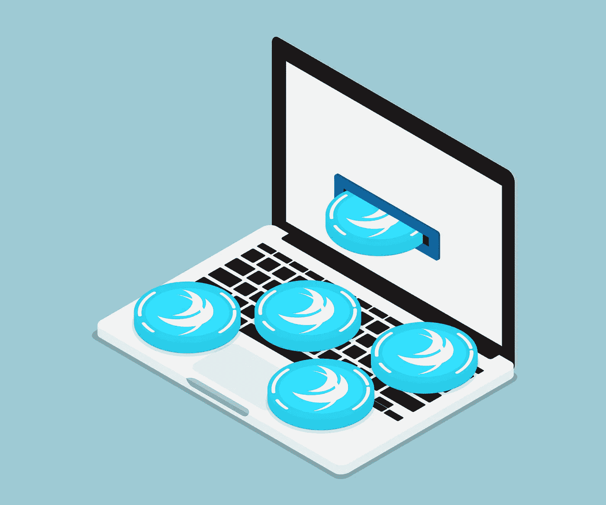

Mining Safex Cash with a laptop with a single click

你的笔记本电脑就是你进入 [**未来电子商务和加密货币**](/swlh/the-future-of-cryptocurrency-why-e-commerce-is-the-answer-822e62ba12f5) 的全部所需。

我们不能指望亚马逊和阿里巴巴会在一夜之间消失。但是随着像 Safex 这样的公司已经完成了电子商务隐私币的开发，**这些数据挖掘巨头的时间可能已经不多了。**

## 关注 **Safex twitter** 了解该项目的最新进展。

 [## Safex (@safex) | Twitter

### Safex 的最新推文(@safex)。$ SAFEX:= $ SFT $ SFX SAFEX 区块链上的去中心化市场。加入…

twitter.com](https://twitter.com/safex) 

> 今年，电子商务中的隐私正在成为现实。敬请期待！

## 这篇文章发表在 [The Startup](https://medium.com/swlh) 上，这是 Medium 最大的创业刊物，拥有+441，678 名读者。

## 订阅接收[我们的头条新闻](https://growthsupply.com/the-startup-newsletter/)。

