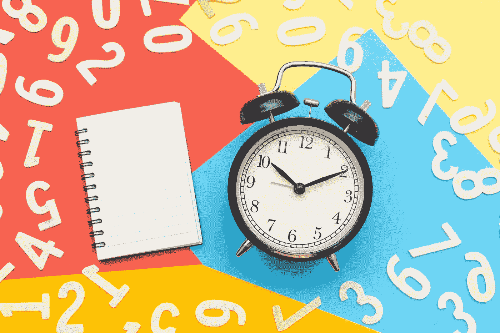
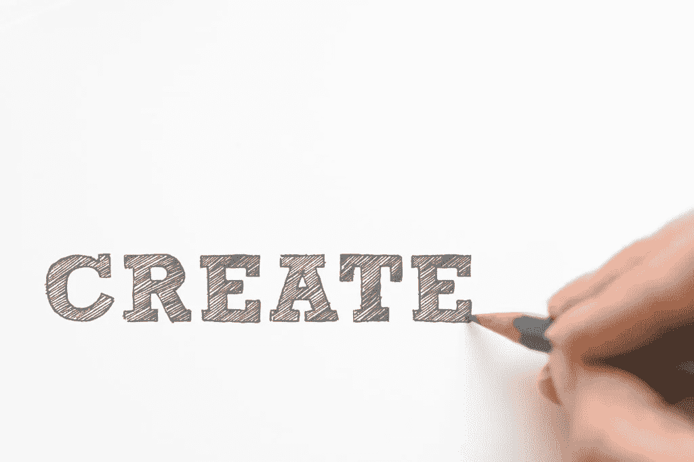

# 解决问题令人上瘾，该怎么办

> 原文：<https://medium.com/swlh/problem-solving-is-addicting-what-to-do-instead-fbdeaa79eac1>

## 你可以解决你的问题，但仍然无法接近你的目标

很容易把我们自己和我们的生活看成是一系列需要解决的问题。解决问题可能正是阻碍你变得高效的原因。

我发现自己解决的问题有以下主题:

*   我怎样才能赚到足够的钱，这样我才能最终拥有这个或者成为那个？
*   为什么我总是对自己的进步感到如此焦虑和不满？
*   我该如何解决它，避免它，让它消失？

还有电子邮件等待我的回复，有任务要完成，有截止日期要到达，有结果要实现。

我经常发现自己只是被动反应，而不是做最重要的事情。

这阻止了我真正创造我想要看到的结果。

# 你可以解决你的问题，但仍然无法接近你的目标

把时间花在对问题、电子邮件的反应上，同时试图变得更有条理，这并没有让我更接近我的目标。

专注于“让我的收件箱归零”并没有产生效果。对每个人的要求和期望做出反应并不能推动任何人前进。

真正的进步需要专注于创造未来愿景的行动。当你被困在解决问题的车轮上时，你不太可能实现你的愿景。

我正在学习，如果我要前进，我必须放弃这些问题。

# 解决问题的问题

你解决了一个问题，第二天又会出现另一个新问题，这种情况有多常见？

> 当我们失去对最重要的事情的关注时，我们就会看到障碍和问题。

解决问题会上瘾，变成一个死循环。我们发现问题，解决问题，享受结果。那么，我们该怎么办？我们寻找更多的问题。

可能已经没有什么重要的问题了，所以我们开始制造新的问题。这很可笑，但却是真的！

我不是建议你忽视现实。远非如此。

# 创造新的东西，而不是绕着老问题打转

你可以[对现实有自知之明](/live-your-life-on-purpose/this-simple-practice-will-change-your-life-5bbe7c7133ec)，而不用判断它是一个需要解决的问题。

解决问题的瘾让我们专注于现状。我们总是围绕着同样的老问题努力追求完美。

你有多经常指出问题，却不知道如何去创造？

当你提出新的想法时，新的问题可能会出现。

但是，制造新问题不是比一次又一次地重复同样的问题更好吗？

相反，[保持好奇心](https://zacharend.com/one-trait-to-solve-all-the-worlds-problems/)，寻找超越问题的机会。

# 相反，你可以问的最有力的问题

如果你开始问“我想要创造什么样的结果”，而不是去寻找问题，那会怎么样呢？

这个问题会让你转向前方，你想去哪里，以及如何最好地到达那里。

现在，一切都变成了反馈，告诉你下一步的目标。这样，你在创造新的东西，而不是解决更多的问题。

所以，现在暂停[设定你的意图](https://zacharend.com/your-goals-depend-on-how-you-set-your-intentions/)，问你自己这个问题:

> 我今天想要创造的结果是什么？

## 下载我的免费清单！

[点击此处](https://www.createpurpose.net/executive-morning-plan)并下载早晨执行计划:通过控制你的早晨来提高你的表现(没有零收件箱和任务列表)！