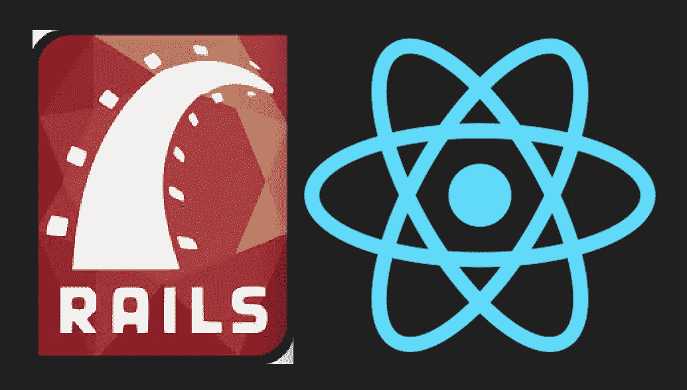

# 在 Heroku 上部署 React & Rails 的问题及其解决方案

> 原文：<https://medium.com/swlh/problems-deploying-react-rails-on-heroku-and-their-solutions-676f039fc325>

This article discusses Ruby on Rails and React deployments on Heroku

你完成了你的应用程序，它很漂亮。现在让我们在 Heroku 上启动它！将我的 React 前端和 Ruby on Rails 后端部署到 Heroku 并不容易。幸运的是，亚历山德罗·阿莱格兰兹已经为此写了一篇博客。[看一看](/@allegranzia/how-to-deploy-a-react-front-end-rails-back-end-project-to-heroku-fa98d915eff2)！