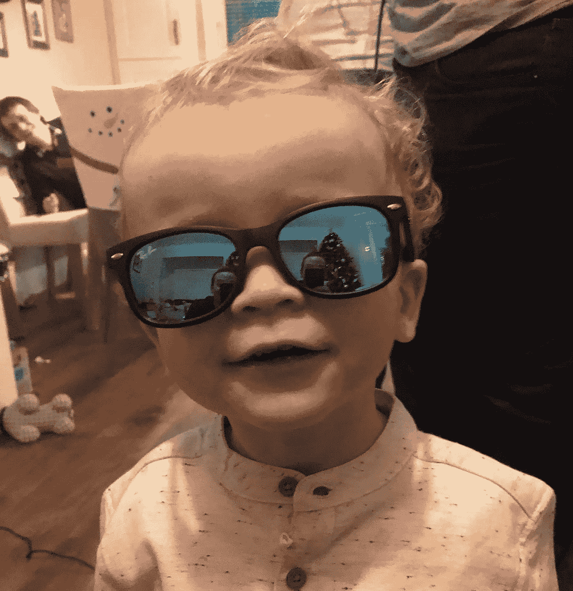

# 现在不存在问题

> 原文：<https://medium.com/swlh/problems-dont-exist-in-the-present-645032cd1c5>

Source: My nephew… problem free and present on Christmas day 2018

## “……那么为什么不在那里多呆一会儿呢。”

你是否曾沉湎于过去的事情，希望自己能以不同的方式做事？

*你是否曾希望几周过去，只过周末？*

*你有没有发现自己在做白日梦，希望自己在别的地方？*