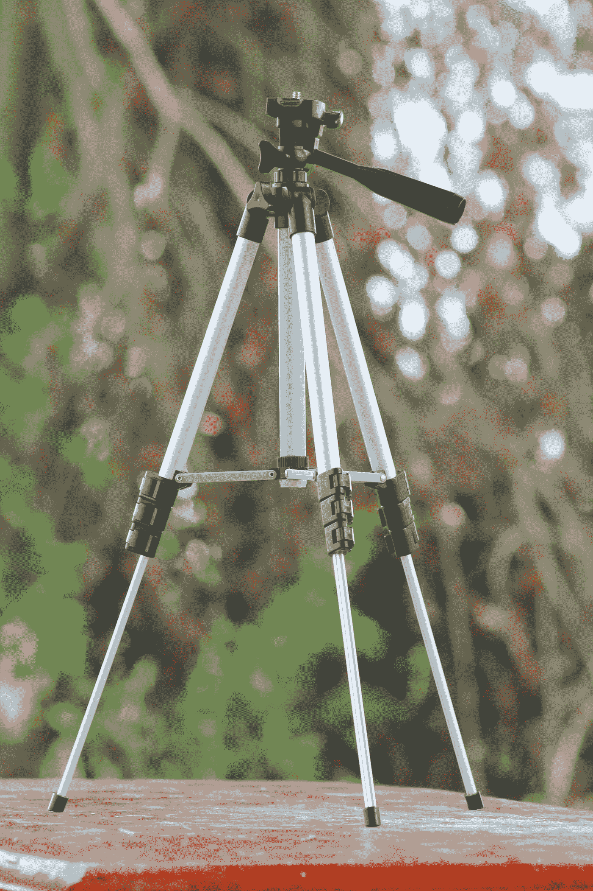
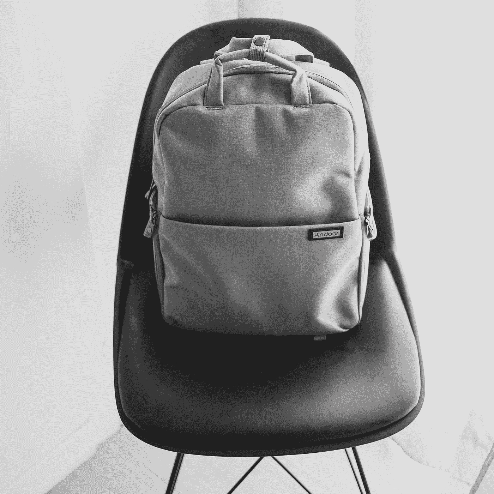

# 在建立你的产品概念之前，要意识到这些成本

> 原文：<https://medium.com/swlh/product-idea-cost-42e387853d40>

## 了解将你的实物产品从概念发展到制造的主要成本，这样你就可以准备你的策略。

Photo by [Amanda Jones](https://unsplash.com/@amandagraphc?utm_source=medium&utm_medium=referral) on [Unsplash](https://unsplash.com?utm_source=medium&utm_medium=referral)

当谈到开发物理产品时，实际创建物理原型和制造最终产品的成本推动了开发成本的上升。

通过我在[的产品开发服务](http://www.abilista.com/services)，我看到许多人将他们自己的伟大想法投注在一个实体产品上，并致力于将他们的产品带入生活。一般来说这是一种好的态度，除非盲目追求。

大多数人对他们能投资多少来实现这一目标有自己的估计。然而，在大多数情况下，他们的估计与市场现实相差甚远。

**开发实物产品不仅成本高昂，而且极具挑战性。**

为了更准确地估计开发一个实体产品的总成本，你需要考虑几个活动。这些成本中的大部分来自于特定专业人员执行这些活动所花费的小时数乘以他们的小时费率。

让我们来看看开发一个实物产品所涉及的主要活动。

## 概念设计

通常，工业设计师会为你的产品构思勾勒出几个概念性的选择。最终选择的概念将被完善，以包括更多关于产品如何工作，所用材料和外观考虑的细节。

## 构造设计

工程师将考虑产品的材料属性、生产流程和功能方面，创建产品及其不同组件的技术 3D 设计。

## 电气设计

电子板、电池、传感器、无线连接、电源管理和主要功能编程等的技术设计。

## 技术条件

这些是根据之前开发的最终设计定义的附加文件和文档。一方面是机械规格，通常是 2D 图纸，包括每个部件的材料、尺寸和关键参数以及生产规格。另一方面，用于制造电路板和进行测试的电气原理图和布局文件。

## 样机研究

几轮原型，从模型到功能版本和预生产小规模系列。成本包括材料和人工成本。

## 产品试验

为确保产品的可靠性和符合规格，必须对产品进行的测试次数。有些可能是对工程信心的非正式测试，但有些是行业标准和法规所要求的。

## 生产工具

这是制造最终产品的部件和组件所需的工具和设备清单。例如，如果你需要为塑料或金属零件制作模具，模具很快成为所有开发中最高的投资。

## 初始生产系列

数百甚至数千个单元的第一次生产构建，以验证生产稳定性和质量。包括生产设备所需的所有材料和外购件，加上组装的人工成本。

 [## 这就是你记录产品成本的方法

### 这篇文章将涵盖你需要知道的要点，以便为你的产品创建一个完整的物料清单…

medium.com](/abilista/create-a-bill-of-materials-of-your-invention-8180552653ee) 

每项活动的成本将根据您正在构建的产品类型而有所不同。现在让我们来看看按产品类别划分的预计成本。

# 设计类别

在设计类别中，我们考虑具有美学特征的产品，以及不同部件和材料的组合，在某些情况下还包括机械装置。

这些产品不包含任何电子或智能功能。

在这一类别中，您可以找到生活用品、家具、厨房用具、玩具和户外设备等产品。

Photo by [Adnan Ghaffar](https://unsplash.com/@officialadnan01?utm_source=medium&utm_medium=referral) on [Unsplash](https://unsplash.com?utm_source=medium&utm_medium=referral)

这些是典型的活动和成本:

*   概念设计(500 美元-1500 美元)
*   机械设计(2500-5000 美元)
*   技术规格(500 美元-1000 美元)
*   原型约 3-4 轮(每轮原型 500 美元-1500 美元)
*   测试(1000 美元-3000 美元)
*   生产工具(5000 美元-20000 美元)
*   初始生产系列(约 500 美元)

对于设计类产品的主要开发活动，这将为您提供一个介于 **12.000 美元到**35.000 美元之间的估计范围。

# 软商品类别

软商品类别包括使用织物、皮革和橡胶类材料等软材料的产品。

**纺织品有其独特的设计和开发方法，通常开发速度更快。**

在这一类别中，你可以找到背包、手提袋、钱包和一些体育用品等产品。虽然纺织品越来越多地融入科技产品，但我在这里只考虑没有科技特色的纯纺织品。

Photo by [SJ Baren](https://unsplash.com/@sjbaren?utm_source=medium&utm_medium=referral) on [Unsplash](https://unsplash.com?utm_source=medium&utm_medium=referral)

这些是典型的活动和成本:

*   概念设计(500 美元-1000 美元)
*   技术模式和图纸(500–2000 美元)
*   技术规格(500 美元-1000 美元)
*   原型~ 3 轮(每轮原型 500 美元-1000 美元)
*   测试(500 美元-1500 美元)
*   生产工具(1000 美元-5000 美元)
*   初始生产系列(约 500 美元)

对于主要的开发活动，软商品类别的估计范围在 **5.000 美元到**15.000 美元之间。

# 技术类别

技术产品共享大部分设计活动，但包含电子和附加技术，需要不同的专业人员和方法将其集成在一起。

由于苛刻的要求和认证，此类产品需要更长的开发周期。

在这个类别中，你可以找到消费电子产品、硬件、可穿戴设备、无人机和智能产品等产品。

Photo by [Jonathan Lampel](https://unsplash.com/@jonlampel?utm_source=medium&utm_medium=referral) on [Unsplash](https://unsplash.com?utm_source=medium&utm_medium=referral)

这些是典型的活动和成本:

*   概念设计(500 美元-1500 美元)
*   机械设计(2500-5000 美元)
*   电气设计(2500-5000 美元)
*   技术规格(1000 美元-2000 美元)
*   原型约 4-5 轮(每轮原型 1000 美元-2000 美元)
*   测试和认证(2000 美元-5000 美元)
*   生产工具(10000 美元-30000 美元)
*   初始生产系列(约 1000 美元)

主要开发活动的技术产品开发从 **25.000 美元到**60.000 美元不等。如果您需要定制软件(如应用程序)，或者如果您正在开发复杂的技术或高度监管的产品(如医疗行业)，这个数字可能会更高。

从上面，你可以知道生产一个实物产品需要多少投资。上面我所展示的仅仅是技术开发的成本，如果你想在市场上全面推出一个实体产品，你可能还需要加上其他的商业、营销和销售成本。

**不幸的是，这些开发成本是许多人在开始之前就放弃想法的原因，或者更糟糕的是，他们开始时没有真正考虑潜在的成本，他们意识到时已经太晚了。**

 [## 规划物理原型的替代方法

### 你不需要甘特图来计划你的原型构建。这种替代方法是规划您的…

medium.com](/abilista/alternative-planning-prototype-d7d06ff5d88f) 

# 我的建议

虽然这些活动不能完全避免，而且是开发产品所必需的，但是有一些方法可以降低风险，有效地使用预算。

我的建议是寻找一些方法，可以让你更快地将你的产品投入使用，并且能够**尽早并且经常**与用户和利益相关者一起验证它。

对于我的客户，我使用一个允许在短周期内构建产品版本的框架，这样你就可以在投入全面开发之前从市场得到反馈。

通过使用这些集中的构建，您可以获得产品的功能版本，同时在每个阶段对您的成本进行控制，确保您将前进的风险最小化，并对您的产品产生兴趣。

最重要的是，这种方法可以增加你从私人投资者或众筹活动中获得资金的机会，以支持你产品的后期阶段和制造。

**(** [**)通过我们的免费电子邮件课程**](https://mailchi.mp/ee8040378f05/email-course-registration) **)** 在短周期内打造您的实物产品

**Abilista** 指导创新者按照我们自己的循序渐进的框架，从概念、原型到制造，开发他们的产品创意。我们已经在帮助一些企业家和初创公司建立他们的想法，为他们提供简单灵活的工具和专业知识。

如果你想阅读更多像这样的故事[，请访问我们的出版页面](https://medium.com/abilista)。