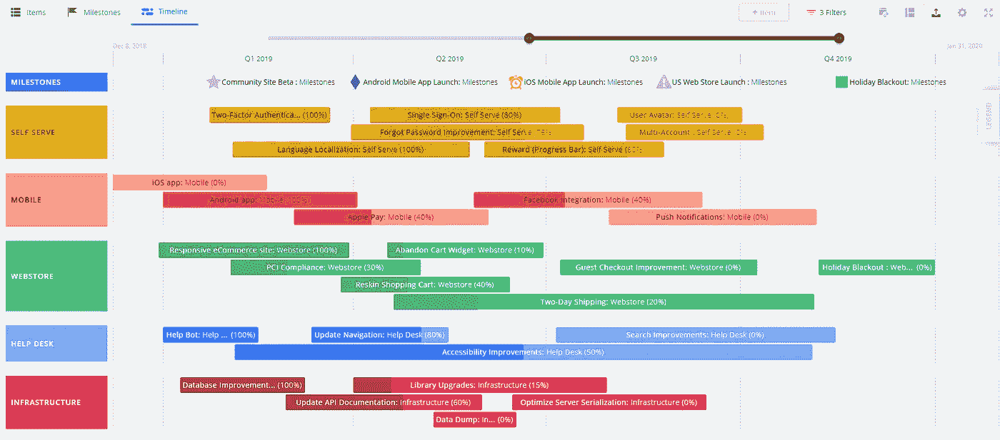
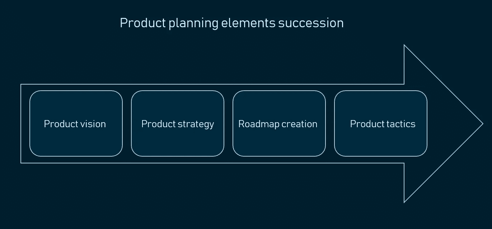
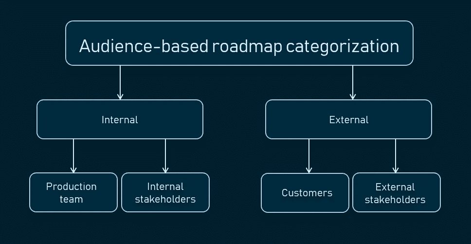
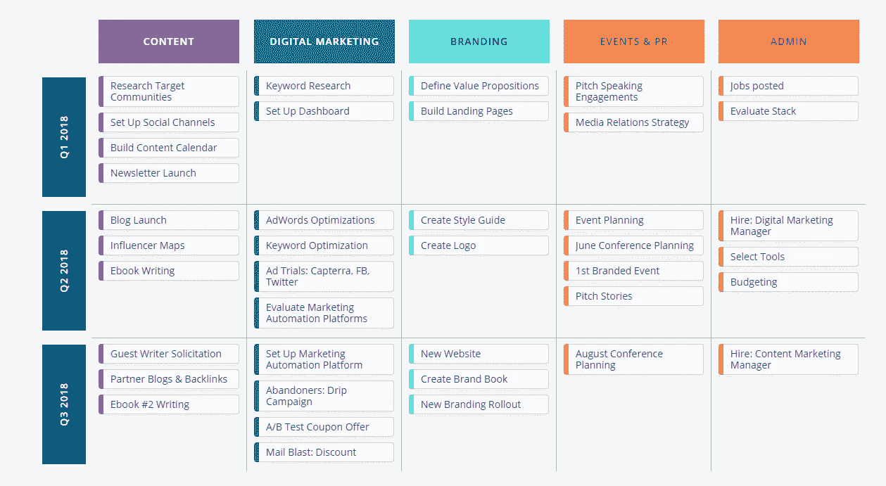
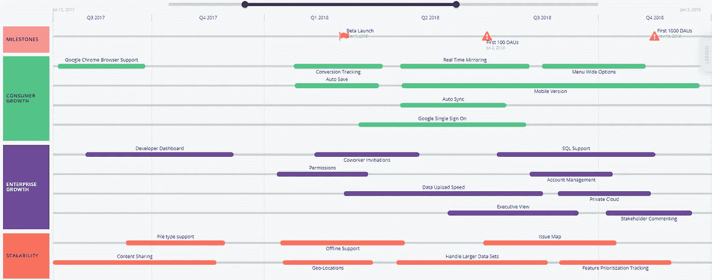
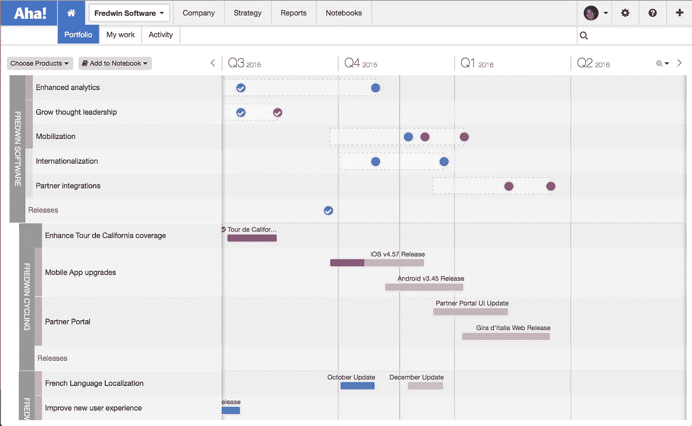
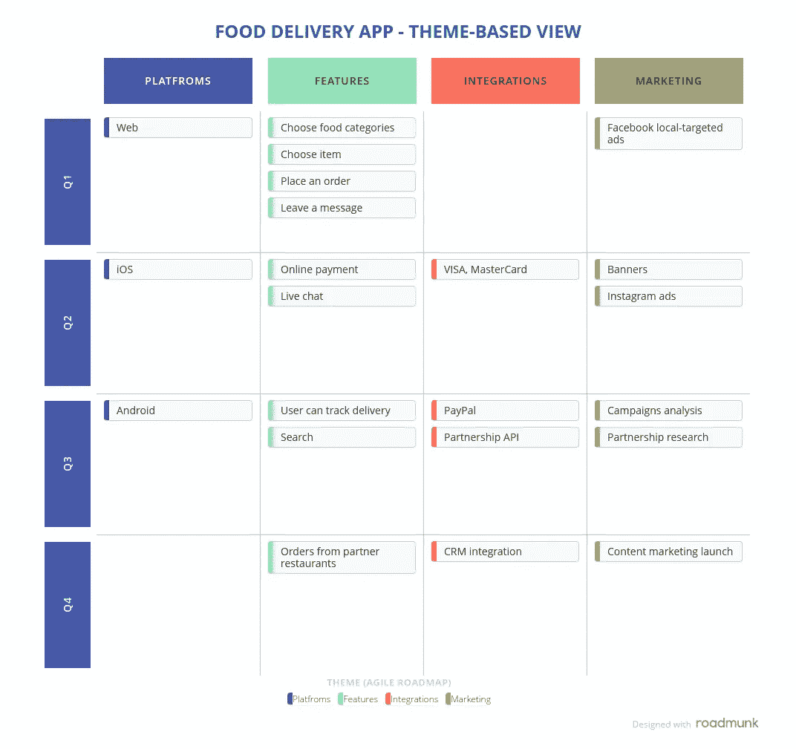
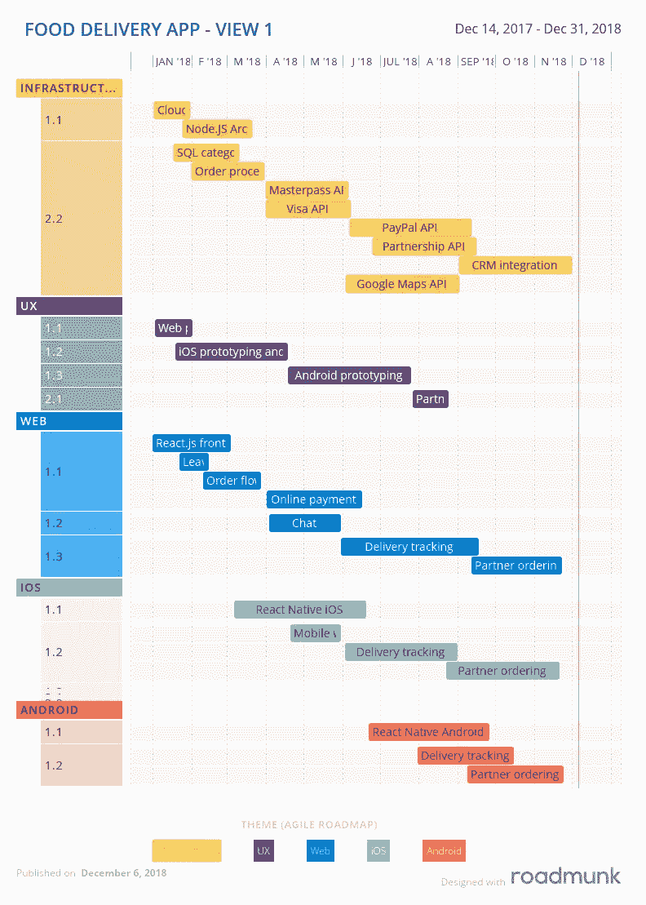
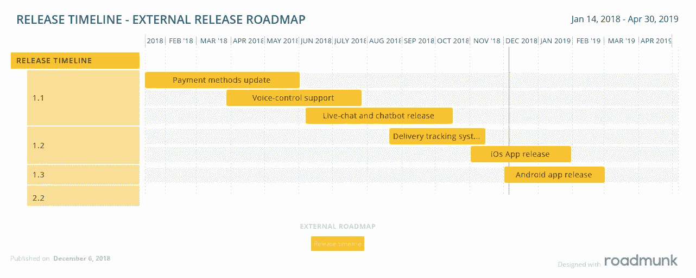

# 产品路线图:主要特性、常见类型和路线图构建技巧

> 原文：<https://medium.com/swlh/product-roadmap-key-features-common-types-and-roadmap-building-tips-a5069115db2d>

出于好奇——如果你有多余的时间——你可能会在网上冲浪，偶然发现一个企业家成功“改变一切”的故事史蒂夫·乔布斯、比尔·盖茨、迈克尔·戴尔、戴维·帕卡德、谷歌联合创始人拉里·佩奇、雅虎联合创始人大卫·费罗和更多的人组成了科技精英。你知道他们是联合创始人或首席执行官。但你可能不知道的是，他们都曾经是产品经理。在本文中，我们将定义产品经理在产品开发中的角色、产品路线图及其主要特性。您还可以找到常见的路线图类型，以及一些关于路线图创建的示例和提示。

# 谁是产品经理？

产品经理的职责很广泛，有时与其他角色和职业的职责相一致。有的把责任分为*入境*和*出境*两类；有些人挑出技术和营销活动。尽管如此，主要职责是:

*   提供深入的市场和竞争对手分析
*   与客户建立持续的沟通渠道
*   开发产品的愿景、战略和战术
*   在生产团队的不同级别之间交流计划
*   与利益相关者沟通产品细节，包括管理层和客户
*   分清工作的轻重缓急，设定时间框架
*   为每个特定群体创建多种类型的产品路线图

要深入了解，请查看我们关于作为组织职能的[产品管理](https://www.altexsoft.com/blog/business/product-management-main-stages-and-product-manager-role/?utm_source=MediumCom&utm_medium=referral)的材料。

## 产品经理或产品所有者——一种误解

产品经理(PM)和产品所有者(PO)是同一个角色的误解指的是敏捷方法的实现。

根据 Scrum 指南，产品负责人是 Scrum 团队的一员，负责创造产品价值。产品负责人开发一个产品 backlog，并编写用户故事。在现实世界的实践中，PO 不断地与工程团队沟通，澄清需求。

那么，这种混乱的原因是什么呢？在 Scrum 真正被引入之前，产品经理曾经接手产品负责人的工作，这导致了两种类型的经理可以互换的观点。此外，Scrum 中没有“产品经理”的角色。PM 是一种职业，而 PO 是一个 Scrum 角色。

在今天的产品开发中，项目经理和采购订单可能有一些共同的责任，比如制定规格。但是，简而言之，产品经理专注于策略开发，而产品负责人确保每天正确执行策略。

如果你对 Scrum 感兴趣，可以看看我们关于 [Scrum 最佳实践](https://www.altexsoft.com/blog/business/25-scrum-process-best-practices-that-set-your-agile-workflow-for-efficiency/)的文章。

# 什么是产品路线图？

产品路线图是一个高层次的战略性文档，它描绘了产品开发的一般阶段。产品路线图的主要目的是将产品愿景与公司的业务目标联系起来。

*Product roadmap example*
*Source:* [*Roadmunk*](https://roadmunk.com/)

产品路线图是战略规划的结果。它记录了产品的执行策略和总体目标。战略性产品路线图通常包括以下要点:

**产品愿景**——你希望你的产品在未来变成什么样。

**战略**——一份详述你的公司将如何实现愿景的执行计划。

**目标** —一个有时间限制的目标，可以用特定的标准来衡量。

**计划** —广泛的主题，这些主题结合了为实现目标而必须实施的特性。

**特性** —产品的实际部分，或者是功能的一部分，或者是第三方应用程序。

**时限** —完成某个目标或功能的日期或时间段。一般来说，产品路线图只是一个近似值。

**状态标记** —用于跟踪工作进度。

**指标** —协助测量数据驱动的目标，如流失率或有机流量。

*Product planning elements scheme*

创建产品路线图很困难，除了产品经理之外，通常还需要多人甚至团队参与生产。

根据您正在开发的产品和实践的方法，参与路线图的团队数量可能会有所不同。通常，你会有你的工程团队，UX，销售，市场，支持团队，运营团队，设计师和测试团队。这些人将从事实际产品的工作。

任何产品路线图都必须清晰易懂。这有助于产品经理在整个开发过程中指导所有团队，并与客户需求和业务目标保持一致。因此，当产品路线图满足以下要求时，它是有用的和适用的:

*   传达产品开发的策略
*   展示产品的愿景
*   随着产品和市场需求的发展和变化
*   优先考虑高级开发单元
*   充当所有相关人员之间的沟通工具
*   设定长期时间框架
*   指明确切的目标，并将它们与业务目标联系起来

有时，一个产品经理会构建多个不同类型的路线图，以向内部和外部的利益相关者展示信息。

# 如何创建产品路线图？

当考虑像配置路线图这样的多步骤过程时，坚持通用的和久经考验的实践是有意义的。所以，这里有一些实用的提示:

## 制定你的战略和产品愿景

与你的内部和外部利益相关者交谈，与你的客户交谈，看看市场和你的竞争对手。定义你的客户角色，听销售人员告诉你什么，和客户自己交谈。向生产团队和管理层提供有关客户意见的信息。一旦您将愿景与所有利益相关者和参与者联系起来，您就拥有了开始制定路线图所需的输入数据。

## 定义你的受众

产品路线图不是放之四海而皆准的计划。你必须向哪些人展示你的路线图，这将是你的路线图的格式、类型和内容的决定因素。确定路线图的类型是一件复杂的事情，我们将在下一节中详述。

## 选择合适的格式

格式也会对你的内容选择产生影响。您可以选择更适合特定受众的格式。例如，基于特征的格式不适合营销部门或管理层，但建议您的工程团队使用。所选择的格式将提出需要强调的必要信息项目，以及在时间表上哪些主题或目标应优先考虑。

## 选择度量标准，并根据实际功能对其进行定制

指标将有助于看到一个更广阔的图景，并衡量你的进步。根据路线图的目的，您可以选择面向客户需求或业务需求的指标。作为相关指标的来源，你可以分析市场和你的竞争对手，或者求助于行业分析师。要了解更多关于在敏捷产品开发中使用的[KPI 和指标，请查看我们的文章。](https://www.altexsoft.com/blog/business/agile-software-development-metrics-and-kpis-that-help-optimize-product-delivery/?utm_source=MediumCom&utm_medium=referral)

## 使用路线图专用工具

使用像 Excel 这样的工具来构建路线图可能是一个痛苦的过程。因此，您将得到一个静态的演示文稿，很难更新。基于云的路线图工具允许您加快流程，并在优先级发生变化时保持路线图更新。以下是一些您可以使用的工具:

[OpenProject](https://www.openproject.org/) 是一个免费的路线图工具，允许你在一个用户配置文件中创建无限的项目。OpenProject 是一个开源的产品管理软件，也是为敏捷/Scrum 团队量身定制的。

[路线图规划器](https://www.roadmap-planner.io/)是另一个用于 Linux 的开源产品管理工具。

ProductPlan 是上述产品中最受欢迎的，在 Windows 和 Adobe 这样的数字巨头中使用。ProductPlan 共享了大量用于各种目的的[路线图模板](https://www.productplan.com/resources/roadmap-templates/)。您还可以从吉拉、电子表格或 VSTS 导入项目，这使得规划过程更加容易。

[啊哈！](https://www.aha.io/)是另一个行业巨头，Shutterstock、LinkedIn 和戴尔都使用它。与其他应用程序的集成列表令人印象深刻。

[Roadmunk](https://roadmunk.com/) 也是顶级产品管理应用之一，符合所有必要标准，价格合理。

## 保持信息的高水平和最新

为了保持战略路线图的功能性，你必须专注于提供总体愿景和战略，而不是战术。你的次要信息是有价值的，但是你的路线图是一份战略文件，必须清晰易懂。出于这个原因，避免太详细，包括太多或不必要的信息。

这里的第二点是你的产品路线图的动态变化。你的产品进步会带来新的特性和目标。为了跟踪他们并将信息传达给其他利益相关者，产品地图应该不断更新，这意味着产品的逐步发展。

# 产品路线图类型

产品路线图可以针对特定的受众、信息类型、不同关键点的方向和方法进行定制。针对内部团队的战略要点可以转化为完全不同的信息，提供给外部利益相关者和管理层。根据产品的类型和数量，路线图可能包括一个或多个产品，或者包括作为信息单元的产品和功能。每个产品经理都会选择路线图的最佳变体。因此，成千上万的自定义类别没有共同的基础。

## 布赖恩·劳里的分类

Brian Lawley 在他的书[*Expert Product Development*](https://280group.com/products/books/expert-product-management/)中介绍了产品开发中最常用的路线图类型的变体:

*   战略和市场路线图
*   愿景路线图
*   技术路线图
*   跨产品路线图的技术
*   平台路线图
*   内部和外部产品路线图

这种分类适合计划在多个市场发布多种产品的大公司。因此，这就是战略和市场路线图的由来。Brian 还将技术和跨产品路线图类型的技术作为产品经理职责的一部分。

但是常规产品公司、数字技术公司和敏捷实践者使用的产品路线图的范围要广得多。这些类型可以按照受众、行业、形式和目的进行分类。

*Common roadmap types scheme*

## 依赖于受众的路线图

与各种受众分享路线图，以协调所有生产参与者的愿景。为了简化参与项目的不同人群之间的对话，产品经理必须创建多个路线图，从不同角度呈现相同的信息。这有助于引发对必要特性和策略的讨论。它还让内部团队与客户需求保持联系。下面的方案代表了按受众的分类。

*Types of audiences in roadmapping*

产品路线图的受众可以是**内部**和**外部**。内部受众是你的执行团队和制作团队。执行团队通常由公司管理团队的利益相关者组成。这部分内部受众对产品的详细愿景及其战略目标感兴趣。通常，这些都是战略路线图，包括客户增长、新市场的产品介绍、竞争对手分析和客户满意度等细节。

生产团队可能很复杂，它的每个部分有时都需要根据他们的特定需求定制路线图。工程团队路线图很可能是技术路线图。这种类型的路线图是基于功能的，因为它专注于技术细节，并围绕即将发布的实际功能而构建，无论是搜索栏、注册表，还是与一些第三方服务/应用程序的集成，或者是[网站的重新设计](https://www.altexsoft.com/blog/uxdesign/how-to-plan-a-website-redesign-stages-approaches-principles/?utm_source=MediumCom&utm_medium=referral)。它还定义了严格的截止日期，并包括目标等高级信息。你的工程团队应该少关注产品的远景，但是仍然要跟踪内部团队的其他成员在做什么。

**销售团队路线图**。销售部门特别感兴趣的是产品特性的组合及其对客户的好处。这就是为什么这种路线图应该集中在产品价值上。基于主题的格式最适合，因为主题可以图形化地显示每个特性服务于哪个目标。

**外部路线图**通常具有类似演示的格式，因为它们不共享任何有关内部流程的具体信息。外部路线图应该易于理解，视觉上清晰，并最大限度地分享有关客户利益的信息。与公众分享的路线图通常不包含任何截止日期。它们通常会引入大致的时间框架和一系列的功能发布。

# 产品路线图格式

这种格式很大程度上依赖于我们上面提到的产品路线图的类型，因为它将决定内容的类型和用于构建它的关键项目。然而，最通用的格式是面向目标的或简单的路线图，基于主题的和基于特性的。

**以目标为导向的格式**有助于保持所有信息的分组和清晰的解释。目标决定了每个特性存在的理由。目标可以用简单的话来表述，如“提高用户参与度”或“加快注册过程”通过围绕目标组织信息，您将保持路线图的高层次，并使您的战略和愿景易于理解。

**基于主题的格式**类似于面向目标的格式。目标和主题概念很接近，因为它们都回答“为什么”的问题。唯一的区别是主题同时包含几个目标。

*Theme-based roadmap example*

基于特性的格式需要使用一个特性作为路线图的中心点，使其非常详细。缺点是:

考虑到变化的市场，一个特征不是一个稳定的单元。技术创新和客户需求导致您的功能集经常变化。

基于功能的格式不提供高层次的细节，这模糊了产品的总体视觉，使您的路线图实际上更难维护和理解。

*Feature-based roadmap example
Source:* [*Roadmunk*](https://roadmunk.com/)

## 依赖行业的路线图

路线图可以在各种行业中用于特定目的。为了满足某个行业的需求，您需要创建一个具有独特内容和适当格式的路线图。以下示例代表了常见的行业路线图:

**技术路线图**或 **IT 路线图**是更低级的文档，通常用于支持主要的战略路线图。它们用于内部团队制定技术需求。技术路线图决定了特定技术的使用，并有助于分配它们所依赖的资源。

*Technology roadmap example
Source:* [*ProductPlan*](https://www.productplan.com/)

制造路线图是为物理产品的实际制造而创建的。这个名字是不言自明的，因为制造路线图有助于控制制造和设置特定版本的实际日期。

## 依目的而定的路线图

正如我们之前提到的，路线图可以用于不同的目的。一般来说，主要目的是在相关人员之间交流战略和愿景。但是，也可以有额外的选择。

**投资组合路线图**用于在高管和产品经理之间传达产品线的战略。在拥有多种产品的公司中，有必要了解每种产品是如何发展的，以及不同的产品是如何相互关联的，以实现高层次的业务目标。

*Portfolio roadmap example
Source:* [*Aha!*](https://www.aha.io/)

**市场路线图**是一份文件，如果计划在多个市场推出产品，可以使用这份文件。它主要是为营销部门和内部利益相关者制定单一或多种产品的营销策略。市场路线图可能是最动态的，因为它们必须捕捉市场的快速变化。竞争对手或技术进步可能导致重大转变，这将需要战略调整。

# 路线图支持文档

任何形式的产品路线图都必须保留信息的一般要点。为了避免向文档中添加低级信息，我们可以使用另外两个工件来支持战略路线图。

**发布计划**是设定严格发布日期的文件。产品经理通常为发布设置浮动的时间框架。虽然产品路线图的目标是展示产品发布的连续性，但是发布计划为将要发布的特定功能提供了更精确的日期。将开发冲刺与某些特性或错误修复相匹配也是一种正常的做法。

产品待办事项列表是一个 Scrum 工件，有一系列高层次的需求和特性。积压订单由产品所有者创建，由[个用户故事](https://www.altexsoft.com/blog/business/software-documentation-types-and-best-practices/)组成。产品待办事项基本上是一个在战术层面定义产品开发的待办事项列表。

**技术路线图**通常作为单独的文档用于数字产品开发。它在技术层面上描述了产品的“如何”,并涵盖了应该用来满足产品路线图的技术。虽然产品路线图保留了高层次的描述并关注于总体业务目标，但是技术路线图显示了应该使用哪些技术手段来实现它们。

# 产品路线图的示例和模板

如果你正在为自己的路线图寻找模板，你可以查看上面提到的服务。Roadmunk 给出了 14 天的试用期和一堆免费使用的模板。ProductPlan 还提出了各种不同用途的[模板](https://www.productplan.com/resources/roadmap-templates/)，你可以在 30 天的试用期内免费试用。或者，您可以使用我们简单的电子表格模板来制作基于主题的路线图。

为了有一个基本的参考，看一下我们针对同一食品配送应用的不同类型的路线图示例。这些插图显示了一些路线图类型中的结构差异。第一个例子是基于主题的路线图，它是围绕不同平台和多个领域内的高级目标组织的。

*Food delivery app roadmap in a theme-based format*

下一个是技术路线图。如您所见，它包含了实现给定特性所需的技术，并在相同的应用程序开发周期中提供了更详细的技术概述。虽然它没有清楚地传达愿景，但是不同的团队可以调整他们对产品交付的理解。

*Food delivery app technology roadmap*

这是一个展示给客户的外部路线图示例。这种类型的路线图代表了面向外部公众的应用程序功能的主要版本，因此它不需要许多技术和实践细节。

*Release timeline roadmap for the external stakeholders*

# 一锤定音

产品是许多企业的收入渠道。没有精确的规划和维护，不管你的产品有多成熟，它都会失败。这使得产品路线图成为任何产品开发团队不可替代的工具。

毫无疑问，路线图是非常耗时的。根据 [ProductPlan 的年度报告](https://www.productplan.com/lp/2018-product-planning-report/) 2018，最繁琐的产品规划任务是确定计划(34%的受访者)，确定计划的优先级和范围(26%)，以及收集输入数据(17%)。但是用于路线图创建的模板和基于云的应用程序可以让您作为产品经理的生活变得更加轻松。

照片由[柯蒂斯·麦克牛顿](https://unsplash.com/photos/vVIwtmqsIuk?utm_source=unsplash&utm_medium=referral&utm_content=creditCopyText)在 [Unsplash](https://unsplash.com/?utm_source=unsplash&utm_medium=referral&utm_content=creditCopyText) 拍摄

*原载于 AltexSoft Tech 博客**[***产品路线图:关键特性、常见类型、路线图构建技巧***](https://www.altexsoft.com/blog/business/product-roadmap-key-features-common-types-and-roadmap-building-tips/?utm_source=MediumCom&utm_medium=referral)*

****

## **这篇文章发表在 [The Startup](https://medium.com/swlh) 上，这是 Medium 最大的创业刊物，拥有+418，678 名读者。**

## **在这里订阅接收[我们的头条新闻](http://growthsupply.com/the-startup-newsletter/)。**

****