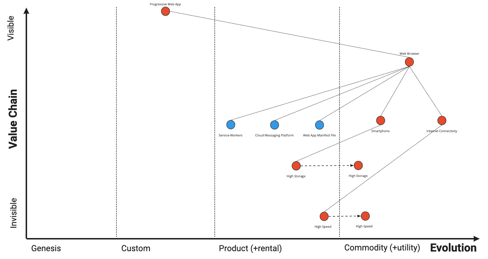

# 失败的产品— PM 注释

> 原文：<https://medium.com/swlh/product-that-failed-pm-notes-27fc38fa1ab8>

作为一名产品人员，我们喜欢谈论我们制造的产品以及它们在市场上取得的成功。我认为反思我们的失败也很重要。什么产品不起作用，为什么不起作用，你能做些什么来避免将来的失败？

最近，作为产品成功的直接负责人，我被要求反思在我任期内失败的产品，这是一个真实的时刻。此外，我相信这是一个很好的时机，因为在经历和现在之间有足够的时间差，能够不带太多情绪地客观分析它。

首先，我粗略地将产品失败定义为产品没有像预期的那样起飞，我们决定不加倍产品开发的努力。

我工作过的一个这样的产品本质上是一个低代码产品开发平台，允许电子商务公司建立他们的在线商店。

虽然这是一个拥挤的市场，有 Pegasystems 这样的巨头在市场领先地位，有 bettyblocks 这样的新贵在利基市场。我们的战略(滩头阵地)是追求进步的 web 应用程序开发市场。为此，我们的主要假设是

1.  低存储—人们的移动设备上没有足够的存储空间来安装他们想要的所有应用程序。
2.  低带宽——许多人通过低带宽连接访问互联网，针对低带宽优化的东西对他们来说很有价值。
3.  商业策略——假设这是一个快餐服务品牌的网络应用，一个核心假设是，人们实际上更喜欢通过品牌的网站直接购买，而不是按需送餐聚合应用。

为了形象化这一点，看一下产品的编辑图:-

Wardley Map For Web Push Notification(Updated 2020)

如上图所示，产品失败的主要原因可以归结为对上述三个核心假设的伪造。让我们带着伪造的原因逐一看一下。

1.  人们的移动设备上没有足够的存储空间来安装他们想要的所有应用程序。虽然我们刚开始时是这样，但在产品开发过程中，市场发展迅速，以如此低的价格提供高容量智能手机，存储对人们来说几乎不是问题。感谢 Xiomi 这样的代工。
2.  低带宽——许多人通过低带宽连接访问互联网，针对低带宽优化的东西对他们来说很有价值。第一点是不幸的，但它并不完全出乎意料，这更多的是一个时间问题。真正的惊喜来自于 2。当我们着手建立一个专注于 PWA 的低代码开发平台时。互联网带宽仍然是一个问题，没有明显的迹象可以很快解决这个问题。在 Jio 出现之前，几乎是在一夜之间，互联网带宽对于我们目标市场中的数千万人来说不成问题。
3.  假设这是一个快餐服务品牌的网络应用程序，一个核心假设是，人们实际上更喜欢通过品牌网站直接购买，而不是按需送餐聚合应用程序。事后来看，这是我们分析中选择这个用例的一个真正的盲点。一个常见的用例，由快速发展、积极进取和资金极其充足的初创公司提供服务。难怪市场更喜欢通过按需送餐聚合服务而不是品牌网站来购买。

综上所述，这次经历非常清楚地表明了投资**产品发现**的重要性。如上所述，大多数原因是由于市场的变化，我在这里并不是说有一种方法可以击败市场，或者也许有，我想我们永远不会知道。相反，我认为我们本可以更加系统化地解决这个问题，有条不紊地发现/或缺少动态市场所需的产品，**提前指出潜在的风险**，然后客观地一个接一个地努力消除这些风险，同时让所有利益相关方与我们正在取得的实际进展保持一致，而不是过度承诺并让自己失望。

产品发现本身是一个非常重要的概念，可以很容易地在自己的博客上发表，但我真的想在这篇文章中简单地谈一下，并在一个高层次上谈论它。

**那么，什么是产品发现？**

其核心是，当你要求你的开发者构建一个解决方案/产品时，它确保**是**。他们相信他们的努力不会白费，也就是说，最终用户至少会使用他们构建的东西，如果他们不喜欢的话。**构建正确的 it 与构建正确的 it 同等重要**如果做不到这一点，不仅会在财务指标上付出高昂的代价，还会对您的团队文化造成巨大的挫折，甚至会让人士气低落。

所以，下一次当你想出一个潜在的解决方案时，你也应该确保这个解决方案至少能抵御 4 种风险

*   易感性——用户真的会在意吗？
*   用户能够使用它吗？
*   可行性——你能用“…”来建造它吗？面”
*   可行性——这在商业上有意义吗？

我计划在接下来的文章中写一篇关于**产品发现**的扩展文章，来分享一些关于成功地为你的产品/功能/想法进行产品发现的其他学习/技巧。敬请关注。