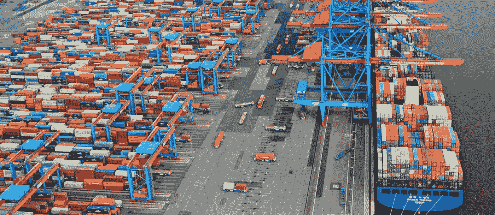

# KOPS 在 AWS 中的 Kubernetes 的生产设置

> 原文：<https://medium.com/swlh/production-setup-for-kubernetes-with-kops-in-aws-46fc68872c03>

Containers getting ready to be loaded onto a ship for transportation. (credits: [gcaptain.com](https://gcaptain.com/13000-containership-hyundai/))

# 介绍

在上一篇博客中，我们使用 AWS 中的 KOPS 设置了一个[简单的 K8 集群，这是下一部分，以将设置扩展到用于生产工作负载的高度可用和可伸缩的 K8 集群。](/@naikaa/kubernetes-with-kops-7d5b3378ca7a)

对于生产级 K8 群集，我们将在专用子网中创建群集。我们将在每个 AZ 创建 3 个主人。我们将创建 3 个实例组…