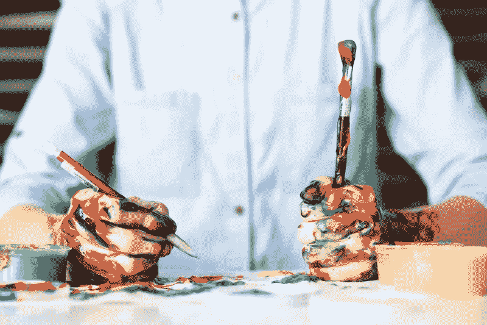

# 生产力与创造力

> 原文：<https://medium.com/swlh/productivity-versus-creativity-d5fea6319b00>

创造性工作与常规工作有何不同，以及为什么我们需要改变心态来接受我们最好的想法。

Photo by [Alice Achterhof](https://unsplash.com/photos/FwF_fKj5tBo?utm_source=unsplash&utm_medium=referral&utm_content=creditCopyText) on [Unsplash](https://unsplash.com/search/photos/creativity?utm_source=unsplash&utm_medium=referral&utm_content=creditCopyText)

我真的很喜欢编故事，但我是一名职业作家，以写真实生活、成人的事情为生，这使得讲述虚构的故事非常困难。

我最近一直有写作障碍的情况。我一直在想怎么才能…