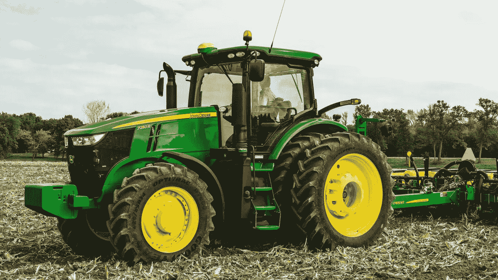
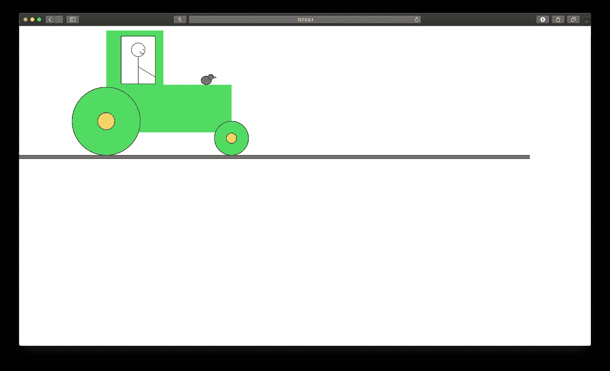
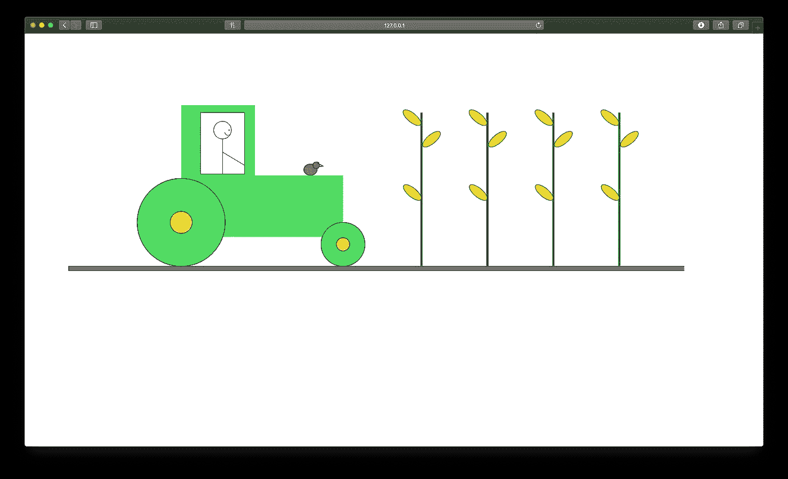
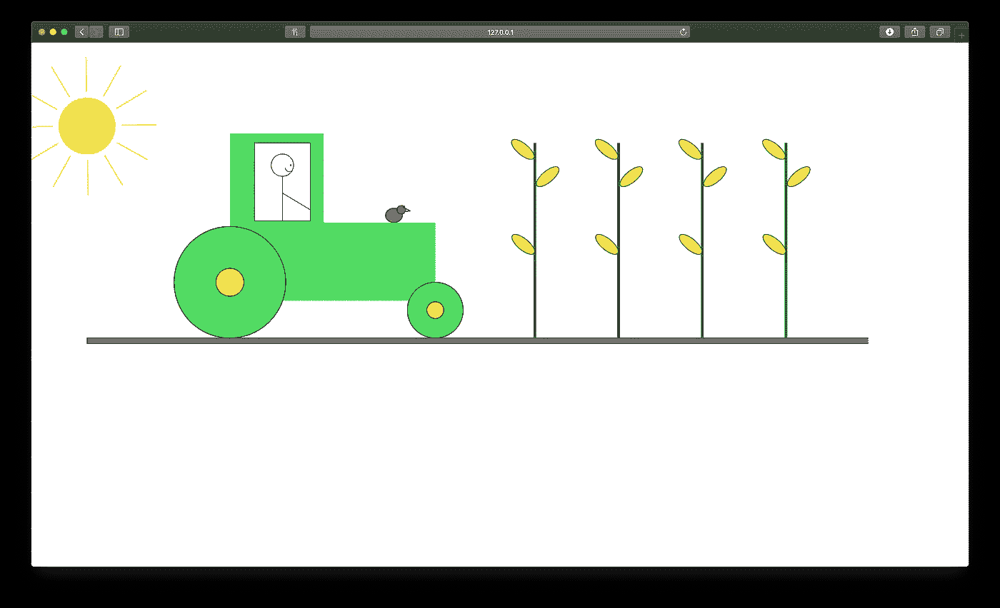
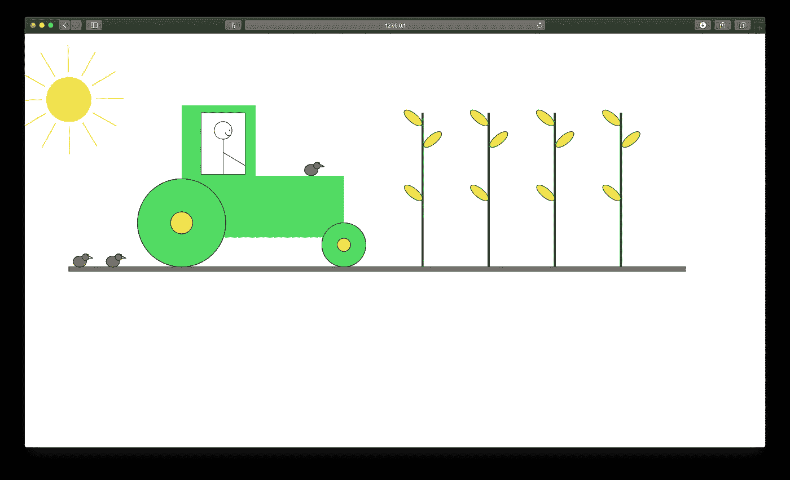

# 项目 1:绘制拖拉机场景

> 原文：<https://medium.com/swlh/project-1-draw-a-tractor-scene-47805710ee33>

原型交互 I (SDEG-600)

本内容是我在托马斯·杰弗逊大学读 UX/IxD 硕士研究生期间完成的作品集的一部分。

*在这里，我记录了我在 2019 年夏天参加原型交互 I 课程时的进展。一部分是学习如何使用*[*P5 . js*](http://p5js.org)*API 用 javascript 编码，一部分是学习设计真实世界的交互。*

*关注我*[*LinkedIn*](http://linkedin.com/in/gloriajulien)*。*

# 目标

## 目标:

在我们的第一个关于 [p5.js](http://p5js.org/reference/) 的介绍性课程中，我们的任务是在作为我们浏览器窗口的空白画布中创建一辆拖拉机。总体目标是开始熟悉 p5.js API 提供的方法。

## 方法:

使用各种绘制方法，包括直线( )、曲线( )、椭圆( )和矩形()。改变颜色和位置。

## 步骤:

1.  设置绘图。
2.  创建拖拉机的基本形状。
3.  画农夫。 *//作为一个类完成的最后一步*
4.  画一只鸡。 *//开始单独工作*
5.  做一片玉米地。
6.  画一个太阳。
7.  多交些鸡朋友。

# 第一步。设置绘图

作为参考，我们使用了 John Deere 为您带来的标志性绿色和黄色拖拉机。



John Deere tractor (Found via Google Images)

作为 javascript 奇妙功能的新手，我们首先将拖拉机分解成基本形状:矩形、圆形、较小的圆形和较小的矩形。

为了设置画布，我们在 **setup( )** 函数中定义了高度和宽度。

```
function setup() {
 createCanvas(1500,800)
}
```

# 第二步。创建拖拉机的基本形状

为了开始形成我们的拖拉机，我们利用一些基本的形状函数来绘制。

```
function setup() {
 createCanvas(1500,800)
}function draw() { //Tractor Body
 noStroke()
 fill(80,220,100)
 rect(256,13,168,300) //Tractor Front Body
 rect(424,173,200,140) //Rear Wheel
 stroke(0,0,0)
 ellipseMode(CENTER)
 ellipse(256,280,200,200) //Rear Hub Wheel
 fill(255,218,88)
 ellipse(256,280,50,50) //Front Wheel
 fill(80,220,100)
 ellipse(624,330,100,100) //Front Hub Wheel
 fill(255,218,88)
 ellipse(624,330,30,30) //Ground
 fill(128,128,128)
 rect(0,380,width,10) //Window
 fill(255,255,255)
 rect(300,30,100,140)}
```

## 输出:


Step 2\. Create basic shapes for the tractor

那是一辆好看的拖拉机。

# 第三步。画农夫

我们需要有人征用拖拉机。农夫戴尔出场。使用简单的几何图形，如椭圆、直线和曲线，我们可以创建一个快乐的农民谷。

```
function setup() {
 createCanvas(1500,800)
}function draw() {//Tractor Body
 noStroke()
 fill(80,220,100)
 rect(256,13,168,300)//Tractor Front Body
 rect(424,173,200,140)//Rear Wheel
 stroke(0,0,0)
 ellipseMode(CENTER)
 ellipse(256,280,200,200)//Rear Hub Wheel
 fill(255,218,88)
 ellipse(256,280,50,50)//Front Wheel
 fill(80,220,100)
 ellipse(624,330,100,100)//Front Hub Wheel
 fill(255,218,88)
 ellipse(624,330,30,30)//Ground
 fill(128,128,128)
 rect(0,380,width,10)//Window
 fill(255,255,255)
 rect(300,30,100,140) //Driver
 ellipse(350,70,40,40)
 line(350,90,350,170)
 line(350,120,400,150) //Smile
 curve(350,20,355,75,368,80,370,70)
 fill(0,0,0)
 ellipse(365,70,2,2)} 
```

## 输出:


Step 3\. Draw the farmer

# 第四步。画一只鸡

没有鸡的农场是不完整的。我决定将它们添加到简单的椭圆中，并创建一些线条来制作鸡的喙。

```
function setup() {
 createCanvas(1500,800)
}function draw() {//Tractor Body
 noStroke()
 fill(80,220,100)
 rect(256,13,168,300)//Tractor Front Body
 rect(424,173,200,140)//Rear Wheel
 stroke(0,0,0)
 ellipseMode(CENTER)
 ellipse(256,280,200,200)//Rear Hub Wheel
 fill(255,218,88)
 ellipse(256,280,50,50)//Front Wheel
 fill(80,220,100)
 ellipse(624,330,100,100)//Front Hub Wheel
 fill(255,218,88)
 ellipse(624,330,30,30)//Ground
 fill(128,128,128)
 rect(0,380,width,10)//Window
 fill(255,255,255)
 rect(300,30,100,140)//Driver
 ellipse(350,70,40,40)
 line(350,90,350,170)
 line(350,120,400,150)//Smile
 curve(350,20,355,75,368,80,370,70)
 fill(0,0,0)
 ellipse(365,70,2,2)//Chicken
  fill(172,98,77)
  ellipse(550,160,30,25)
  ellipse(563,150,15,15)
  line(571,148,579,152)
  line(571,153,579,152)
  fill(0,0,0)
  ellipse(568,145,3,3)}
```

## 输出:



Step 4\. Draw some chickens

# 第五步。做一片玉米地

我是一个玉米爱好者，所以对我来说包括玉米秸秆是很自然的。我使用了 **rect()、rotate()、translate()、**和 **ellipse( )** 函数来制作它们。此外，我决定将整个画布向中心移动。

为了旋转玉米棒，我必须声明**角度模式(度数)**。因此，我将这一行代码添加到我的 **setup( )** 函数中。在玩了 translate()和 rotate()函数之后，我让我的玉米棒子在我的玉米杆上看起来很好很饱满。

此外，我练习使用 **push( )** 和 **pop( )** 函数来控制画布相对于我编写的其他代码的移动方式。我不想让我的后续代码被之前写的代码控制。因此，添加 push()和 pop()函数允许我编写特定于玉米棒的控制函数。

```
function setup() {
 createCanvas(1500,800)
 angleMode(DEGREES)
}function draw() {
 translate(100,150)
 push()//Tractor Body
 noStroke()
 fill(80,220,100)
 rect(256,13,168,300)//Tractor Front Body
 rect(424,173,200,140)//Rear Wheel
 stroke(0,0,0)
 ellipseMode(CENTER)
 ellipse(256,280,200,200)//Rear Hub Wheel
 fill(255,218,88)
 ellipse(256,280,50,50)//Front Wheel
 fill(80,220,100)
 ellipse(624,330,100,100)//Front Hub Wheel
 fill(255,218,88)
 ellipse(624,330,30,30)//Ground
 fill(128,128,128)
 rect(0,380,width,10)//Window
 fill(255,255,255)
 rect(300,30,100,140)//Driver
 ellipse(350,70,40,40)
 line(350,90,350,170)
 line(350,120,400,150)//Smile
 curve(350,20,355,75,368,80,370,70)
 fill(0,0,0)
 ellipse(365,70,2,2)//Chicken
 fill(172,98,77)
 ellipse(550,160,30,25)
 ellipse(563,150,15,15)
 line(571,148,579,152)
 line(571,153,579,152)
 fill(0,0,0)
 ellipse(568,145,3,3)//Corn Stalks 1
 fill(18,126,41)
 noStroke()
 rect(800,30,5,350)
 fill(234,213,34)
 stroke(18,126,41)//Corn
 push()
 rotate(40)
 translate(-175,-500)
 ellipse(800,30,50,20)
 pop()
 push()
 rotate(40)
 translate(-65,-400)
 ellipse(800,60,50,20)
 pop()
 push()
 rotate(-40)
 translate(-236,500)
 ellipse(810,100,50,20)
 pop()//Corn Stalks 2
 translate(150,0)
 fill(18,126,41)
 noStroke()
 rect(800,30,5,350)
 fill(234,213,34)
 stroke(18,126,41)//Corn
 push()
 rotate(40)
 translate(-175,-500)
 ellipse(800,30,50,20) pop()
 push()
 rotate(40)
 translate(-65,-400)
 ellipse(800,60,50,20)
 pop()
 push()
 rotate(-40)
 translate(-236,500)
 ellipse(810,100,50,20)
 pop()//Corn Stalks 3
 translate(150,0)
 fill(18,126,41)
 noStroke()
 rect(800,30,5,350)
 fill(234,213,34)
 stroke(18,126,41)//Corn
 push()
 rotate(40)
 translate(-175,-500)
 ellipse(800,30,50,20)
 pop()
 push()
 rotate(40)
 translate(-65,-400)
 ellipse(800,60,50,20)
 pop()
 push()
 rotate(-40)
 translate(-236,500)
 ellipse(810,100,50,20)
 pop()//Corn Stalks 4
 translate(150,0)
 fill(18,126,41)
 noStroke()
 rect(800,30,5,350)
 fill(234,213,34)
 stroke(18,126,41)//Corn
 push()
 rotate(40)
 translate(-175,-500)
 ellipse(800,30,50,20)
 pop()
 push()
 rotate(40)
 translate(-65,-400)
 ellipse(800,60,50,20)
 pop()
 push()
 rotate(-40)
 translate(-236,500)
 ellipse(810,100,50,20)
 pop() pop()}
```

## 输出:



Step 5\. Make a cornfield

# 第六步。画一个太阳

然后，我添加了一个太阳来完成风景和田野里阳光灿烂的幻想。类似于玉米棒，我画了一条线，绕着太阳的中心旋转。再次使用 push()和 pop()来确保旋转只发生在我的 sun 代码中。

```
function setup() {
  // put setup code here
  createCanvas(1500,800)
  angleMode(DEGREES)
}function draw() {
  translate(100,150)//Tractor Body
  push()
  noStroke()
  fill(80,220,100)
  rect(256,13,168,300)//Tractor Front Body
  rect(424,173,200,140)//Rear Wheel
  stroke(0,0,0)
  ellipseMode(CENTER)
  ellipse(256,280,200,200)//Rear Hub Wheel
  fill(255,218,88)
  ellipse(256,280,50,50)//Front Wheel
  fill(80,220,100)
  ellipse(624,330,100,100)//Front Hub Wheel
  fill(255,218,88)
  ellipse(624,330,30,30)//Ground
  fill(128,128,128)
  rect(0,380,width,10) //width will call the current width of the canvas//Window
  fill(255,255,255)
  rect(300,30,100,140)//Driver
  ellipse(350,70,40,40)
  line(350,90,350,170)
  line(350,120,400,150)//Smile
  curve(350,20,355,75,368,80,370,70)
  fill(0,0,0)
  ellipse(365,70,2,2)//Chicken
  fill(172,98,77)
  ellipse(550,160,30,25)
  ellipse(563,150,15,15)
  line(571,148,579,152)
  line(571,153,579,152)
  fill(0,0,0)
  ellipse(568,145,3,3)//Corn Stalks 1
  fill(18,126,41)
  noStroke()
  rect(800,30,5,350)
  fill(234,213,34)
  stroke(18,126,41)//Corn
  push()
  rotate(40)
  translate(-175,-500)
  ellipse(800,30,50,20)
  pop()
  push()
  rotate(40)
  translate(-65,-400)
  ellipse(800,60,50,20)
  pop()
  push()
  rotate(-40)
  translate(-236,500)
  ellipse(810,100,50,20)
  pop()//Corn Stalks 2
  translate(150,0)
  fill(18,126,41)
  noStroke()
  rect(800,30,5,350)
  fill(234,213,34)
  stroke(18,126,41)//Corn
  push()
  rotate(40)
  translate(-175,-500)
  ellipse(800,30,50,20)
  pop()
  push()
  rotate(40)
  translate(-65,-400)
  ellipse(800,60,50,20)
  pop()
  push()
  rotate(-40)
  translate(-236,500)
  ellipse(810,100,50,20)
  pop()//Corn Stalks 3
  translate(150,0)
  fill(18,126,41)
  noStroke()
  rect(800,30,5,350)
  fill(234,213,34)
  stroke(18,126,41)//Corn
  push()
  rotate(40)
  translate(-175,-500)
  ellipse(800,30,50,20)
  pop()
  push()
  rotate(40)
  translate(-65,-400)
  ellipse(800,60,50,20)
  pop()
  push()
  rotate(-40)
  translate(-236,500)
  ellipse(810,100,50,20)
  pop()//Corn Stalks 4
  translate(150,0)
  fill(18,126,41)
  noStroke()
  rect(800,30,5,350)
  fill(234,213,34)
  stroke(18,126,41)//Corn
  push()
  rotate(40)
  translate(-175,-500)
  ellipse(800,30,50,20)
  pop()
  push()
  rotate(40)
  translate(-65,-400)
  ellipse(800,60,50,20)
  pop()
  push()
  rotate(-40)
  translate(-236,500)
  ellipse(810,100,50,20)
  pop()
  pop()//Sun
  push()
  fill(255,239,100)
  stroke(238,218,56)
  ellipse(0,0,100,100)
  line(54,30,108,60)
  rotate(30)
  line(54,30,108,60)
  rotate(30)
  line(54,30,108,60)
  rotate(30)
  line(54,30,108,60)
  rotate(30)
  line(54,30,108,60)
  rotate(30)
  line(54,30,108,60)
  rotate(30)
  line(54,30,108,60)
  rotate(30)
  line(54,30,108,60)
  rotate(30)
  line(54,30,108,60)
  rotate(30)
  line(54,30,108,60)
  rotate(30)
  line(54,30,108,60)
  rotate(30)
  line(54,30,108,60)
  pop()
}
```

## 输出:



Step 6\. Draw a sun

# 第七步。多交些鸡朋友

一只鸡对我来说不够，所以我使用 translate()函数添加了更多。

```
function setup() {
  // put setup code here
  createCanvas(1500,800)
  angleMode(DEGREES)
}function draw() {
  translate(100,150)//Tractor Body
  push()
  noStroke()
  fill(80,220,100)
  rect(256,13,168,300)//Tractor Front Body
  rect(424,173,200,140)//Rear Wheel
  stroke(0,0,0)
  ellipseMode(CENTER)
  ellipse(256,280,200,200)//Rear Hub Wheel
  fill(255,218,88)
  ellipse(256,280,50,50)//Front Wheel
  fill(80,220,100)
  ellipse(624,330,100,100)//Front Hub Wheel
  fill(255,218,88)
  ellipse(624,330,30,30)//Ground
  fill(128,128,128)
  rect(0,380,width,10) //width will call the current width of the canvas//Window
  fill(255,255,255)
  rect(300,30,100,140)//Driver
  ellipse(350,70,40,40)
  line(350,90,350,170)
  line(350,120,400,150)//Smile
  curve(350,20,355,75,368,80,370,70)
  fill(0,0,0)
  ellipse(365,70,2,2)//Chicken
  fill(172,98,77)
  ellipse(550,160,30,25)
  ellipse(563,150,15,15)
  line(571,148,579,152)
  line(571,153,579,152)
  fill(0,0,0)
  ellipse(568,145,3,3)//Corn Stalks 1
  fill(18,126,41)
  noStroke()
  rect(800,30,5,350)
  fill(234,213,34)
  stroke(18,126,41)//Corn
  push()
  rotate(40)
  translate(-175,-500)
  ellipse(800,30,50,20)
  pop()
  push()
  rotate(40)
  translate(-65,-400)
  ellipse(800,60,50,20)
  pop()
  push()
  rotate(-40)
  translate(-236,500)
  ellipse(810,100,50,20)
  pop()//Corn Stalks 2
  translate(150,0)
  fill(18,126,41)
  noStroke()
  rect(800,30,5,350)
  fill(234,213,34)
  stroke(18,126,41)//Corn
  push()
  rotate(40)
  translate(-175,-500)
  ellipse(800,30,50,20)
  pop()
  push()
  rotate(40)
  translate(-65,-400)
  ellipse(800,60,50,20)
  pop()
  push()
  rotate(-40)
  translate(-236,500)
  ellipse(810,100,50,20)
  pop()//Corn Stalks 3
  translate(150,0)
  fill(18,126,41)
  noStroke()
  rect(800,30,5,350)
  fill(234,213,34)
  stroke(18,126,41)//Corn
  push()
  rotate(40)
  translate(-175,-500)
  ellipse(800,30,50,20)
  pop()
  push()
  rotate(40)
  translate(-65,-400)
  ellipse(800,60,50,20)
  pop()
  push()
  rotate(-40)
  translate(-236,500)
  ellipse(810,100,50,20)
  pop()//Corn Stalks 4
  translate(150,0)
  fill(18,126,41)
  noStroke()
  rect(800,30,5,350)
  fill(234,213,34)
  stroke(18,126,41)//Corn
  push()
  rotate(40)
  translate(-175,-500)
  ellipse(800,30,50,20)
  pop()
  push()
  rotate(40)
  translate(-65,-400)
  ellipse(800,60,50,20)
  pop()
  push()
  rotate(-40)
  translate(-236,500)
  ellipse(810,100,50,20)
  pop()
  pop()//Sun
  push()
  fill(255,239,100)
  stroke(238,218,56)
  ellipse(0,0,100,100)
  line(54,30,108,60)
  rotate(30)
  line(54,30,108,60)
  rotate(30)
  line(54,30,108,60)
  rotate(30)
  line(54,30,108,60)
  rotate(30)
  line(54,30,108,60)
  rotate(30)
  line(54,30,108,60)
  rotate(30)
  line(54,30,108,60)
  rotate(30)
  line(54,30,108,60)
  rotate(30)
  line(54,30,108,60)
  rotate(30)
  line(54,30,108,60)
  rotate(30)
  line(54,30,108,60)
  rotate(30)
  line(54,30,108,60)
  pop()

//Chicken Friends
  translate(-450,208)
  fill(172,98,77)
  ellipse(550,160,30,25)
  ellipse(563,150,15,15)
  line(571,148,579,152)
  line(571,153,579,152)
  fill(0,0,0)
  ellipse(568,145,3,3)
  translate(-75,0)
  fill(172,98,77)
  ellipse(550,160,30,25)
  ellipse(563,150,15,15)
  line(571,148,579,152)
  line(571,153,579,152)
  fill(0,0,0)
  ellipse(568,145,3,3)
}
```

## 输出:



Step 7\. Make more chicken friends

现在我有一个快乐的农民，他被他的鸡朋友们包围着。(让我们假装他们不知道他们可能会在砧板上…)

# 经验教训

在发现 rotate()函数后，我很快意识到我想要旋转的对象不会围绕自己的中心旋转。相反，旋转相对于画布的'(0，0)坐标发生。因此，当旋转玉米棒时，我使用试错法来直观地将它们定位在我想要的位置。这不是最有效的方法。将来，我会考虑用数学方法绘制出我想要的位置，以确定我的玉米棒子的坐标。

*感谢阅读！请留下你认为可能帮助我提高技能的评论。也许我可以尝试一些新的东西。我很想试一试。*

*关注我*[*LinkedIn*](http://linkedin.com/in/gloriajulien)*。*