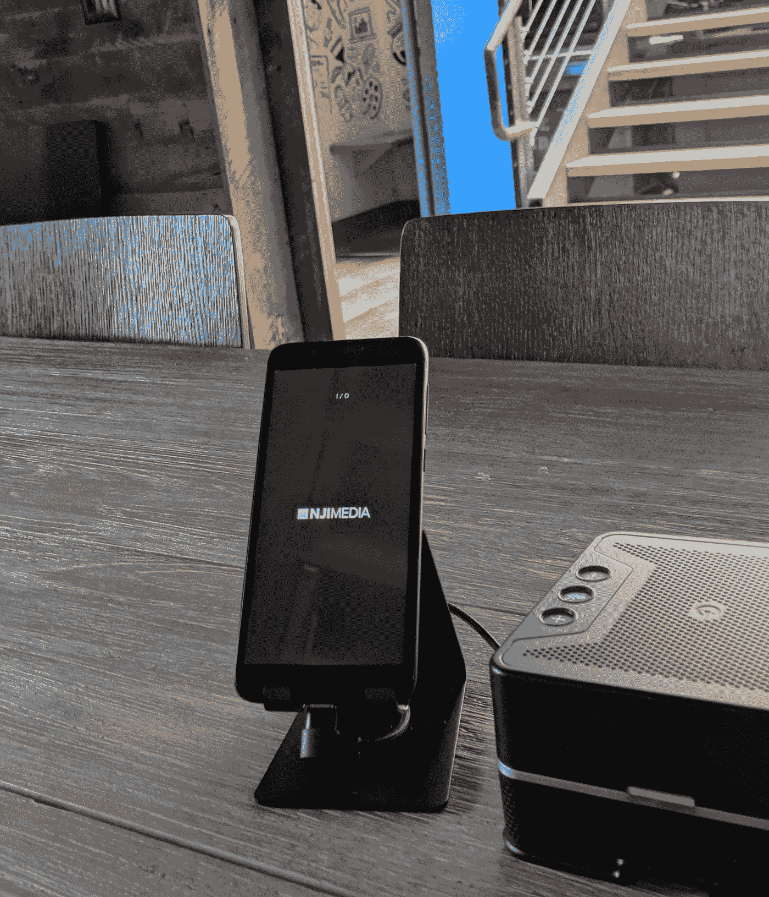

# 项目:自定义 AV 遥控器 w/ Flutter 和索尼音频控制 API

> 原文：<https://medium.com/swlh/project-custom-av-remote-w-flutter-and-sony-audio-control-api-7f391cc0b036>

*项目总结*

使用 Flutter UI 框架、紧凑型触摸屏和索尼 AV 接收器构建的定制音频/视频系统遥控器。

*消息来源*

*   远程 App 来源:【https://github.com/dtateii/sony-remote 
*   索尼音频控制 API 参考…