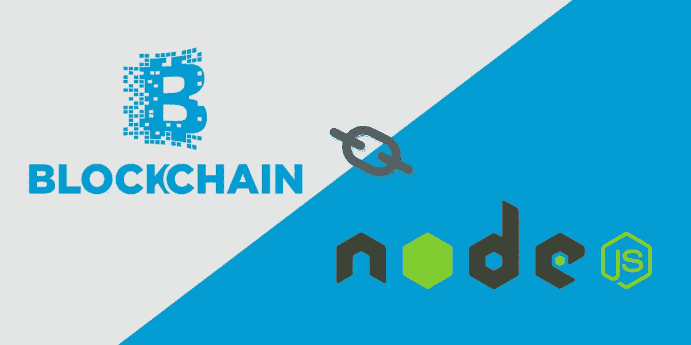

# 使用 Hyperledger Fabric v 1 . 1 . 0-preview 和 NodeJS SDK 的项目设置

> 原文：<https://medium.com/swlh/project-setup-using-hyperledger-fabric-v1-1-0-preview-and-nodejs-sdk-70ca4c4331be>

正如我们所知，区块链现在是一项非常迅速的新兴技术，正被用于 DApps 的开发。区块链并没有提供技术世界中现有的任何新功能。区块链所做的是，它将一些可用的功能组合到一个单独的包中，这减少了工作量以及代码质量和大小。所以…