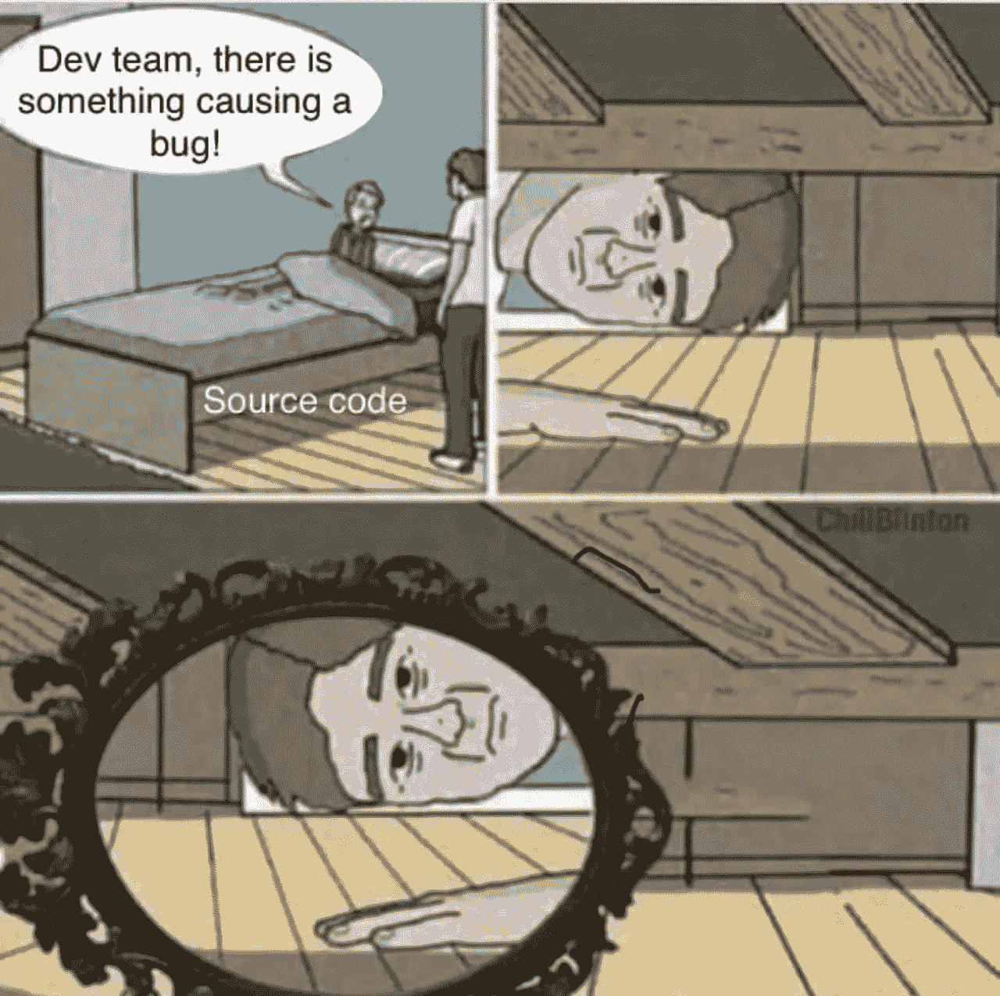

# 促进代码库的共同责任

> 原文：<https://medium.com/swlh/promoting-shared-accountability-of-a-codebase-fe71b5cdfa0f>

Shoutout to [/r/ProgrammerHumor](https://www.reddit.com/r/ProgrammerHumor/comments/b8eyj4/woah/)

每个维护生产系统足够长时间的程序员都有过这样的时刻，他们调查了一个生产问题，做出了一个草率的判断，即产生错误的代码是粗心的，不应该通过代码审查，走上了一条找出是谁写的代码的战争之路，然后有了运行 *git 责备*并意识到是他们两年前提交了该代码的屈辱经历。