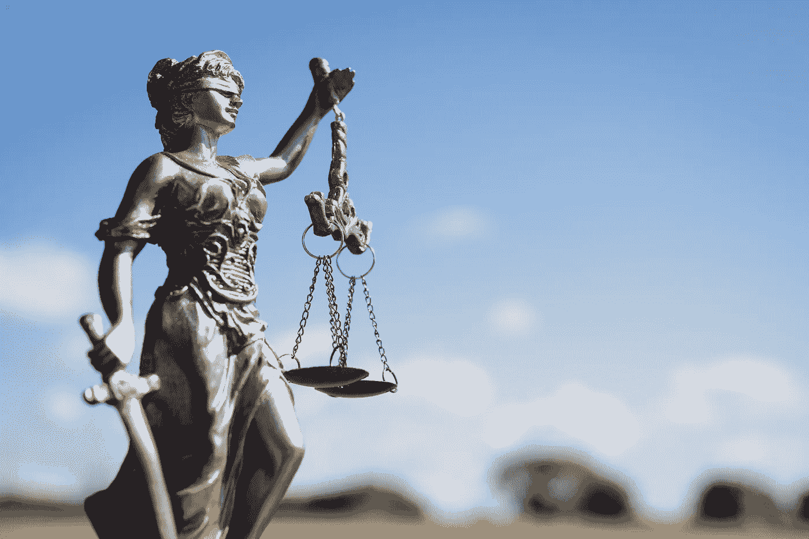

# 在数字资本主义中保护公民权利

> 原文：<https://medium.com/swlh/protecting-civil-rights-in-digital-capitalism-1daca069599>

监管脸书、推特&公司并不是要剥夺自由。而是拯救它。为了所有人的利益，包括公司本身。

越来越多的人觉得数字资本主义出了大问题。当我还是个孩子的时候，我的一个同学在一所公立学校的墙上写了一些愚蠢和非法的东西。他不是个坏孩子。这只是其中之一…