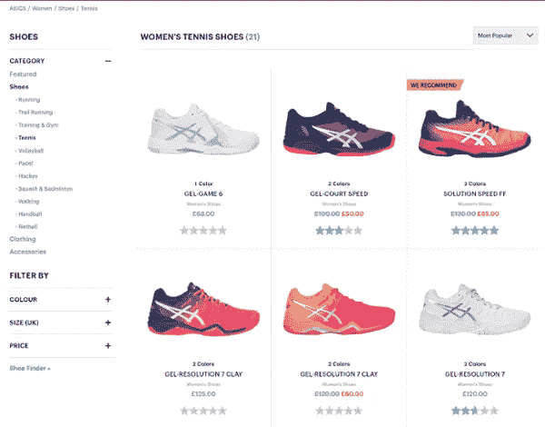

# 心理营销 101:为什么它不是邪恶的，只是被误解了

> 原文：<https://medium.com/swlh/psychographic-marketing-101-why-it-isnt-evil-just-misunderstood-e4f7465f217e>

在过去的十年里，我们见证了一个不断增长的现象，随着我们的注意力持续时间迅速缩短，注意力需求者也在增加。

每天都有成百上千的品牌在不断竞争当今最有价值的货币——注意力。我们生活在一个 24/7 的社会中，个人永远被耸人听闻的全球新闻、源源不断的社交媒体信息以及网络中几乎任何连接的即时通信所吞噬。

这让营销人员陷入了困境。

心理营销通过推广能引起受众共鸣的信息，帮助营销人员渗透注意力经济。它通过为数据驱动的方法提供工具，使意大利面条式的品牌传播方法成为历史。

但是你如何开始心理营销呢？

在本帖中，我们会给你所有你需要的信息，要么开始心理营销，要么为你的下一个项目获得灵感。

# 什么是心理图形？

**心理图形回答了*为什么*人会根据他们的生活方式、兴趣、动机和个性**行事。当谈到数据时，它们代表了了解个人的定性方面。

心理测量学通过给个人资料添加柔和的一面来完善客户角色。它们与其他三种关键数据类型结合使用时效果最佳。

快速回顾一下，您有四种主要类型的数据，经常用于研究、营销或业务规划。除了心理学，还有:

**人口统计数据**向你展示你的受众是谁，这些静态数据包括年龄、性别、职业、地点和婚姻状况。

**行为数据**向你展示*他们如何在你的网站上行动*。行为数据通常由微事件表示，如点击率、加入购物车等。

**交易数据**向您展示个人在您的网上商店购买的订单价值、产品识别号和产品数量。

这四种数据类型结合在一起，形成了您的购物者和客户的整体视图。这种 360°视角将为您提供所需的洞察力，以创建更有可能引起共鸣的数据驱动型营销活动。

# 如何找到营销心理数据

早在 60 年代，[当心理学首次被用作研究参与者的标识符](https://archive.ama.org/archive/ResourceLibrary/MarketingResearch/documents/9511240220.pdf)时，收集这些有价值的数据要困难得多。研究人员被迫通过采访和调查手动收集数据。

如今，心理数据收集从未如此简单。你的网站、社交媒体广告和论坛拥有许多关于目标受众的金块信息。

如今，数据不仅更容易找到，而且也更可靠。这是因为当个体处于他们所谓的“自然环境”中时，可以捕捉到心理图形

让我们来看看几种最有效的心理营销研究方法:

# 1.谷歌分析

作为一名营销人员，很难不对 Google Analytics 情有独钟。它是免费的。很详细。这是实时的。我可以说，这是悦耳的音乐。

嗯，事情开始好转了。在 GA 上，你也可以访问你的网站访问者的一些广泛的心理特征。只要去分析，点击观众，兴趣，你有它，你的网站访问者的兴趣类别。

如果您单击其中一个类别，您可以通过设置“次要维度”，根据来源、媒介或许多其他变量对兴趣进行排序

如果你对受众的一些首要兴趣感兴趣，谷歌分析可能是一个很好的起点。比方说，你可以利用这些见解来激励各种渠道的内容营销或活动。

# 2.社会化媒体

几乎每一个提供广告服务的社交媒体平台都会提供关于你的追随者心理特征的细节。

你可以在 Twitter 上找到这些数据，方法是进入 Twitter 广告-分析-受众洞察。这将有助于了解你的活动受众、追随者、有机受众、定制受众和所有 Twitter 用户的人口统计数据和兴趣。

脸书也提供类似的服务。要访问这些，请到您的业务经理那里，单击左上角的汉堡菜单图标，选择观众观察，然后选择以下任一选项:

*   **脸书的每个人**都在寻找更多关于潜在顾客的信息，这些顾客可能是你广告活动的目标。
*   **连接到您页面的人**了解更多关于已经在脸书关注您品牌的人的信息，以便您能够更好地重新吸引这些人。

从那里，[你可以搜索各种各样的](https://blog.hootsuite.com/facebook-audience-insights/)兴趣、页面喜好和人口统计数据。

# 3.文本分析

你也可以使用文本分析[从文本来源](https://www.crimsonhexagon.com/blog/how-text-analytics-works-for-social-media/)中获取信息。这可以用于任何基于文本的平台，从社交媒体和博客到论坛帖子和通话记录。

文本分析帮助你更清楚地了解听众的情绪、用词、短语以及他们讨论的共同话题。

收集过程通常由技术来推动，您也可以通过进行内容分析来手动完成。或者，如果你有使用 python 的经验，你可以[挖掘文本](https://www.analyticsvidhya.com/blog/2018/02/the-different-methods-deal-text-data-predictive-python/)。

在论坛上进行分析，比如 Quora，覆盖你所在行业的博客，Twitter，脸书，或者任何你知道你的目标受众经常光顾的网站。

# 4.网站数据

收集心理图形的一个更高级的选择是在你的网站上进行实验。在这里，你可以分析你的行为数据，并通过基于理论的方法将其转化为心理图形。

用这种方法，你将运行各种实验来测试你的访问者对文案、心理学原理、产品特性等的反应。

查看这篇关于[将行为数据转化为心理图形](https://blog.crobox.com/article/psychographic-data)的博客，获得一步一步的指导。

# 5.客户调查、访谈、焦点小组

自然地，你也可以走老路，和你的客户坐下来了解他们明确的偏好和期望。

顾客调查可以在购买后发送。为完成调查提供一点激励不仅会增加完成调查的可能性，还能鼓励回访行为。

然而，调查的范围是有限的，因为它们必须足够短，以保持填写者(短暂的)注意力。一对一的面试通常比表面更深入一些，更详细地描述他们的经历。

进行这些采访的一个相对低成本的方法是通过电话。也有人说，电话面试更有可能产生诚实的反馈，因为他们在[他们的自然环境](https://contentmarketinginstitute.com/2011/05/one-on-one-interviews-b2b-audience/)。

如果财政资源比时间资源更不是问题，那么焦点小组是在四分之一的时间内让各种利益相关者参与进来的好方法。请注意，这可能会让你的发现受到“[群体效应](https://www.insightsassociation.org/issues-policies/glossary/group-effect)”的影响，参与者的答案会被群体中直言不讳的人带偏。

# 心理营销的例子

你可以在整个顾客旅程中使用心理营销，从认知到保留。我们收集了一些心理数字营销的正确案例，以帮助激发你的策略灵感。

# 意识

顾客旅程的第一阶段，认知。在这个品牌集中和喧嚣的时代，你可能很难脱颖而出。通过有效地根据人口统计和兴趣或生活方式锁定被动的个人，让他们出现在你的网站上的机会会大大增加。

这里有几个我们在各种社交媒体中发现的心理营销的例子。

# 推特

互动是在社交媒体世界寻找和吸引新业务的独特机会，因为大多数平台允许你瞄准与这一重大生活事件相关的主要关键词。

考虑你的客户的故事:他们将如何使用你的产品？它们能用于特定的庆祝活动、项目或爱好吗？看一看你在研究阶段获得的数据，将这些发现与吸引人的文案和图片配对，因为它们的相关性更高，会引起被动的注意。

# 脸谱网

社交广告提供的另一个很棒的功能是根据关注的页面或账户来定位。美元剃须俱乐部利用这一功能为吉列追随者提供广告。它很好地抓住了脸书用户的注意力，通过使用一个值得信赖的品牌名称来引发他们的好奇心。

当然，在试图赢得竞争对手的顾客时，你不必表现得如此明显。如果你的数据让你洞察到你的目标受众信任或使用什么样的品牌，你可以把它作为你自己活动的目标标准。

这将让你找到可能认同或想要你品牌产品的新顾客。

# 照片墙

你也可以通过使用由说服技巧驱动的信息来利用心理图形的心理学方面。在这个 Chambord Instagram 广告中，他们使用了对独家稀缺的[偏见，这吸引了寻求有限产品的个人。这些人强烈渴望与众不同，这使得他们更容易对这种形式的信息做出反应。](https://blog.crobox.com/article/scarcity)

[Instagram 提供广泛的定位功能](https://www.wordstream.com/blog/ws/2017/11/20/instagram-advertising)。我发现这个平台上的广告特别有用，因为定位水平可以非常精确。我已经被这些广告诱惑太多次了。这种情况只会加剧，因为这些广告的嵌入性质使得从正常的信息流中检测广告变得更加困难。

# 油管（国外视频网站）

这个安德玛的预滚动广告做了一个伟大的工作，把它的目标观众的一部分的世界:棒球符合 UA 夹板。这显示了他们对棒球的了解，一项你的数据为王的运动。安德玛努力消除这种倾向。

YouTube 允许你根据个人以前的观看历史来锁定他们。这打开了根据表现出的兴趣进行精确定位的大门。有了这种能力，你就可以制作与观众直接相关的精准广告。

# 定位和考虑

客户之旅的下一阶段进入了定位领域。当个人从觉知过渡到定向时，发生的主要转变是意图的改变。在意识阶段，人们仅仅是路人，被动地浏览互联网。

然而，在定位阶段，我们面对的是有购买意向的顾客。他们现在正在探索各种选择，并考虑具体的选择。

# 重新确定活动目标

这是一个很好的重定目标的例子。它的语言与目标受众产生共鸣，它与一年中的时间相关，并且有个人观看的相关产品。

[重定目标可能是一条不归路](https://blog.rebrandly.com/retargeting-campaigns/)，所以一定要小心行事。你不希望因为用户感到被跟踪而被他们从精神上[封锁](https://blog.crobox.com/article/marketing-resistance-psychology)(通常这是一个很好的经验法则)。如果你要使用重定目标，小心使用，不要让个人负担过重。像上面的广告一样，尝试通过唤起拥有产品的人的形象来激励他们。

# 主页

当你假期后要回去工作时，没有什么比走进办公室时看起来如此清新、如此干净更好的了。我们明白了。他们知道他们的顾客也是如此。

当设计主页时，你想抓住注意力，并把行为导向一个特定的地方。这是与你的观众的文化产生共鸣的绝好机会。

# 产品列表页面

产品徽章可以提供双重目的，它们在注册动机触发器的同时驱动行为。Asics 使用徽章利用说服技巧，“我们推荐”使用权威信息来吸引那些向某个领域的专家寻求产品建议的人。

说服技巧可以用来突出不同的产品特征。它是受欢迎的产品吗？使用[社交验证信息](https://blog.crobox.com/article/social-proof)。这是独家优惠吗？[尝试稀缺。这个清单还可以继续下去，只是要确保事先做好调查，以保持完整性。](https://blog.crobox.com/article/scarcity)

# 产品详细信息页面

本例中的智能通知(位于产品图片的底部)将用户的注意力吸引到可能吸引浏览者的特定产品属性上。在这种情况下，在当地采购。

虽然本地采购的含义可能因购物者而异，但了解他们对信息的反应有助于激发该细分市场的营销活动。一般来说，在客户旅程的这一点上，个人需要额外的推动才能前进。

通过突出给定产品的特点，你可以看到哪种产品对特定类型的人更有效。利用这些见解，您可以细分您的目标受众并开展相应的活动。

# 购买

# 手推车

在顾客旅程的这一点上，一切都是为了推动前进。这个例子让购物者知道他们快完成了，这有助于提高完成交易的动力([目标梯度效应](https://www.conversion-uplift.co.uk/glossary-of-conversion-marketing/goal-gradient-effect/))。

其他技巧是专注于品牌 USP，如免费送货、安全结账、限时结账等。

# 检验

你知道赋予你所拥有的物品更多经济价值是一种普遍趋势吗？事实上，心理学家认为，如果你试图清理你的衣柜，你应该考虑如果你在商店里看到某些衣服，你会为它们支付多少钱。这将帮助你摆脱杂乱。

接下来，上面的例子[使用禀赋效应](https://blog.crobox.com/article/behavioral-economics-marketing)来将产品的所有权投射给购物者。人们发现，这种额外的推动非常有效。

# 弃车

让我们面对现实吧，弃车是房间里讨厌的小苍蝇，无论你做什么，它都不会消失。如果你真的想让你的顾客回到你的网站来完成他们的订单，你需要让他们觉得物有所值。

画一幅画，讲一个故事，利用你所掌握的顾客心理信息来唤起必要的意象，让他们回来。Chubbies 通过取悦读者和引发行动来做到这一切。

# 保留

当你进入保留阶段时，你应该对你正在处理的各种细分市场有一个非常清晰的了解。特别是如果你使用有说服力的徽章、通知和推动，你可以开始在你工作的确切领域执行最佳表现的文案。

看看心理测量学的一些特别聪明的应用。

# 电子邮件产品线

我们喜欢这个例子，因为它显示了 Jins 对客户的了解程度。他们不仅以一种急迫的呼吁吸引读者，“要么用它，要么失去它”，而且这与他们的观众的生活事件有关。又名每年更新的利益，可以支付眼镜。

想想你的观众生活中发生了什么。在某些时候或情况下，他们会购买你的品牌吗？试着将你的品牌嵌入到他们的生活方式、文化或习惯行为中，只要对你的产品有意义。

# 电子邮件营销折扣

随着数字原住民年龄的增长，短信和表情符号一代已经占据了中心舞台。事实上，这甚至不是“年轻”一代的专利。如果说有什么不同的话，那就是我父母比我们年轻人更沉迷于手机。

当你想到任何一个人收到的简讯数量时，脱颖而出是值得的。这就是为什么我们喜欢这个凯特·斯派德周六时事通讯。很大胆。它能引起读者的共鸣。它利用稀缺性来驱动行为。

# 开始建造

有了对心理营销的深入介绍，你就有了工具，是时候开始构建了。和任何 DIY 项目一样，一定要保持耐心，一步一步来。

总结一下这个过程:

1.  **了解你的数据**:考虑你已经有哪些数据点。了解如何理解这一点。
2.  **选择你的方法**:收集数据有多种方式，选择对你的品牌有意义的方式。无论是谷歌分析，文本分析，网站数据，还是定性方法，如客户调查，采访和焦点小组。
3.  **实验，迭代，实验**:如果你还不喜欢实验，那就学着去喜欢它。像对待绿叶蔬菜一样对待它，因为，在一天结束时，你可能不喜欢它的味道，但你在日常饮食中需要它。
4.  **冲洗并重复**:这应该是一个连续的过程。一定要检查你的数据，以确保你使用最新的信息，并相应地调整你的方法。

Crobox 是心理营销领域的领导者。我们的技术与我们内部的客户心理学家一起，在您的平台上运行说服实验，因此您可以实时获得心理客户情报。 [*下载我们的白皮书了解更多信息*](https://blog.crobox.com/cs/c/?cta_guid=9856eaae-2532-421c-aad6-ca4584fda633&placement_guid=e4e3cb3a-cb26-4734-af75-cb007f99bf04&portal_id=3782461&canon=https%3A%2F%2Fblog.crobox.com%2Farticle%2Fpsychographic-marketing&redirect_url=APefjpGl5wWiRyOFfThdeJL58lEglFS1YuyV3JZnDmDLMoKbUs9My_1e8qFbRhm4p14DRfSOV1YwzzvqFlqF7voE4Y57j7N2-Rntuqzs2h5wTThZ5tmJ0osTavZYPc7dreJaNN8_8Jsdej1np1GJqFCKffYg3NS0p8IBMwOjZ00_60Z9-xQSBfV8iOV0xXg5ctTROpqbseCqegS5_vnjNRzsYLHpoaLrrXsnd5ouVUZUHzq1v9GeiU0dZYG9QmOej8akw8TUMhxxGj6b1rsHeuPAZLc1Aap0soPE1YiQpuXMN_gifqn3qi4&click=2f79075e-12e8-4778-962c-5b1ef13a1b1c&hsutk=efb1d532a9ad2bd4334e229359c508ed&utm_referrer=https%3A%2F%2Fblog.crobox.com%2F&pageId=7238100959&__hstc=55380212.efb1d532a9ad2bd4334e229359c508ed.1539157259386.1544173313470.1544191863902.66&__hssc=55380212.2.1548846357472&__hsfp=1293094515) *。*

*最初发表于*[*blog.crobox.com*](https://blog.crobox.com/article/psychographic-marketing)*。*

## 这篇文章发表在 [The Startup](https://medium.com/swlh) 上，这是 Medium 最大的创业刊物，拥有+420，678 名读者。

## 在这里订阅接收[我们的头条新闻](https://growthsupply.com/the-startup-newsletter/)。

