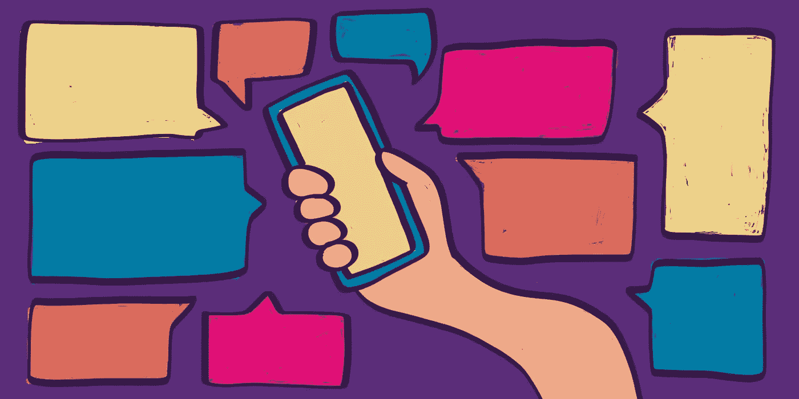

# 推送通知>全部删除？

> 原文：<https://medium.com/swlh/push-notifications-delete-all-79d2ff0f242b>

推它。使劲推。

我唯一能收到的通知是我的随身听需要更换电池的日子已经一去不复返了。今天，你生活中的每一个电子设备都想向你发送某种类型的警报，提醒你一些他们认为重要的事情。如果你真的想一想，甚至你当地的食品配送服务也可能有一个应用程序，它会不断地发送关于某种超级有限折扣的警报，只在未来 3 天内可用。在我们当前的环境中，时间是我们最大的货币，开发应用程序是为了最大限度地吸引用户的注意力。即使你没有使用某个应用程序，它也有可能通过一个简单的叫做**推送通知**的东西，以一种非常简单和成功的方式吸引你的注意力。

# 我们的光芒

现在让我们面对现实吧，可悲的现实是，当你看到手机屏幕发光或听到那种标志性的*乒*声时，你实际上可以感觉到你的肾上腺素因兴奋而激增。但事实上，这种表面上的快乐只是掩盖了一些严重的负面影响，这些负面影响会影响你的注意力、工作效率，甚至是心理健康。关于这一点已经有了多项研究，但大多数人仍然选择要么忽略这个话题，要么完全不做任何事情来改变它。

我觉得有了通知，人和囤积者的思维过程是一样的。他们可能会想“哦，我将来可能需要这个”，或者更具体地说，“哦，我知道这个应用程序到目前为止没有给我任何相关通知，但最终它会给我发送一些重要的信息，我不想错过这些信息。”当我和朋友或同事谈论这个话题时，我有时甚至会听到“我一直开着推送通知，以防万一”的借口，我会问:万一？你最喜欢的航空公司为打开应用程序的前 500 名乘客提供免费机票？或者你喜欢的名人给你发了一条推特，邀请你在接下来的 15 分钟内和他们一起喝杯咖啡？不幸的是，我非常怀疑这些或类似的事情会发生。俗话说，如果过去没有发生过，将来也不会发生——或者类似的事情。人们找到借口囤积推送通知，第一步就是承认自己有问题。

# 我的应用想我了

当我收到某个应用程序的推送通知时，我第一次开始考虑这个问题，通知只有三个字“我们想你”，后面是沉思的表情符号。这让我想到“应用程序开发者真的认为我会在尝试玩一些情感游戏后停止一切来使用应用程序吗？”。但具有讽刺意味的是，我实际上停止了正在做的事情，去查看那个推送通知。诚然，我不知道它会包含这样无用的内容，但是，我看到了该死的光芒，我暂停了我的工作，抓起我的手机。我认为最终的问题是:为什么我允许接收这种类型的警报？所以在那一刻，我故意停下一切，决定看看我的推送通知设置。

我很快发现，我手机上超过一半的应用程序都打开了推送通知。这让我想到了另一个问题，也是我写这篇文章的原因:“我真的需要所有这些推送通知吗？”。

# 通知监管

在最初的反应之后，我开始检查每一个有任何类型通知设置的应用程序，并认真思考它是否给我的日常生活带来了一些东西。我必须考虑一个特定的推送通知是否有足够的价值让我停下一天的工作来看看我的手机。正如你所料，我最终关闭了几个不同应用程序的大部分通知。

在所有的应用程序中，我改变了通知的设置，我设法找到了在这个练习中不变的四个最大的应用程序组。在下面的列表中，你会发现这四个类别，以及我个人关闭每组通知的原因和方法。

1.  **社交媒体，显而易见的**:当你读这篇文章的时候，有可能在某个时候，这组应用程序就像在我的脑海中一样，突然出现在你的脑海中，所以这就是我开始的地方。但我很快发现，来自这个群组的推送通知可能有点棘手，因为这些平台上发生了很多事情——从喜欢到分享，甚至是消息。这些应用程序的监管权不能用一个简单的“关闭”手势来解决，因为我需要它们中的一些。我的方法是实际进入每个应用程序，查看我收到的所有通知，并在那里进行任何类型的调整。
2.  **网上购物，戏弄**:虽然我只喜欢在打折季购物，我喜欢便宜货，但收到打折促销的推送通知纯粹是一种诱惑。我决定干脆关掉这些应用程序的所有提醒，让它们远离我的视线和思绪，最终让我的钱包开心起来。
3.  游戏，狡猾的人:当我第一次开始这个练习时，这个群体完全不在我的注意范围内，只有当我看着我的应用程序列表时，我才意识到这些应用程序的推送通知对我来说是多么的无用。当我无聊的时候，我只在手机上玩游戏，因此我不知道我的哪个朋友刚刚在地铁冲浪中获得了高分。不用说，我基本上关闭了所有来自群组的推送通知。

# 当馆长

这是我试图解释的部分，毕竟，我不反对推送通知。我实际上相信你可以让通知对你的日常生活和生产力有用和有帮助。然而，要做到这一点，你首先需要解决你可能存在的囤积问题。

我鼓励你尝试同样的练习，管理你的推送通知。我给你我的清单只是作为一个起点，来激励你。不是让你盲从的指南。如果你做了这个练习，很有可能你的结果会与我的不同，也许你会想到比我更多的应用程序——然后你一定会分享你的发现，激励更多的人。

重要的是反思那些“发光和哔哔声”以及它们对你和你的日常生活产生了什么影响。只要想想你的优先事项和推送通知的位置，然后问自己“**我真的需要它吗？**”。