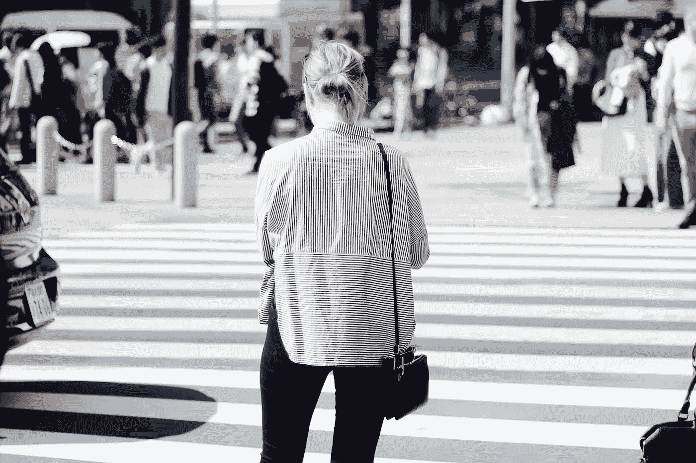

# 放下你的电话，过会儿谢谢我

> 原文：<https://medium.com/swlh/put-down-your-phone-and-thank-me-later-1b63a827c82a>

## 如果你想花更少的时间在手机上，花更多的时间生活，这里有一些建议可以尝试。

Photo by [Harry Knight](https://unsplash.com/@harryknight?utm_source=unsplash&utm_medium=referral&utm_content=creditCopyText)

你有没有注意到过马路的时候再也没有人抬头看了？大多数人都忙于回复短信或浏览社交媒体，而没有时间关注周围的环境。