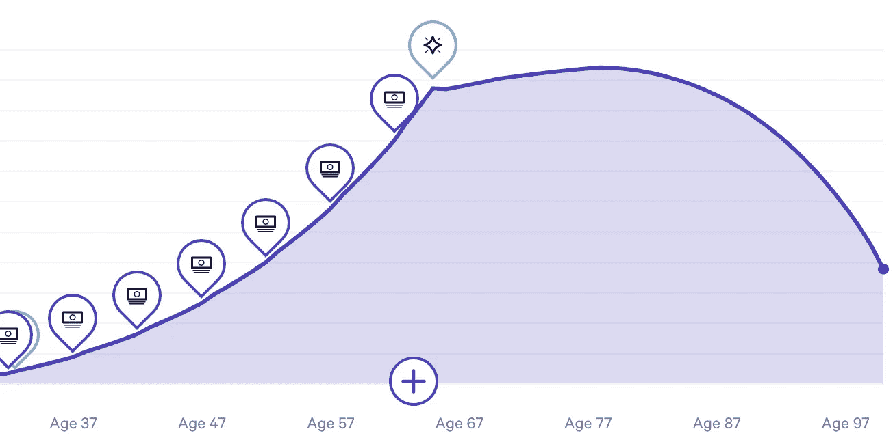

# 让你的钱发挥作用

> 原文：<https://medium.com/swlh/putting-your-money-to-work-47bc47eda161>

Lifetime growth of money with plenty to spare. Remember: $10 + Joules = $20 — Joules are the SI Unit for Work

你有没有想过你可以更好地管理你的现金？你在网上看到过关于你应该如何用你的现金做更多事情的文章，但是不知道从哪里开始吗？你希望有一篇文章不会给你“取决于你的情况”的建议，而是简单地告诉你该做什么吗？继续读。

下面是我用来管理大部分财务的谷歌表单。它包括一个你所有现金和现金目标的部分，一个当前信用卡支出的部分，一个中短期支出计划的部分，以及一个作为整个表格基础的收入和支出的部分。

之前，我发布了几篇关于我如何设法在 4 年内偿还 55000 美元贷款的文章，以及我用来记录一切的 T2 谷歌表单。虽然这篇新文章提出了在还清贷款后你可以计划收入和支出的方法，但你可以在还贷款的同时很容易地根据自己的需要进行调整。

**新谷歌单** [**此处**](https://docs.google.com/spreadsheets/d/1Hk1O41Zf6Qlx2Mj0S_uIcHRQdvK11NcvU4rAyVuCv-Y/copy) **—月度现金分析**

D 部分—右下方(几何爱好者的象限四)

请注意 H14:K20 单元。为什么他从右下角开始？让 D 区继续？这一节让我们开始，但我最终把它放在了右下角，因为它不会经常改变，而且看起来也不那么有趣。然而，它确实为其他部分奠定了一些基础。我们从这里开始逆时针走。

单元格 I15 是你的总收入(税后、预扣等)。)—阅读:你存入账户的钱数。单元格 J16 是你的租金(负数)。单元格 J17 是你的月支出；除了房租之外，我 99.8%的钱都用信用卡支付(每月全额付清余额)。单元格 K18 是你每个月试图储蓄/投资的金额。K19 单元格用于大额采购储蓄。如果您想在不同的帐户之间改变这些详细信息，可以使用总计列。

确保 D 部分是正确的，因为它影响到其他部分的许多部分。

C 部分—左下方(象限 III)

从 D 区逆时针移动…C 区是关于记录你的信用卡。我用 Mint 做了很多事情，比如预算和跟踪，但是我从来没有能够以一种方式使用它，让我觉得我实际上掌握了美元的流入和流出，直到为时已晚。因此，我创建了这个小部分，我能够从 Mint 中发现的趋势中推断出我想要的支出目标，并在 c 部分跟踪它们。

首先，您可能需要根据每月使用的信用卡数量来修改这一部分。如果超过 3 个，我强烈建议减少，除非你是那种真正喜欢管理信用卡的人(在这种情况下，你可能不需要阅读 C 部分)。

A 列是卡片的名称。我用 3 张追卡。一个是亚马逊，因为我一直在使用的亚马逊购物有 5%的折扣——我实际上刚刚收到年费，决定取消我的会员资格，所以也许未来我会写一篇关于没有亚马逊的生活的文章，不管有几个月或几周。一个是 Chase Sapphire Reserve——餐饮和旅游(我最喜欢的两个消费类别)3%的返现。最后一个是 Chase Freedom Unlimited——其他东西返现 1.5%。关于信用卡的更多信息，我强烈推荐积分专家。无论你做什么，不要注销旧的信用卡。较长的信用记录对你的信用评分有积极的影响，所以如果你有太多的信用记录，就停止使用它们。然后偶尔用这些钱买些小东西，然后马上付清。

B 列和 C 列用于每张卡上已过账和待处理的交易。我发现把这些分解出来比一直做数学题更容易——让计算机做数学题。D 列是已付/报销金额。你的卡上有一笔未支付的款项吗？期待工作费用报销？把这些放在 d 列。

C 部分的最后一部分是双月/月度分析。目标是根据您在 d 部分的支出预先填充的。然后，您将看到您与目标单元格 C21 和 C22 的差异。根据你在两个工资周期之间所处的位置，你会希望保持这些差异为正。正差异相当于月底(或支付期)的额外收入，你可以随意分配——债务、储蓄、投资、新玩具等等。

A 部分—左上角(象限 II) —我的钱在哪里？

我有三个独立的机构，用于日常现金、储蓄、投资(不包括 401k)、信用卡和支出。这些机构是大通银行、查尔斯·施瓦布银行和财富前线银行，它们都列在 a 节中

从简单的开始，蔡斯。我使用 Chase 是因为他们有很好的信用卡，而且他们有你在传统银行想要的所有功能——直接存款、账单支付、chase QuickPay 真的很好(比 Venmo 安全得多)，等等。我在支票上存 1000 美元，在储蓄上存 1000 美元——都是为了现金流。我的开销通常不会超过 1000 美元，除非你把房租算在内，所以这个数字对我来说不错。在过去，我两次都是在几百美元左右，但是当你手头的现金接近边缘时，你必须非常小心。

为什么要把支票和储蓄分开？有一些情况下，我的支票低于 1000 美元(例如，当我不得不快速支付某人，我每月的账单，等等。).然而，把钱存入储蓄账户对我的大脑来说是个恶作剧。如果我的支票低于 1000 美元，我真的不在乎。但如果我需要动用我的储蓄账户，我的大脑会突然出现轻微的焦虑，促使我重新评估我的整个生活；因此，我从来不碰这些钱。

从大学开始，我就有了一个查尔斯·施瓦布经纪和支票账户。这些账户不收费(我不记得保持免费的要求是什么，但如果有的话，也是非常少的)。支票账户将自动从你的经纪账户中提取流动现金，以避免透支费用。最后，最好的部分是，从来没有 ATM 费用！*

在大多数银行，当你使用不是他们的自动取款机时，你要支付自动取款机的费用和你的银行的费用。有许多银行承诺不收自动柜员机费，但其中许多银行根本不收取自己的费用，但你仍然要支付自动柜员机费。另一方面，嘉信理财会补偿你使用自动取款机所产生的费用。所以是的，从技术上来说，没有自动取款机收费。您可以在从 ATM 机取款时支付这些费用，但每个月 Schwab 都会将所有这些费用进行汇总，并将全额退款存入您的账户。

为什么你要 3000 美元？嗯，因为我的大通账户之间有 2000 美元，在这个示例电子表格中，每月支出是 5000 美元——每年 60000 美元/12；为了简单起见，我们忽略了税收(如果只是，一个权利？).拥有一个月的现金流真的有助于我放松心情。此外，我看过太多电影，在这些电影中，一大笔现金真的派上了用场。万一我需要跑路，我希望 3000 美元至少足以让我起步。

现在说说有趣的事情。大约 4 年前，我第一次投资了 Wealthfront。我强烈推荐它作为投资的产品([无耻推荐链接](http://wlth.fr/1MU8JxP))。当与我父母这个年龄的人交谈时，他们谈论的要么是主动投资，要么是被动投资。积极通常意味着必须每天关注市场，并为单笔交易支付费用。被动的意思是穿上西装去见一个经纪人，付给他们 Wealthfront 在软件方面的报酬(最初免费，之后更便宜 _)，这样他们就能买得起比你更贵的西装。公平地说，经纪人和财务顾问在社会中扮演着举足轻重的角色。然而，他们并不*适合*第一次投资少量的钱，没有孩子，没有房子，距离退休还有 40 多年。把那些财务人员留给你 40 岁的时候吧。

然而，位于 A 部分的 Wealthfront 的目的是关于他们新的**现金**账户。我曾经把大部分应急储蓄存在一个升值令人沮丧的储蓄账户里(就像上面的大通银行)。然而，许多银行现在对储蓄账户提供更高的利率。我喜欢 Wealthfront 的原因有很多，但最好的一个原因是——在我写这篇文章的时候，它是市场上最高的利率。

为什么是 1 万美元？哪些数字也被标为财富前沿？在这个例子中，Wealthfront 现金账户中总共有 12，500 美元，但是一些钱被指定用于不同的事情。1 万美元是应急基金。有 5000 美元的现金流(来自上面的 Chase 和 Schwab ),加上 10000 美元的储蓄，总共是 15000 美元——除以 5000 美元的月支出，你得到 3 个月的紧急储蓄。

另外两笔是为大额购买而储蓄的。想买新家具？休假？你不会想为投资股市的麻烦而烦恼，为这些费用做预算，但你也不想这些储蓄让你一无所获。Wealthfront 现金账户非常适合这种情况。这两行在第 11 行中被再次引用，这样你就可以知道你的总现金是多少(单元格 B10)以及你存了多少钱但没有指定用于其他目的(单元格 B12)。

现在，您会注意到 D 列中有目标数字，e 列中有差异。您的目标是让差异列尽可能多地为零，希望不要将您的目标设置得更低。在本例中，现金流量目标得到满足；我个人优先考虑月与月之间的现金流，以应对可能的短期问题，而不是中期紧急情况。

尽管如此，紧急储蓄目标仍然存在差异。你最终会想要 6 个月的应急储蓄。我有点欺骗了这个目标，因为将你的应急储蓄翻倍可能会让人不知所措。稍后你会看到，每月 5000 美元中的 1750 美元是用于储蓄/投资的。在你需要动用应急基金的紧急情况下，你可能会停止储蓄/投资。因此，3，250*6 美元= 19，500 美元，或略低于 20，000 美元(15，000 美元+5，000 美元现金流)。

B 部分—右上(象限 1)

B 部分是关于中长期规划。你当然可以把这部分延长几个月。从单元格 I2 开始，该单元格是一个公式，它结合了 d 节中您的储蓄和购买行项目。单元格 I2 是您的顶行。下面的单元格是用来添加一次性奖金的，如果你希望有奖金的话。在圣诞节时会像强盗一样亲热？马上要开毕业派对了？或者干脆工作有年终奖？使用第 3 行的灰色阴影单元格。

关于奖金的快速说明。我说的是数百或数千美元的巨额奖金。规则 1——永远不要依赖奖金。依赖你还没有的钱是一条通往痛苦的道路。此外，不要花光你的全部奖金。一旦你掌握了理财的诀窍，你就没有理由花掉 100%的奖金。至少保留一半的钱用于长期财务目标的储蓄/投资。我试图达到 60-70%的目标。

接下来的两行(第 4 行和第 5 行)是我大部分资金的去向——要么是 Wealthfront 现金，要么是 Wealthfront 投资。我现在已经为我所有的 1500 英镑存款(来自 D 区)建立了投资账户(在这个例子中复制了),因为这是我为买房的长期目标而投资的地方。以前，在我建立应急基金之前，大部分都是现金。

现在真正有趣的是。H 列和 P 列中相应的灰色阴影单元格用于预算较大的费用。我每月有 250 美元用于购买这些大件物品，正如你所见，接下来的几个月都是为了确保我能在今年秋天买得起新的 Pixel 4。我还让美国巨头接下来出场，因为我真的很喜欢他们的东西，但我还没有计划好。只需在 H 列的一个单元格中输入描述，并在 p 列中输入相应的价格。

250 美元/月听起来很多吗？没关系。在我偿还贷款的许多年里，这个数字是 0 美元。我总是在寻找我需要/想要的东西的大优惠——Kohls 和 Target 都有非常便宜的衣服和配件，亚马逊 prime day 有很多你可能想要的电子产品的优惠，让你的智能手机升级比新发布的晚两年可以为你节省数百美元；提前计划好就行了。

250 美元/月听起来不多吧？听起来你可能比我赚更多的钱，或者你和我有不同的财务目标。各有所好。我个人的观点是，很少 20 多岁的人需要每月 250 美元以上的储蓄来购买大件商品。然而，我也租房，所以我可以看到房主可能有更大的支出。在这种情况下，我建议每月投入 1500 美元用于家庭装修投资。改造，新电器等。可以被认为是对你房子价值的投资。

就是这样！请分享你的评论，反馈，自己的亲身经历。我很想听听其他人的看法，以及他们是如何管理现金的。此外，如果您有任何问题，请随时联系我们。

披露:作者自称“仅仅是一个互联网上的纨绔子弟。”他不具备任何法律或财务资格来承担此处包含的建议的责任(他只是看了足够多的电视来使用“此处”)。本文中描述的任何想法、建议或其他内容仅限于作者的直接经验，并在“可能对他人有所帮助”的标题下分享，不打算作为具体的法律或财务建议(或任何其他相关建议)。