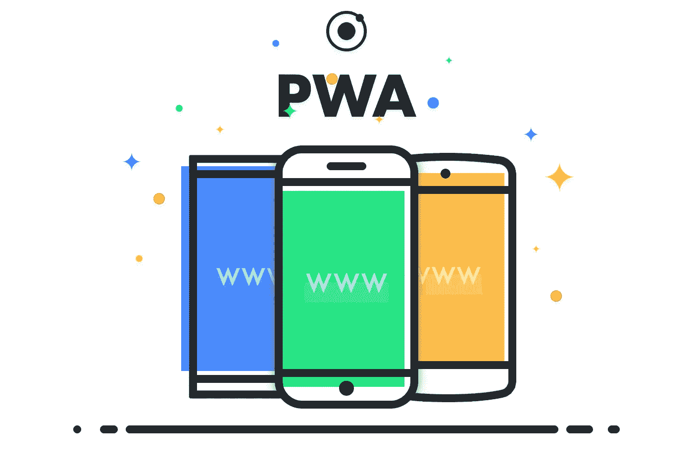

# 对于你的 MVP: PWA 还是移动应用？

> 原文：<https://medium.com/swlh/pwa-or-mobile-application-d26e904e814e>

我最近遇到一位创始人，他向我挑战:“我有一家在线旅行社，当我可以创建一个渐进式网络应用程序时，我为什么要创建一个移动应用程序？”。

当场，我没有一个好的答案。老实说，我从来没有研究过艾滋病毒，只是假设它们是坏的。虽然对于这个结论，我没有什么可争辩的，而且这个答案的根源可能在于这样一个事实，即这不是…