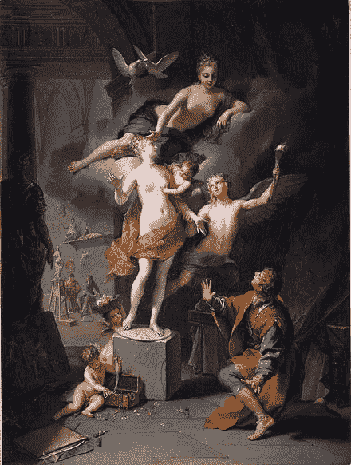

# 领导力的皮格马利翁效应

> 原文：<https://medium.com/swlh/pygmalioneffect-e8898fa27cf2>

## 领导力课程——弗兰克·威廉·布伦南

## 最真实的交流方式

Depiction of Ovid’s narrative by [Jean Raoux](https://en.wikipedia.org/wiki/Jean_Raoux).

在酒店行业，我经常听到经理们对年轻员工的抱怨。信念是 GEN-Z 员工不知道如何服务客人，也不愿意学习。他们总是在打电话，不关心…