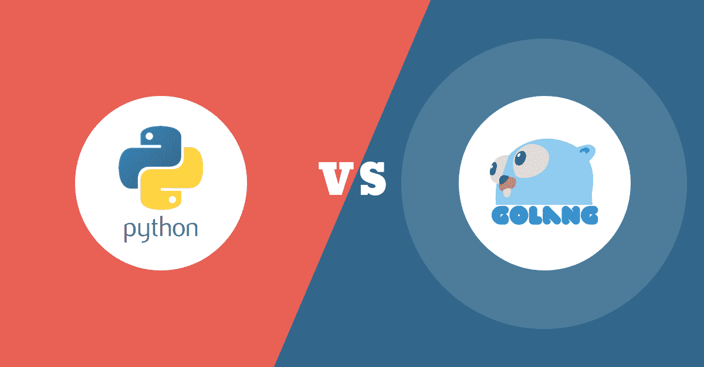
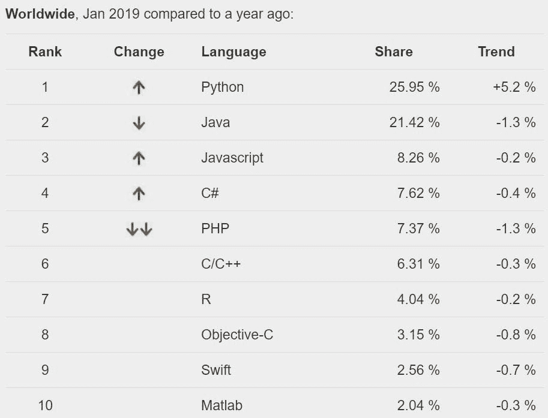
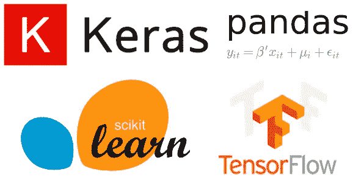
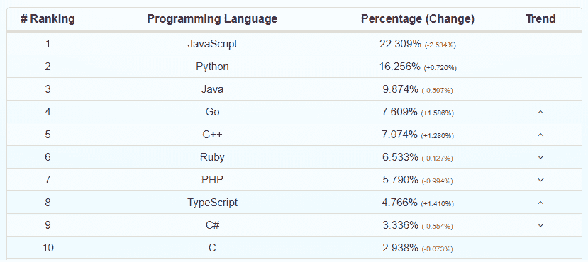
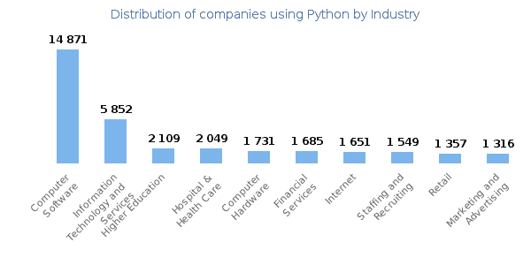
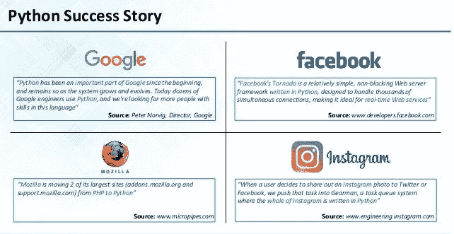
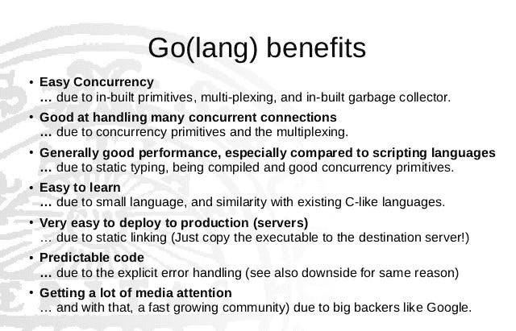
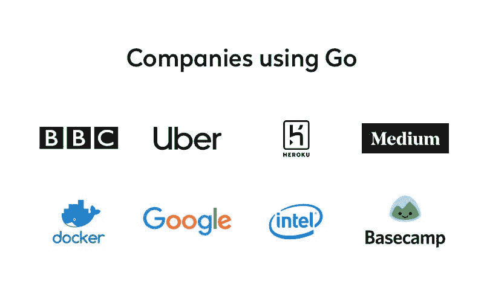

# Go vs Python:选择最适合您业务的

> 原文：<https://medium.com/swlh/python-vs-golang-select-the-best-one-to-level-up-your-business-1a6d0fb32991>

## Go 和 Python 哪个更适合构建你的商业应用？仔细看看 Go 和 Python 的比较点。

从一开始，什么样的编程语言最适合你的业务就是一个至关重要的决定。谈到编程语言，当今商界的每个人都有自己的偏好、想法和要求。有不同的选项可供选择，比如 Python、Go 语言、JavaScript、C++、PHP 等等。

如果你需要关于哪种编程语言最适合你的创业公司的令人信服的建议。你来对地方了。我给你最好的关于 Go vs Python 的建议。此外，我将列出一些已经使用 Python 和 Go 语言在各自领域获得竞争优势的企业的例子。要获得更多关于 Go 和 Python 开发的帮助，您可以联系行业专家来解决您所有与开发和技术问题相关的疑问。

**那么，让我们从 Go vs Python** 开始

## **Python 统计&性能**

Python web 开发行业正以令人难以置信的速度增长。

***我们来看看最近的一些 Python 统计:***

> ***Python 是六种最常用的编程语言之一，也是年度***[***IEEE Spectrum***](https://spectrum.ieee.org/at-work/innovation/the-2018-top-programming-languages)***排行榜的第一名。***
> 
> ***Python 趋势呈上升趋势，使用统计数据增长+5.2%。***

# **是什么让 Python 出类拔萃？**

## **答案是** [**Python 的** a **mazing 库列表**](https://www.bitcoininsider.org/article/37302/top-10-libraries-python-implement-machine-learning) **。**

它惊人的库列表，如 [NumPy](https://www.numpy.org/) 、 [Keras](https://pypi.org/project/Keras/) 、 [Scikit-learn](https://scikit-learn.org/stable/) 、 [Pandas](https://pandas.pydata.org/) 、 [Tensorflow](https://www.tensorflow.org/tutorials/keras) 和 [SciPy](https://www.scipy.org/) ，可以帮助节省您的时间，并减少初始开发周期的成本。

对于创业公司来说，Python 非常容易使用和应用到工作中。这就是为什么它成为 2019 年最容易使用的编程语言之一。Python 在 web 和软件开发领域被广泛使用，它的语法很容易理解，因此对于刚起步的公司来说，它是一种简单的语言。雇佣 IT 外包开发者，用 Python 构建交互式移动应用和软件程序。

> **你也可以为你的下一个商业应用雇佣 Python 开发者，他们擅长使用 Django、Flask 和 Web2py 框架。**

> **当谈到 Go 和 Python 时，Python 是构建分析工具和数据集的最佳选择。Python 是一门非常重要的语言，可以为您的业务添砖加瓦。**

## **Go 语言统计&性能**

下面来看围棋 vs Python 的第二部分。这是关于 Google 的 Go 语言，由于其轻量级的结构，它在商业社区中获得了巨大的收益。它是一种开源语言，最适合今天的微服务软件架构。

***参见*** 的一个例子……假设您经营一家电子商务商店，该商店接受客户订单、核实库存并发货。在这里，每个微服务都相对较小，如果你有一个基于 Go 语言的网站，那么你可以期望相对较小的服务有更好的可维护性，更好的可测试性，以及更好的应用程序可部署性。

***重要统计:***

> ***根据 GitHub 上发表的一份报告显示，*** [***Go 是 2019 年度发展最快的语言***](https://hub.packtpub.com/why-golan-is-the-fastest-growing-language-on-github/) ***。***
> 
> ***Golang web 开发行业总体增长了近 7%，与上一季度相比变化了 1.5%*。**

## Go vs Python——是什么让 Go 语言流行起来？

这是一种云本地语言，它被应用于基于 [**以太坊**](https://www.ethereum.org/) 和 [**Docker**](https://www.docker.com/) 的领先开发项目。

Go 是一种跨平台语言，允许你在编译代码时使用自己选择的操作系统。Golang 非常容易安装，并且具有出色的调试质量，这有助于它比其他语言更受欢迎。

您可以轻松构建自己选择的生产级软件，包括从流行的 web APIs 到加密软件的一系列用例。

## **Go vs Python —业务能力**

现在，您将看到一些 Go 和 Python 在商业行业中的流行用例。

> **尽管 Go vs Python 是商业社区的热门话题，但这两种编程语言不仅都适合创建 web 应用程序，而且都有助于实现与您的业务相关的任务自动化。**

***参见一些例子:***

## **Python 为什么受商家欢迎？**

Python 在您的业务中的应用可能很多。可能性是无限的，缩小你的需求是你在你的业务中能做的最好的解决方案。

***下面是一个概述:***

您可以使用 Python 在您的业务网站或移动应用程序上创建交互式用户案例。

> 如果这是关于 Go 和 Python 的，那么 Python 也是易于阅读的，也是你的商业网站易于访问的源代码。对于您的数据科学、机器学习开发、数据分析和可视化相关的业务需求来说，这是一种相当好的语言。

## **那么，专家们为什么推荐 Python 做业务呢？**

从许多方面来说，Python 是当今商业的选择。由于我上面已经提到的许多好的原因，它在商业界变得非常流行。

不用说，Python 的多功能性使它能够处理所有类型的未来挑战。

当今许多成功的企业都在工作中使用 Python。

***我们来看看知名品牌使用 Python***

## [insta gram](https://instagram-engineering.com/web-service-efficiency-at-instagram-with-python-4976d078e366)

Instagram 的工程团队表示——***“Python 是用户友好的，也帮助他们以简单易行的方式处理海量的流量。”***

## [**脸书**](https://www.probytes.net/blog/python-for-facebook/)

**脸书已经在 Python 上建立了一个非阻塞的 web 服务器框架，以实时处理成千上万个并发的 FB 连接。**

## ****谷歌****

**Google 从一开始就使用 Python。Google 的开发团队决定使用 Python，因为它易于维护，而且输出速度相对较快。**

**Python 已经帮助几个企业改进了他们现有的企业应用程序，并有几个成功的案例作为支持。**

**继续讨论 Go 与 Python 的话题，我想分享一些关于 Go 为您的业务带来的能力的信息。**

## ****Golang 为您的企业带来的好处****

****

**由于其简单性、高级编译能力、现代并发性、通道和强大的生态系统，Go 在企业和开发人员社区中越来越受欢迎。**

> **Go 是人工智能和云计算等未来技术的语言。它在那些希望在更短的时间内用最少的费用开发 web 应用程序和商业网站的企业中越来越受欢迎。**

**Go 速度很快，也不局限于编译语言。它将其所有库链接到一个二进制文件中，并允许移动应用程序开发人员变得更加高效和快速。**

**很多业务之所以采用 Go，是因为它的跨平台支持和内置的并发性，可以让你同时进行多个流程。**

**想招聘 Golang 网站开发人员吗？只需在网上搜索，寻找 Golang web 开发公司或 IT 外包公司来雇佣 Golang web 程序员，为您正在进行的项目提供支持。**

## ****Golang 在商业中的一些流行使用案例****

****

## ****优步****

**优步的 GeoFence 查找和 Geobase 服务是用 Golang 编写的。根据目前的市场评估，这两项服务都是优步最好的 QPS 服务。**

## ****中等****

**Medium 是完全基于 Golang 的最受欢迎的内容发布平台之一。他们的图像处理、后端服务和 Neo4j 数据库都由一个用 Go 语言编写的服务来管理。**

## **英国广播公司**

**BBC Worldwide 也从 2012 年开始使用 Go 创建不同的手机游戏和后端系统。他们已经使用 Go lang 为社交媒体构建了爬虫，还成功地使用 Go lang 创建了不同的 web 服务。**

> ****所以，正如你所看到的，随着 Python 这些年来的发展，Go 也开始受到企业的关注。****

**那么，哪种语言更适合你的开发项目呢？选择 Python 还是 Go，这不是一个容易做出的决定。我们的观察是，Golang 已经通过提供跨平台开发、支持多平台等诸多优势，在 web 开发行业中占据了一席之地。**

**此外，如果您正在寻找一个多功能平台来构建您的下一个业务应用程序，Python 无疑是最佳选择之一，它可以为您提供高质量的最终结果，其快速原型制作和适应性强的解决方案可满足您的任何业务需求。**

## **Go vs Python:更多信息**

**好了，现在我已经给了你这两种语言的细节，让我们开始更详细地比较它们。**

**我要谈谈这两种语言的表现。我一直在使用和练习各种工具和语言，如 python、go、javascript、Java、C、C++以及像 [Docker](https://www.docker.com/https://www.docker.com/) 、 [codepipeline](https://aws.amazon.com/codepipeline/) 、 [codebuild](https://aws.amazon.com/codebuild/) 等工具。**

**所以，我对通常的编程概念有很好的了解。刚刚在 2019 年的今天看了 Python，它让我想起了 Java 在编程的一些部分，如简单的语法和易用性。**

## **面向开发者的 Python**

**考虑到企业主寻找人工智能、人工智能和数据分析软件应用的方式，Python 正变得与开发者极其相关。对于所有基于算法的开发，Python 吸引了开发人员的注意力，并成为当代程序员和编码人员最流行和首选的语言。**

## **支持开发人员**

**另一方面，Golang 由于其对并发性的支持而被用于云计算和集群计算领域。Golang 在 web 开发领域也获得了很多赞赏，因为它有一个强大的库列表，可以让你在几秒钟内建立一个 web 服务器。**

## **应用程序开发的 Go vs Python**

**Python 在许多数据科学家中变得越来越流行，因为它收集了为数据的数值分析而设计的库。**

> **比如可以用 [**NumPy**](https://www.numpy.org/) 和 [**SciPy**](https://www.scipy.org/) 来处理复杂的数值应用。Pandas 最适合用于科学和工程领域的数据分析。Python 的 **PyKyra** 和 **PyGame** 是 3D 游戏开发的框架。**

**Golang 是一种现代编程语言，在计算环境中工作良好，这对于希望开发下一代商业 web 应用程序的公司来说也很重要。**

> **Python 也被用于开发 ERP 工具，如 [**Odoo**](https://quintagroup.com/cms/python/odoo) ，帮助企业和组织管理 **CMS** 、 **BI engine** 等。Odoo 包括 30 多个主要应用程序，提供一个开源 CMS 和一个商业智能引擎。**

**此外，Python 是一个轻量级软件，可以处理从业务管理到数据分析等所有业务。**

**而 Go 是一种非常棒开源语言，让你感觉像是在用 Ruby 这样的快速解释语言工作。Go 使用起来很安全，你可以用 Go 语言创建非常可靠的应用和软件。**

> **围棋是**“最好的做事方法之一**。 **"** 多年来，Python 开发已经赢得了软件开发行业，Go 也在追赶这个步伐。**

**我认为编程语言 Go 和 Python 都有很好的未来。尽管没有明确的选择来满足前端和后端的开发需求，但是您可以选择 go 或 Python 来在开发领域脱颖而出。**

## **结论——Go vs Python**

**那么，你同意我的观点吗？如果你同意或不同意，请在下面的评论区分享你的观点。希望这里所做的比较能帮助你对 Go 和 Python 有所了解，以及哪一个是创建你的业务应用程序的最佳选择。**

****

## **这篇文章发表在 [The Startup](https://medium.com/swlh) 上，这是 Medium 最大的创业刊物，拥有+446，678 名读者。**

## **在此订阅接收[我们的头条新闻](https://growthsupply.com/the-startup-newsletter/)。**

****