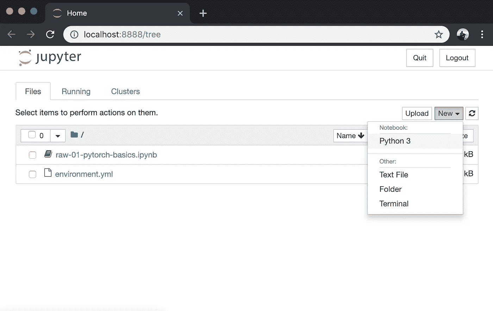
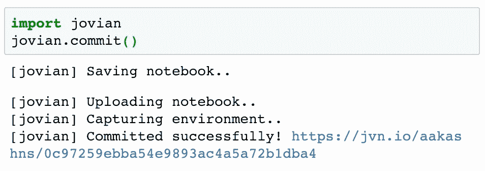
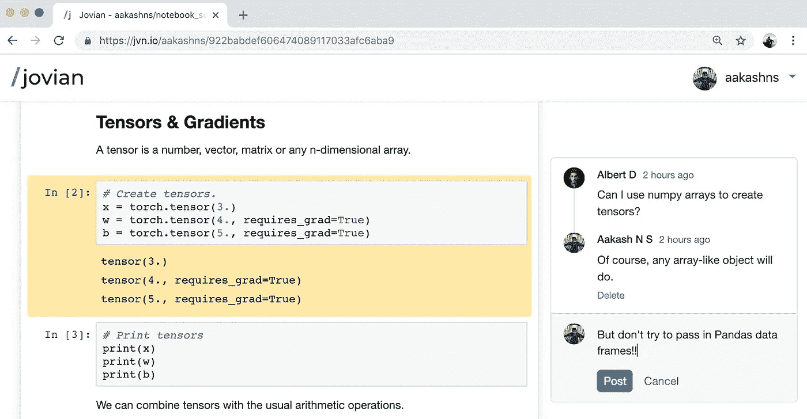

# PyTorch 基础:张量和渐变

> 原文：<https://medium.com/swlh/pytorch-basics-tensors-and-gradients-eb2f6e8a6eee>

## “PyTorch:零到 GANs”的第一部分


*本帖是关于用*[*【py torch】*](https://pytorch.org/)*【脸书开发和维护的开源神经网络库】构建深度学习模型系列教程的第一篇。查看完整系列:*

1.  [*PyTorch 基础知识:张量&渐变*](/jovian-io/pytorch-basics-tensors-and-gradients-eb2f6e8a6eee) *(本帖)*
2.  [*线性回归&梯度下降*](/jovian-io/linear-regression-with-pytorch-3dde91d60b50)
3.  [*分类采用逻辑回归*](/jovian-io/image-classification-using-logistic-regression-in-pytorch-ebb96cc9eb79)
4.  [*前馈神经网络&在 GPU 上训练*](/jovian-io/training-deep-neural-networks-on-a-gpu-with-pytorch-11079d89805)
5.  即将到来..(CNN、迁移学习、RNNs、GANs 等。)

这个系列试图让 PyTorch 对刚开始学习深度学习和神经网络的人来说更容易接近。在这篇文章中，我们将介绍 PyTorch 模型的基本构件:*张量和梯度*。

# 系统设置

本教程采用了代码优先的方法来学习 PyTorch，您应该尝试自己运行和试验代码。我们将使用 Python 的 [Anaconda 发行版](https://www.anaconda.com/distribution/)来安装库和管理虚拟环境。对于交互式编码和实验，我们将使用 [Jupyter 笔记本](https://jupyter.org/)。本系列的所有教程都可以在 Jupyter 笔记本上获得，托管在 [Jovian](https://www.jvn.io/) 上:Jupyter 的一个共享和协作平台。这篇文章的笔记本可以在这里找到:

[](https://jvn.io/aakashns/e5cfe043873f4f3c9287507016747ae5) [## aakashns/01-py torch-基础-木星

### 即时分享 Juptyer 笔记本。Jovian 使 Jupyter 笔记本可共享、可评论和可复制。

jvn.io](https://jvn.io/aakashns/e5cfe043873f4f3c9287507016747ae5) 

Jovian 通过直接在 Jupyter 中运行一个命令，使得在云上共享 Jupyter 笔记本变得很容易。它还捕获运行笔记本所需的 Python 环境和库，因此任何人(包括您)都可以复制您的工作。

以下是您需要开始做的事情:

1.按照这里给出的[说明安装 Anaconda。您可能还需要将 Anaconda 二进制文件添加到系统路径中，以便能够运行`conda`命令行工具。](https://conda.io/projects/conda/en/latest/user-guide/install/index.html)

2.通过在 Mac/Linux 终端或 Windows 命令提示符下运行以下命令(不带`$`)来安装`jovian` Python 库:

```
$ pip install jovian --upgrade
```

3.使用`jovian clone`命令下载本教程的笔记本:

```
$ jovian clone e5cfe043873f4f3c9287507016747ae5
```

这将创建一个包含 Jupyter 笔记本和 Anaconda 环境文件的目录`01-pytorch-basics`。

```
$ ls 01-pytorch-basics
01-pytorch-basics.ipynb  environment.yml
```

4.现在我们可以进入目录并安装所需的 Python 库(Jupyter、PyTorch 等。)使用`jovian`的单一命令:

```
$ cd 01-pytorch-basics
$ jovian install
```

`jovian`读取`environment.yml`文件，为您的操作系统确定正确的依赖项，创建一个具有给定名称(默认为`01-pytorch-basics`)的虚拟环境，并在该环境中安装所有需要的库，以避免修改您的 Python 系统范围的安装。它在内部使用`conda`。如果你面临`jovian install`的问题，试着运行`conda env update`来代替。

5.通过运行以下命令激活虚拟环境

```
$ conda activate 01-pytorch-basics
```

对于 conda 的旧版本，您可能需要运行命令:`source activate 01-pytorch-basics`。

6.一旦虚拟环境被激活，我们就可以通过运行

```
$ jupyter notebook
```

7.你现在可以通过点击终端上显示的链接或者在浏览器上访问 [http://localhost:8888](http://localhost:8888) 来访问 Jupyter 的网络界面。



此时，您可以点击笔记本`01-pytorch-basics.ipynb`打开它并运行代码。如果您想自己键入代码，也可以使用“新建”按钮创建一个新笔记本。

我们从导入 PyTorch 开始:

# 张量

PyTorch 的核心是一个处理张量的库。张量是数字、向量、矩阵或任何 n 维数组。让我们创建一个只有一个数字的张量:

`4.`是`4.0`的简写。它用于向 Python(和 PyTorch)表明您想要创建一个浮点数。我们可以通过检查张量的`dtype`属性来验证这一点:

让我们试着创建稍微复杂一点的张量:

张量可以有任意多个维度，并且每个维度的长度不同。我们可以使用张量的`.shape`属性来检查每个维度的长度。

# 张量运算和梯度

我们可以把张量和通常的算术运算结合起来。让我们看一个例子:

我们已经创建了 3 个张量`x`、`w`和`b`，都是数字。`w`和`b`有一个附加参数`requires_grad`设置为`True`。我们马上就能看到它的作用。

让我们通过组合这些张量来创建一个新的张量`y`:

正如所料，`y`是一个值为`3 * 4 + 5 = 17`的张量。PyTorch 的特别之处在于，我们可以自动计算`y` w.r.t .的导数，即`requires_grad`设置为`True`的张量，即`w`和`b`。为了计算导数，我们可以在结果`y`上调用`.backward`方法。

`y`相对于输入张量的导数存储在各自张量的`.grad`属性中。

不出所料，`dy/dw`与`x`的值相同，即`3`，而`dy/db`的值为`1`。注意`x.grad`是`None`，因为`x`没有将`requires_grad`设置为`True`。`w.grad`中的“grad”代表梯度，是导数的另一个术语，主要在处理矩阵时使用。

# 与 Numpy 的互操作性

Numpy 是一个流行的开源库，用于 Python 中的数学和科学计算。它支持对大型多维阵列进行高效操作，并拥有一个庞大的支持库生态系统:

*   用于绘图和可视化的 Matplotlib
*   [用于图像和视频处理的 OpenCV](https://opencv.org/)
*   [Pandas](https://pandas.pydata.org/) 用于文件 I/O 和数据分析

PyTorch 没有重新发明轮子，而是与 Numpy 很好地互操作，以利用其现有的工具和库生态系统。

下面是我们如何在 Numpy 中创建数组:

我们可以使用`torch.from_numpy`将 Numpy 数组转换成 PyTorch 张量。

让我们验证 Numpy 数组和 PyTorch 张量具有相似的数据类型。

我们可以使用张量的`.numpy`方法将 PyTorch 张量转换为 Numpy 数组。

PyTorch 和 Numpy 之间的互操作性非常重要，因为您将使用的大多数数据集可能会作为 Numpy 数组进行读取和预处理。

# 提交并上传笔记本

最后一步，我们可以使用`jovian`库保存并提交我们的工作。

```
!pip install jovian --upgrade
```



Jovian 将笔记本上传到 [Jovian.ml](https://www.jovian.ml) ，捕获 Python 环境并为您的笔记本创建一个可共享的链接，如上图所示。你可以使用这个链接来分享你的作品，让任何人用`jovian clone`命令轻松复制它。Jovian 还包括一个强大的评论界面，所以你(和其他人)可以讨论&对你笔记本特定部分的评论:



# 进一步阅读

PyTorch 中的张量支持各种操作，我们在这里讨论的内容并不详尽。您可以在此了解关于张量和张量运算的更多信息:

 [## 火炬。张量- PyTorch 主文档

### 当数据是一个张量 x 时，从传递的数据中读出“数据”,并构造一个叶变量。因此…

pytorch.org](https://pytorch.org/docs/stable/tensors.html) 

您可以利用交互式 Jupyter 环境来试验张量，并尝试上面讨论的不同操作组合。以下是一些可以尝试的东西:

1.  在上面的例子中，如果一个或多个“*x“*”、“*w”*或“*b”*是矩阵，而不是数字，会怎么样？在这种情况下，结果“*y”*和梯度`w.grad`和`b.grad`会是什么样子呢？
2.  如果" *y"* 是一个使用`torch.tensor`创建的矩阵，矩阵的每个元素都表示为数字张量" *x"* 、" *w"* 和" *b"* "的组合会怎么样？
3.  如果我们有一个操作链，而不是只有一个操作链，即`y = x * w + b`、`z = l * y + m`、`e =c * z + d`等等，会怎么样？调用`e.backward()`会做什么？

如果你感兴趣，你可以在维基百科上了解更多关于矩阵导数的知识(尽管这不是跟随这一系列教程所必需的):

 [## 矩阵微积分-维基百科

### 在数学中，矩阵微积分是做多变量微积分的专门符号，特别是在…

en.wikipedia.org](https://en.wikipedia.org/wiki/Matrix_calculus#Derivatives_with_matrices) 

至此，我们完成了 PyTorch 中关于张量和梯度的讨论，我们准备进入下一个主题:*线性回归*。

# 信用

本系列中的材料主要受以下资源的启发:

1.  [深度学习研究者 PyTorch 教程](https://github.com/yunjey/pytorch-tutorial)作者 Yunjey Choi
2.  [FastAI 开发笔记本](https://github.com/fastai/fastai_docs/tree/master/dev_nb)杰瑞米·霍华德