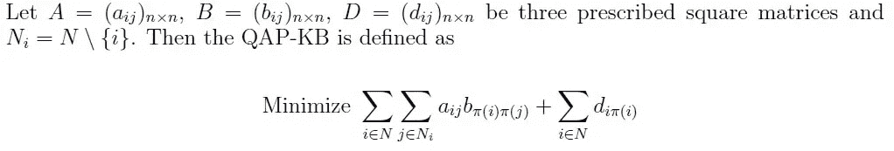
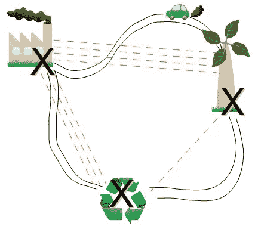
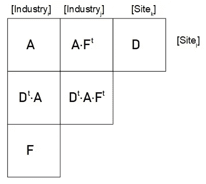
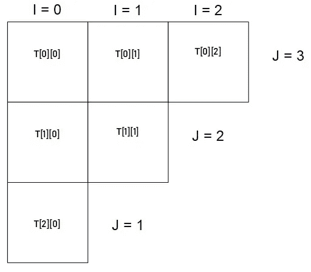

# 二次分配问题，解决了？

> 原文：<https://medium.com/swlh/quadratic-assignment-problem-solved-247338a6aa40>


## 在这里，我提出了一个新的结构，基于我确保我解决布尔可满足性的方式，这是专门为 QAP 设计的

二次分配问题是一个有多种用途的问题。从决定在哪里安装机器、大型装置…，甚至帮助在百货商店摆放产品以鼓励消费。

在研究了矩阵计算并观察了我如何解释布尔可满足性之后，在相应的[文章](/swlh/the-boolean-satisfiability-problem-solved-48ceb5550115?source=your_stories_page---------------------------) …

[](/swlh/the-boolean-satisfiability-problem-solved-48ceb5550115) [## 布尔可满足性问题，解决了吗？

### 在这里，我展示了一些终极技术来制作逻辑运算的强大工具。

medium.com](/swlh/the-boolean-satisfiability-problem-solved-48ceb5550115) 

我可以向你保证，有一个简单的结构，大大简化了问题。

# QAP 定义

有一套 *n* 设施和一套 *n* 地点。对于每对位置，指定一个*距离*，对于每对设施，指定一个*重量*或*流量*(例如，在两个设施之间运输的物资数量)。问题是将所有设施分配到不同的位置，目标是最小化距离乘以相应流量的总和。

这个问题最初是由律师[2]定义的，但我们可以从 Koopmans 和 Beckmann 的不同方式中找到一个替代定义:即考虑在任何位置安装设施的成本以及设施之间所需的所有移动的成本乘以距离。



Koopmans-Beckmann model, being π(·) a permutation

我们可以想象:在 N 个地点放置 N 个设施，这些设施以不同的方式相互交流，例如需要或多或少地靠得更近。



For each site where each industry is installed, there will be a particular cost, which must be added to the costs of the flows multiplied by the distance.

## 一些麻烦

1976 年，Sahni 和 Gonzalez [1]从[哈密顿回路](https://en.wikipedia.org/wiki/Hamiltonian_circuit)对这个问题进行了转化。因此，这被认为是一个棘手的问题。在这篇文章中，我将向你提出一个快速实现，你可以在文章的最后找到代码。

# 我的提议

我们只需要联系三个共享某个维度的矩阵:行业 x 行业，行业 x 站点，站点 x 站点。因此，在三角形表中，我们需要添加三个额外的矩阵来保持一致性，如下图所示:



A: Assingments, D: Distances, F: Flows x Movements

这使得我们使用 6 个 n 阶方阵。我们的三角表只能包含布尔值，因此优化系统应该考虑有序消除较高的成本。

证明算法真的给了我们最好的解决方案并不容易，所以这里我只展示和解释代码。

# 实施

考虑到上图，以及我上一篇文章中的 *sharp* 方法是如何工作的(求解**布尔可满足性**，你可以很容易地理解构造函数:

```
import numpy as np
class QAP:
    def __init__(self, assignments, distances,
                 flows, threshold = None):
        self.A = np.matrix(assignments)
        self.D = np.matrix(distances)
        self.F = np.matrix(flows) self.T = [[None, None, None], [None, None], [None]]
        self.L = self.costs()
        self.MAX = (self.L[0][0] + 1) if threshold is None \
                   else threshold
        self.establishThreshold(self.MAX) def costs(self):
        L = []
        N = self.A.shape[0]
        for i in range(1, N):
            for j in range(i):
                for k in range(1, N):
                    for l in range(k):
                        L.append((self.D[i, j] * self.F[k,l],
                                  (i, j , k, l)))
        for i in range(N):
            for j in range(N):
                L.append((self.A[i, j], (i, j)))
        L.sort(reverse = True)
        return L

    def establishThreshold(self, th):
        self.T[0][0] = self.A < th
        self.T[0][2] = self.D < th
        self.T[2][0] = self.F < th
        self.T[0][1] = self.T[0][0] * self.T[2][0].transpose()
        self.T[1][0] = self.T[0][2].transpose()*self.T[0][0]
        self.T[1][1] = self.T[0][2].transpose()*self.T[0][1]
        self.sharp()
```

虽然在这篇文章中，我没有使用*阈值*，但它被排除在外，以防任何想要优化代码并改善其用途的人感兴趣。

*costs* 方法生成被加数列表，该列表将按从高到低的顺序排列，以消除权重最大的坐标。

## 夏普方法

*sharp* 方法是我们将所有信息结合起来，使其在整个结构中完全连贯的方法。考虑如何引用桌子的坐标:



Relationship between clauses of the table and their indices for _sharp method

```
def sharp(self):
        for i in range(4):
            self._sharp(list(range(i)) + list(range(i+1, 4)))def _sharp(self, L3):
        [I, J, K] = L3
        self.T[3-K][I] &= self.T[3-J][I] * self.T[3-K][J]
        self.T[3-J][I] &= self.T[3-K][I] \
                          * self.T[3-K][J].transpose()
        self.T[3-K][J] &= self.T[3-J][I].transpose() \
                          * self.T[3-K][I]
```

## 优化方法

如前所述，为了优化，我们将遍历列表，我们将逐个消除坐标，只要它不是生成某种解决方案的实质性因素。这样，直到我们获得一个独特的解决方案。

为了找出是否没有单一的解决方案，以及是否只有一个解决方案，我们只需进入代表场地设施分配的二元矩阵。

```
@staticmethod
def notPermutable(aMatrix):
        'Returns if aMatrix contains a permutation'
        return aMatrix.sum(axis = 0).prod() \
               * aMatrix.sum(axis = 1).prod()  == 0

@staticmethod
def oneSwap(aMatrix):
        'Returns if aMatrix contains exactly one permutation'
        return aMatrix.sum(axis = 0).prod()==1 \
               and aMatrix.sum(axis = 1).prod()  == 1def noSolution(self):
        return QAP.notPermutable(self.T[0][0])def gotOneSolution(self):
        return QAP.oneSwap(self.T[0][0])
```

为了消除解，我们将实现 _break 方法，该方法将利用消除赋值的和，或者产生乘法的最大因子来消除。

```
def _break(self, item):
        if len(item) ==  2:
            i, j = item
            self.T[0][0][i, j] = False
        elif len(item) == 4:
            i, j, k, l = item
            if self.T[0][2][i, j] > self.T[2][0][k, l]:
                self.T[0][2][i, j] = False
                self.T[0][2][j, i] = False
            else:
                self.T[2][0][k, l] = False
                self.T[2][0][l, k] = False
```

移除多余元素后，尝试应用 sharp 来查看结构是否保持不变，因此我们继续对其进行优化。

```
def _saveTable(self):
        R = []
        for row in self.T:         
            R.append([m.copy() for m in row])
        return Rdef optimize(self):
        saved = []
        for X in self.L:
            saveT = self._saveTable()
            self._break(X[1])
            self.sharp()
            if self.noSolution():
                saved.append(X)
                self.T = saveT
            elif self.gotOneSolution():
                return True
        return False
```

实现后， *optimize* 方法不能返回 **False** ，除非有 bug。不要忘记，以各种可能的方式测试、改进和使用这些代码是很有趣的。

## 显示结果

最后，为了显示结果，您只需利用 **numpy** 库提供的工具来搜索非零坐标。

```
def listing(self):
        'PRE: There is one and only one solution'
        'POST: The assingment is returned'
        A = {}
        X, Y = self.T[0][0].nonzero()
        for i, x in enumerate(X):
            A[x] = Y[i]
        return Adef evaluate(self, S):
        cost = 0
        for i, site in S.items():
            cost += self.A[site, i]
        for i in range(1, len(S)):
            for j in range(i):
                cost += self.F[i, j]*self.D[S[i], S[j]]
        return cost
```

*列出的*方法将返回我们的作业，而*评估*方法该作业的成本是多少。

要测试此代码，您可以键入:

```
def test1(A, D, F):
    qap = QAP(A, D, F)
    if qap.optimize():
        result = qap.listing()
        return result, qap.evaluate(result)
    return None, None
```

这样…，

```
>>> test1([[9, 51, 3], [2, 4, 1], [6, 22, 7]], 
[[0, 70, 2], [7, 0, 43], [2, 41, 0]], 
[[0, 31, 6], [3, 0, 42], [6, 4, 0]])
({0: 2, 1: 1, 2: 0}, 434)
```

# 结论

作为开始，[这里的](https://archive.org/details/QuadraticAssingmentProblem)是供你仔细检查的代码。你要觉得很正常，对于那些自称有很重要结构的人来说，很多问题都可以用简单的方法解决。

但是，还是有可能这种结构只是由于一些我自己没能成熟的失败而产生的改进。在任何情况下，它都应该被用作理解这些模型如何工作的培训。

# 参考

[1] Sahni S，和 Gonzalez t .*P-完全逼近问题*。计算机械协会杂志 23(1976)555–565。

[2]劳勒 E. *二次分配问题*，《管理科学》9(1963)586–599。