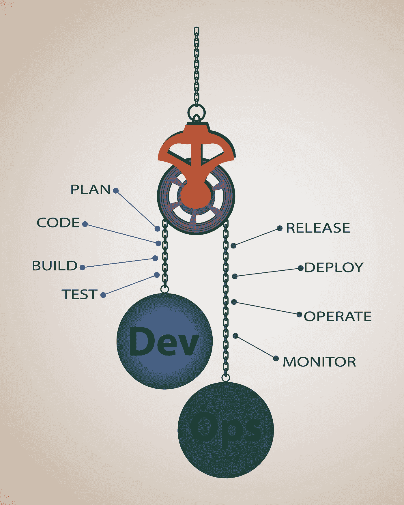
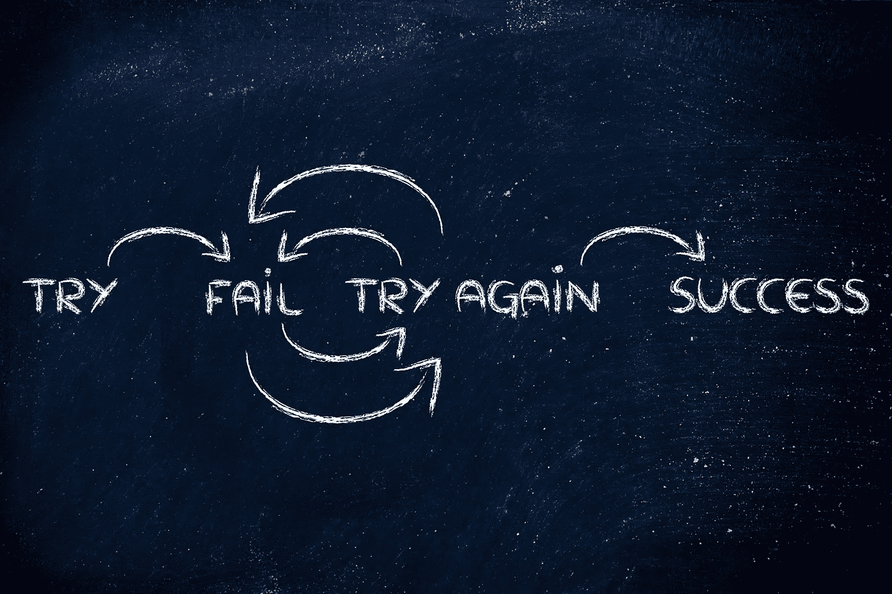

# 分布式团队的质量习惯

> 原文：<https://medium.com/swlh/quality-habits-for-distributed-teams-700b4ffd2eb4>

## 建立坚实的基础以确保成功

开发团队通常由高度多样化的成员组成。每个成员都有自己喜欢的不同编码标准和流程。让同处一地的团队在这些问题上达成一致已经够复杂的了，但是对于分散的团队来说，从哪里开始呢？这篇文章是写给所有正在寻找一种方法来开始构建或者改进他们当前实践的团队的。

## **有目的地计划**

在办公室的任务板上贴便笺曾经是一种规范(在一些组织中，这是最好的解决方案)，但即使是同处一地的团队也在利用集中式问题跟踪应用程序的力量，例如[吉拉](https://www.atlassian.com/software/jira)、 [GitHub 问题](https://help.github.com/en/articles/about-issues)和 [Gitlab 问题跟踪器](https://docs.gitlab.com/ee/user/project/issues/)等等。这些应用程序提供了对工作项进行优先级排序、分配的方法，并且可以提供关于完成某些功能和 bug 需要多长时间的统计数据。了解工作量并能够区分优先顺序将允许您的团队专注于眼前的目标，并更有效地朝着这些目标努力。它肯定会胜过共享文档或聊天中的待办事项列表！

从用户体验开始你的计划会议。考虑谁是目标受众，产品或功能如何影响他们，以及他们将如何使用它。作为开发人员，我们倾向于尝试立即解决所有问题。在你的团队的计划会议中，在深入功能和任务的细枝末节之前，先花点时间想想大的图景和客户体验。加速这个过程不会带来任何好处，尤其是如果它最终迫使你的团队在几个月的开发后进行调整。

## **质量编码**

查看代码。当你的队友发布一个拉动请求时，实际上要花时间回顾一下回顾的内容。它与用户故事或票证相关联吗？在检查中引用票据或问题编号。这样做是为了给提交的内容添加更多的上下文。确保你们互相对团队制定的编码标准负责，并礼貌地建议潜在错误的修复、命名更正和编码最佳实践。我们都不喜欢返工，但也没有人喜欢返工别人的工作，尤其是如果问题可以在代码审查中得到纠正的话。

团队中的每个人都应该测试。不要等到分支已经合并到您的主/主分支中时才进行测试。坦率地说，只在特性集成到主分支之后测试代码是不负责任的。测试的时间是在开始和整个实现的迭代中。一旦你的代码编译完成，运行单元测试并修复错误。测试驱动开发要求您首先编写单元测试，然后逐步编写代码来修复失败的测试。如果您的团队遵循这一点，那么您将一直在逐步测试。对你有好处。对于那些处理直接影响用户的票证的人，您应该包括面向用户功能的增量测试(包括手动和自动)和 UX 审查。不要把所有的测试都留给你的 QA 成员。在用户接触到新产品或新功能之前，你的 QA 应该是你的最后一道防线。bug 会变得很贵，让我们把它们从产品中剔除吧。

## **利用管道**

一些公司可能允许将特性和更新直接提交到主分支，并将发布分支用于生产，其他公司可能依赖主分支作为生产的真实来源，并强制使用特性分支，然后将这些分支合并到主分支中。不管是什么情况，找到对你的团队有效的方法。也许将 bug 修复和特性转移到分支上会有帮助，也许不会。对于我过去的团队来说，使用特性分支确实可以更容易地提出新的概念，而不会造成混乱。我曾在一些公司中使用主分支或“主干”作为真理的来源，它工作得很好，直到它不工作。这真的取决于你的发布节奏和团队规模。

团队可以利用大量的持续集成和部署(CI/CD)框架和工具。对于开源团队来说， [TravisCI](https://travis-ci.org) 、 [GitLab CI/CD](https://about.gitlab.com/solutions/github/) 、 [CircleCI](https://circleci.com/open-source/) 都是免费的！想想你的团队因为不必合并分支并手动运行单元和集成测试而节省的时间吧！如果团队设置好了，部署也可以自动化，这在简化开发和测试周期时会很方便。通常情况下，团队会每隔几个月发布一次较大的系统，但是你的团队发布特性和缺陷修复的速度取决于你的团队。尽早明确这一点将会节省时间，并减少以后的困惑。

## **建立稳固的团队**

一些团队召开代码审查会议，一些召开设计会议，也许你的团队两者都做！然而，所有团队都应该召开团队评审会议。在 scrum 团队中，我们称之为回顾。为什么这很重要？这是一个安全的地方和时间，团队成员可以公开谈论什么进展顺利，什么不顺利，以及团队前进需要改进的地方。成功的团队总是寻求改进的方法，并一起解决问题领域。

我的团队过去使用不同的工具来跟踪我们的进展；我想到的前两个是 [GoReflect](https://www.goreflect.com/) 和 [FunRetro](https://funretro.io/) 。这两个产品提供了一种托管方式来跟踪哪些进展顺利，哪些进展不顺利，以及团队同意采取哪些行动来改进。

记住，不是所有的过程都会成功。毕竟每个团队都不一样。这就是这些评审会议的目的，来解决那些行之有效和行之无效的流程。预计会失败几次，但要一直推动你的团队前进。成功的秘诀并不总是显而易见的，但它确实存在。不断尝试和失败，直到你最终成功。

## **遗言**

每个团队都不一样。你的团队需要找到适合他们的方法。如果它还没有找到自己的节奏，那也没关系。现在开始对话并实施计划还为时不晚。改变习惯和采用每个人都认为最有效的方法需要时间，但当你看到你的团队像全明星队员一样表现时，这一切都是值得的！