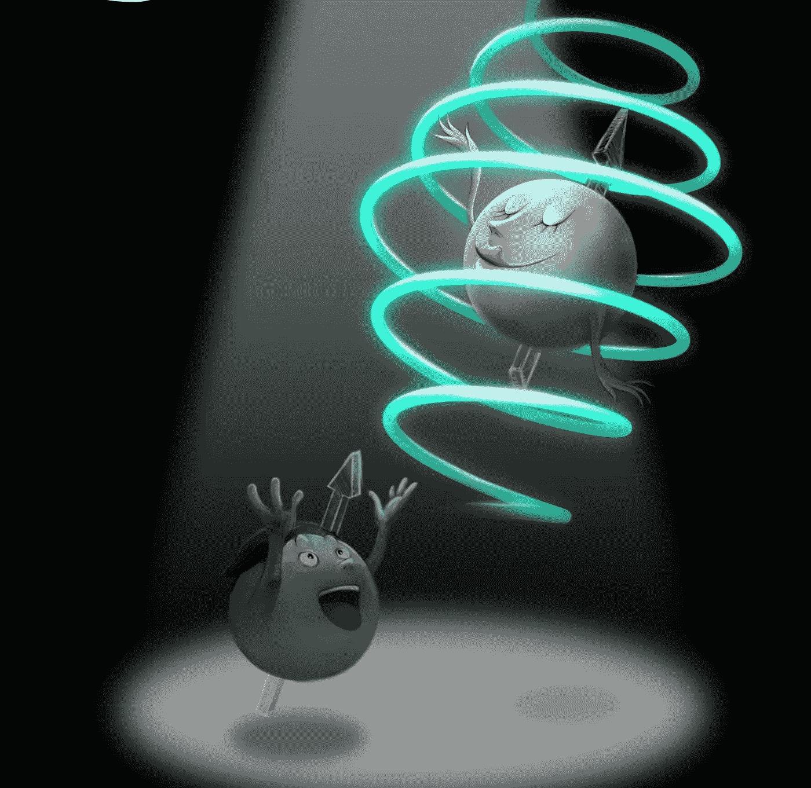

# 首次证明量子对称破缺

> 原文：<https://medium.com/swlh/quantum-symmetry-breaking-demonstrated-for-the-first-time-52c0e1dec539>

## 量子对称性破缺首次在实验室中得到证实——这对更好地控制量子系统的能力具有惊人的意义。

The figure describes the dynamics of two spins as a harmonious couple-dance. Different from a solo-dance of a single spin, the couple-dance would present more unique and charming features, such as parity-time symmetry breaking demonstrated in the work. (Guoyan Wang & Lei Chen)

研究人员第一次观察到单个量子系统的破裂。观察结果——以及…