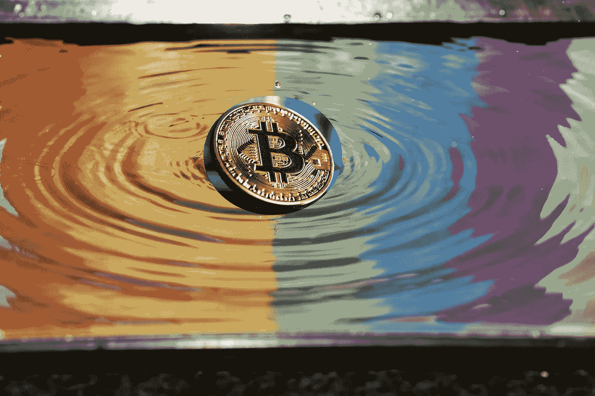

# Queering 区块链

> 原文：<https://medium.com/swlh/queering-the-blockchain-e0e55ba88b79>

骄傲月快乐！虽然从历史上看，自豪感显然更多地与我们作为完全平等的公民而存在的权利有关，但我认为这也是一个反思我们已经走了多远以及我们还需要走多远的好时机。

我成年后的大部分时间都在从事 LGBTQ 运动。我第一次意识到自己是女同性恋是在高中。在那一点上，我主要关注的是在没有人发现的情况下生存。这是一个难以置信的艰难…