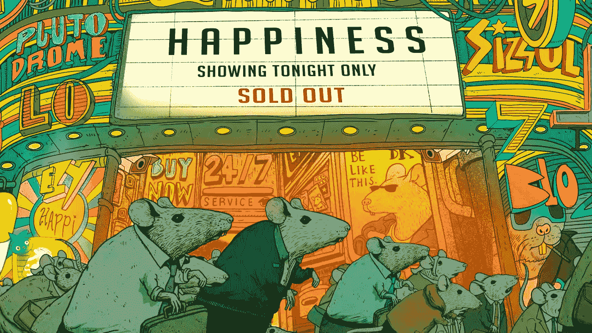

# 退出激烈的竞争

> 原文：<https://medium.com/swlh/quitting-the-rat-race-338e12f2e96d>

## 它是什么，以及如何逃离它。

Image Credit: [Steve Cutts](http://www.stevecutts.com/)

看看周围所有你认识的人。他们都在做什么？

当我问自己这个问题时，我意识到我的网络中的人都在做大致相同的几件事:

*   工作太多
*   追逐金钱
*   寻找引人注目/意义重大的鸡尾酒