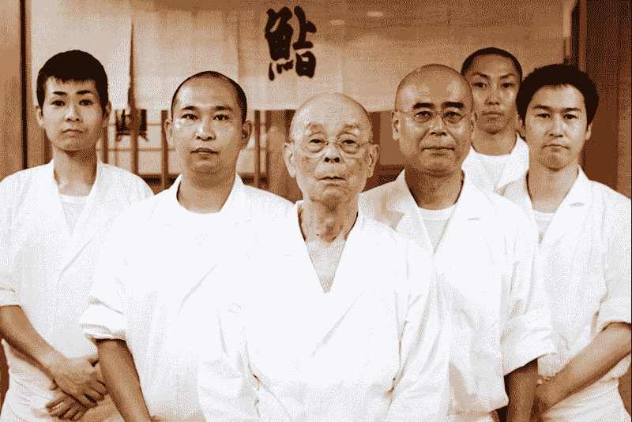
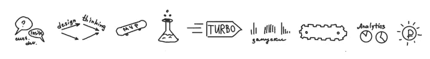

# 小测验:你是变革者还是跑步者？

> 原文：<https://medium.com/swlh/quiz-are-you-a-changer-or-a-runner-3ce858438aa3>

# Gartner 的分析师建议，你所做的一切要么是“改变”的一部分，要么是“运行”的一部分。“运行”代表常规的、定义明确的流程。“改变”——向未知、创新或实验领域扩展。找出你更像一个变革者还是一个跑步者，并获得如何成长的建议。

如果你仍然不太明白什么是“改变者”或“跑步者”——没关系，这实际上意味着你将不带偏见地参加这个测验。当你知道结果后，一切都会变得更加清楚。

**如何使用这个小测验:**回答问题，统计你选择“A”作为答案的次数。

***

> 1.你会为你的坟墓选择哪种墓碑:

A.“这里躺着为他们整个国家提供切面包刀的人”

B.“这里躺着发明切面包刀的人”

> 2.你收到了两家不同公司的工作邀请。两者都不理想，但你必须选择较小的邪恶。会是哪一个？

A.一个有固定程序的地方，每天都是一样的

B.一个完全混乱的世界，每天都有变化

> 3.你是如何为你的毕业论文选择题目的？

A.关于这个主题的资源越多越好

B.这个话题研究得越少越好

> 4.你的经理从一个会议回来，宣布:“伙计们，我们一直都做错了！从现在起，我们将做一切不同的事情”。你的反应:

A.我很可能会感到焦虑

B.我很可能会受到鼓舞

> 5.在你职业生涯的前两年，你是一家女性杂志的 SMM 经理。现在你想改变什么。如果其他条件都一样，你会选择哪一项工作？

A.另一家女性杂志 SMM 部的经理

B.初创公司的初级营销助理

> 6.你的经理提议你开始一个新项目。你会选择哪一个？

A.一年后发射的那个

B.一个月后发射的那个

> 7.你有两个项目可以选择。你会选择哪一个？

A.主要目标是推广前任的成功实验——让公司获得大量利润

B.主要目标是做一个比前任更成功的实验——这将需要花费公司预算的一大块

> 8.亚历克斯和保罗都兼职做法语家教。你更赞同谁？

A.亚历克斯:“我喜欢老师的书准确地告诉我们在一堂课的每个时刻应该做什么。这个星球上最聪明的人想出了这个课程——我不需要花时间去解决问题，只要完善这个过程就可以了”。

B.保罗:“我不用老师的书。当我第一次发现他们的时候，我几乎完全停止了辅导。当你不用自己想出教案和做任何研究时，对我来说就变得太无聊了。”

> 9.你有一个需要测试的非常冒险的想法。你认为哪一个更邪恶？

A.没有测试这个想法，然后看到它为竞争对手工作

B.测试这个想法，看看它行不通，你错了

> 10.你刚找到一份新工作，你学到的第一件事是，经理把所有新人都扔进了“死亡地带”——给他们一个特定的目标和实现目标的完全自由。如果他们不成功，就会被解雇。你的反应会是什么？

A.你会感到焦虑，因为你不确定自己是否能那么快展现自己的价值

B.你会感到高兴，因为你马上就有机会证明自己

# 7 到 10 个“A”答案——你是一个跑步者

“运行”代表经过试验和测试的任务、项目或整个业务。既定的流程、可预测的结果、运行中略有波动的计划。跑步者是寻找节奏和可预测性的人。

> 一个改变者从零开始创造的东西只有在一个跑步者得到它的时候才能存活。

跑步者因极端变化而“晕船”。所以，当暴风雨来临时，他们首先试图让每个人都遵守秩序，然后弃船而去。一个好的跑步者不会保守产品或过程，他们会缓慢但稳定地完善它们。它在日本被称为“改善”。

> 《大东梦见寿司》中的大东是一个跑步者的完美例子。
> 
> 二郎一生致力于完善他的寿司制作技术。他的过程是精确校准的。他的助手们年复一年地接受训练来完成最基本的任务，直到他们达到可以接受的完美程度。二郎的寿司是世界上最好的。他的餐厅有米其林三星，但他一直在努力完善自己的手艺。

*Sushi Genius — Jiro and his team.* [*Watch the full documentary*](https://www.youtube.com/watch?v=Q3Ve7ec1HpY)

一个改变者从零开始创造的东西只有在一个跑步者得到它的时候才能存活。一个改变者会失去兴趣，为了另一个而放弃这个项目。

**如何成长为一名跑步者**

当一个跑步者迟到(双关语，非故意的)或忘记某事时，就会破坏流程，并对公司的利润造成损失。所以**作为一名跑步者，成长的第一步**是完善你的训练。

第二层是学习优化你周围的所有流程——让事情变得更快、更便宜、自动化、可视化、组合和分类。

**第三层次**不仅要知道如何保持流程运行并完善它，还要从头开始构建复杂的流程。一名跑步者可以利用变革者的成功实验，建立一条装配线，并对其应用“改善”。

了解自己的价值——优秀的跑步者是稀缺的。你所做的可以增加公司今天的利润——而且很容易跟踪和监控。

不要同意涉及太多不确定性的项目或晋升，除非团队中有一个强有力的变革者，并且你们都了解对方的优势和劣势。继续成长为一个伟大的跑步者，了解你的优势，雇主会排着队想要得到你。

# 0 到 3 个“A”答案—你是一个改变者

“改变”涉及那些旨在创造新事物或将现有产品提升到下一个水平的业务部分。变革者是喜欢这类项目的人。当变革者停止创造时，他们的动力和效率就会下降。

> 让优秀跑步者开心的稳定进步并不能让改变者感到足够重要。

变革者在不确定性和混乱中表现良好。他们不会因为新的数据和计划的改变而烦恼。需要为你的第一个网上商店写一份用户协议吗？即使变革者不知道这是什么，他/她也会追根究底，把事情做好。

当他们不得不从事重复而有序的工作时，他们感觉自己就像是“土拨鼠日”的主角。让优秀跑步者开心的稳定进步并不能让改变者感到足够重要。他们想去寻找新的毛坯钻石，而不是完善旧的。

> 苏联火箭工程师鲍里斯·劳申巴赫是变革者的一个完美例子。
> 
> 他是致力于将加加林送上太空的人之一。在火箭科学领域工作了 40 年后，他突然完全放弃了它——开始了他的艺术研究。当被问及原因时，他回答道:
> 
> “当这是有史以来的第一次飞行时，我们完全不知道在外太空有什么在等着我们。这非常有趣。后来它变成了简单的工程。我对简单的工程不感兴趣。”

跑步者确保企业今天获得利润；一个改变者确保它将在明天获得利润。但今天，变革者只是花钱，而这些花钱可能会毁掉企业。一个糟糕的变革者会比一个糟糕的运营者对企业造成更大的损害——所以磨练自己作为变革者的技能非常重要。

**如何成长为变革者**

改变者和跑步者的工作方式通常是完全相反的。例如，当一个跑步者仔细检查每件事以确保万无一失时，一个改变者必须不惜一切代价避免“分析瘫痪”。记住你必须“在你准备好之前开始”。这些原则是每个改变者在掌握任何乐器之前必须学习的第一件事。

困难的是，我们大多数人都是在跑步原则的影响下长大的。学校、学院、大学和其他机构让我们遵守跑步规则。20 世纪的大多数商业书籍也旨在磨练经营相关技能:建立和优化业务流程、传统管理、项目管理等等。

如果你想了解更多关于变革原则的知识，去看看创业和敏捷相关的书籍，在黑客马拉松上寻找变革者。

在变革中，工具从属于原则。但它们让事情变得更容易、更愉快，并有助于避免愚蠢的错误。你可以在敏捷、Scrum、看板、设计思维、成长黑客、Couching、Teal organizations、业务敏捷等中寻找这些工具。也要研究所有与创新相关的东西。这是一个供改变者游泳的海洋——在他们的余生中。

除了原则和工具之外，变革者必须了解业务，知道如何分析任何东西，利用他们可以利用的任何东西。如果变革者不是从跑步者角色开始的，他们也必须获得一些基本的跑步者技能——学习如何完成项目，清楚地跟踪进度，遵守期限等等。

# 4 到 6 个“A”答案—不确定

根据这个测验，你不能被归类为跑步者或改变者。

也许你是这样或那样的，但跑者或换者的特质在你身上并不太突出。也许你处于平衡和/或以上类别，了解双方的利弊，并根据情况选择如何行动。

另一种选择可能是，这些标签根本不适合你，就像它们不适合我的祖母和这个星球上数百万其他人一样。或者也许这个测验并不完美。阅读“跑步者”和“改变者”的结果描述，并决定哪一个是你最喜欢的。

我叫娜塔莉亚·巴巴娃。我是莫斯科变革者学校的创始人。我用俄语和英语为每个人写关于创新的文章。请随时关注我在 Medium 上的[。](/@nbabaeva)

## 这篇文章发表在[《创业](https://medium.com/swlh)》上，这是 Medium 最大的创业刊物，有+424，678 人关注。

## 订阅接收[我们的头条新闻](https://growthsupply.com/the-startup-newsletter/)。

