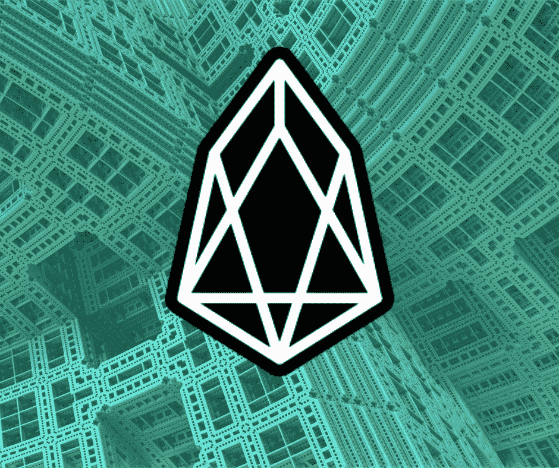

# 奔向 100 万:EOS 案例

> 原文：<https://medium.com/swlh/race-to-1-mil-the-case-for-eos-299642958257>

蒂姆·伯纳笔下的李，这位给我们带来万维网的谦逊天才，最近一直在哀叹他的作品在诞生后的二十年里所走的方向。这位英国学者惊恐地看到，网络日益集中化已经产生了“一种反人类的大规模新兴现象”。他对修复破碎的互联网的愿景密切反映了 Web 3.0 建设者的精神，专注于真正的数据所有权和强大的隐私措施，在这两个阵营中都发挥着核心作用。

dApp 开发者和互联网创始人一致认为互联网的未来是去中心化的。然而，截至 2019 年春天，Web 3.0 仍然处于茧中。随着加密开始从基础设施阶段走向成熟，随着 UX 的改进和第二层解决方案弥补基础层协议的局限性，预计将会看到分散应用程序的使用大幅加速。

哪种基础层协议将达到第一个重要的采用里程碑——单个 dApp 上的 100 万日活跃用户——仍有待观察。随着 100 万的竞赛日益激烈，深入了解未来应用出现的基础区块链非常重要。

想知道在哪里下注吗？本周，我们关注 EOS 的独特潜力，以及它走向领奖台的道路上的一些挑战。

我们走吧。

## 什么是 EOS？

除非你在 2017 年依偎在岩石下，否则你一定听说过最终诞生 EOS 的 40 亿美元 ICO。运行 EOS 的代码是由 Block.one 开发的，block . one 是一家私人公司，领导着业内资深人士，如 Brendan Blumer、Brock Pierce 和 Dan Larimer。Blumer 担任首席执行官，而 Larimer 是该公司的首席技术官，他还负责 Steem 和 Bitshares 等其他著名项目。他们构建并发布了 EOSIO，这是一个模板操作系统，不仅支持 EOS mainnet，还支持 Telos、Worbli 和 Bos 等并行链。拥有多个平行的 EOSIO 链——每个链都有其独特的价值主张和使用案例——彼此之间的互操作符合 B1 的区块链网络的宏伟愿景，该网络可以水平和垂直扩展(水平与垂直是非常重要的知识，因此[我这里有一些阅读材料](https://stackoverflow.com/questions/11707879/difference-between-scaling-horizontally-and-vertically-for-databases)供您学习。不客气)

## 为什么 EOS 能赢得 100 万的竞赛？

首先，它又快又便宜。EOS 通过解决一些阻碍以太坊辉煌的关键问题，成为 dApps 的家园。每隔 500 毫秒就会产生一个新的模块，比竞争对手快几个数量级。此外，在 EOS 上没有汽油费。相反，它采用了网络资源的所有权模型。为了使用网络，开发者和用户需要三种网络资源，即 CPU、NET 和 RAM。CPU 指的是处理一个特定事务所需的时间，而 NET 衡量的是事务在一个块上占用的空间量。CPU 和 NET 是可再生资源，可以通过堆叠 EOS 令牌来获得。然而，RAM 是一种稀缺资源，可从 [eosio.ram 智能合约](https://bloks.io/account/eosio.ram)购买，并直接卖回给合约。

此外，EOS 内部的文化是合作竞争的文化。尽管为了 EOS 令牌持有者的选票而相互竞争，但事实证明，当产业链的健康受到威胁时，区块生产商在合作方面是有效的。尽管 EOS 每年以 5%的速度膨胀，但只有 1%作为奖励支付给区块生产商。剩下的钱会累积到由前 21 个 BPs 控制的储蓄账户中，他们可以投票决定如何使用这些资金。现在，BPs 没有以一些虚假的理由把钱分配给他们自己，而是最近投票决定烧掉储蓄账户的内容。BP 采取了对整个网络有益的行动，而不是只为自己谋利，为此，向他们致敬。

## 是什么阻碍了它？

还记得 CPU，NET，RAM 吗？事实证明，这些网络资源的市场是非常低效的。特别是 RAM 供应极其短缺，这使得构建 dApps 的成本变得不必要的昂贵。就在昨天，(2019 年 5 月 27 日)Block.one 带来了价值 2500 万美元的 RAM，导致价格飙升至超过 100 万美元一 GB 的 RAM。现在想象一下，试图在 EOS 上构建脸书，却不得不花一百万美元来存储数据。众所周知，CPU 也会不稳定地耗尽，从而影响 EOS dApps 的用户体验。

我也想念 IBC。EOS 的宏伟愿景是看到一系列平行链在彼此之间无缝传递价值。块链间通信将使多链应用程序能够在不同的 EOSIO 链上运行单独的组件。Block.one 承诺了一个 IBC 解决方案，但在交付之前，EOSIO 链仍然是孤立的价值孤岛。

## 著名的 EOS dApps

简单浏览一下 EOS 上表现最好的 dApps，你会发现大多数都是赌博网站。然而，与 Tron 不同，EOS 有许多严肃的非赌博 dApps 正在争夺令人垂涎的 100 万 DAU 里程碑。社交媒体平台 Karma 鼓励用户分享他们的善举，它是一个做好事的 Instagram，已经拥有几千名日活跃用户。对于游戏狂热者来说，有 [EOSKnights](https://eosknights.io/) ，这是 dApp 雷达排名中的固定设备。效果。自从 AI 决定将其分散的 mechanical turk 平台从 NEO 迁移到 EOS mainnet 以来，它已经引起了很多关注。此外，如果你正在寻找一些非常酷的东西，去 [Infiniverse](https://www.infiniverse.net/) 看看，他们正在为增强现实世界建立一个数字土地登记处。

EOS 会打破终点线的彩带吗？还是它的资源限制和 IBC 的缺乏让它肩上的担子太重了？

别走开，我们很快就会把织机和宇宙放到显微镜下。

在推特上对我无礼。