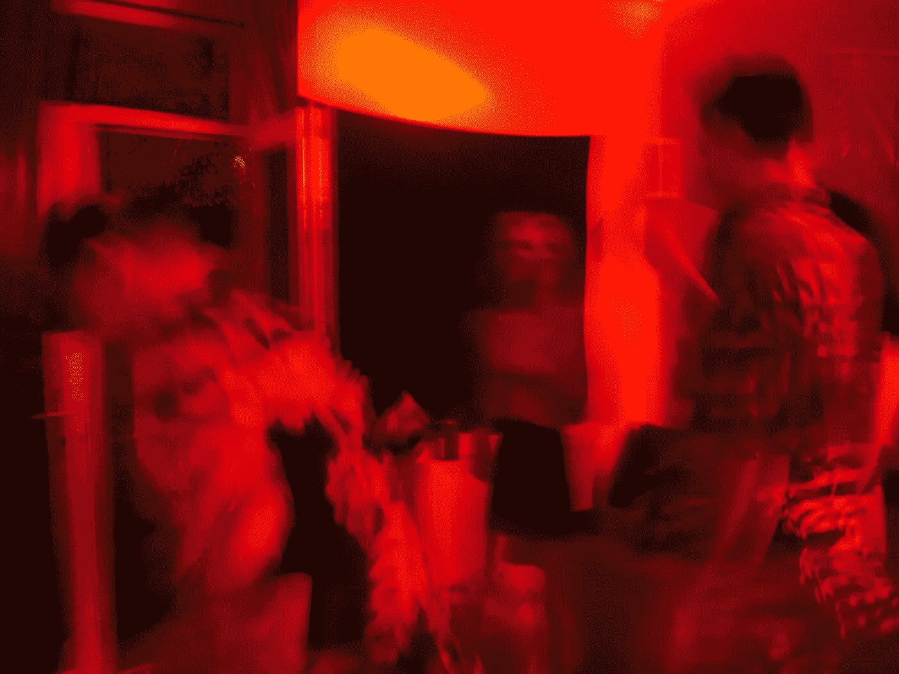

# 举起你的红旗

> 原文：<https://medium.com/swlh/raise-your-red-flags-8b65f77b8ac2>

## 因为合适的人会得到它

*注意:我知道“危险信号”这个词的负面含义，在这种情况下，我用它来指你的任何一个方面，别人可能会认为你有问题或者是交易破坏者。*

Strangers mostly at a friend’s birthday, last year.

几个月前，我读了一个知心大姐类型的专栏，一些可怜的人哀叹说，他们害怕他们的朋友都将排斥他们…