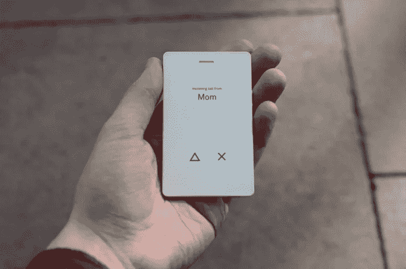
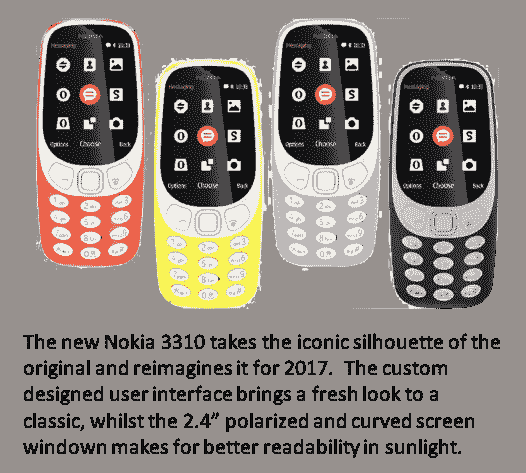
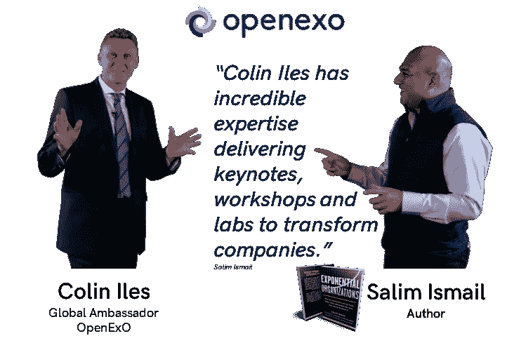
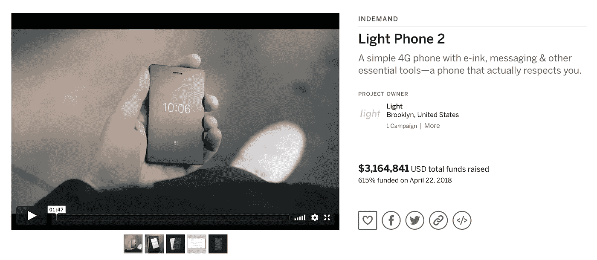
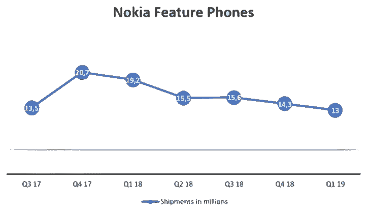

# 筹集资金很容易(如果你是一个目标驱动的组织)

> 原文：<https://medium.com/swlh/raising-funding-is-easy-for-pursposeful-organisations-f14e27e87f34>

# openexo #目的性组织#指数思维

这是之前一篇名为《有目的创业的充裕资本》的文章的更新版。

我最近给一个公司听众做了一个主题演讲，我强调了指数级技术让初创公司迅速变得重要，有时甚至对传统企业构成生存威胁。

我承认有某种程度的怀疑。

当我提出大型机构需要重新尊重初创企业，因为资本现在唾手可得时，所有人都皱起了眉头。

光电话 2 是一个很好的例子，为什么我袖手旁观这句话。资本是可以获得的，尤其是对于任何一个围绕利润以外的目的开发产品或服务的人来说。

在他们的 2015 年 Kickstarter 活动中，创始人 Joe Hollier 和 Kaiwei Tang 设法筹集了 41.5 万美元来创造这款轻型手机。尽管最初的支持者中似乎有相当大的比例对第一款产品不满意，但他们随后转向了 [Indiegogo](https://www.indiegogo.com/projects/light-phone-2-smartphone-design/x/18245718#/) 来资助 Light Phone 2 的开发。

> ***2017 年 3 月 1 日募集的资金~ $399，000***

对于一个公司来说，创造一个“越少越好”的营销产品是不错的！

那么，他们是如何做到这一点的？大型成熟机构能从他们身上学到什么？

首先，他们不仅仅制造了一个可以打电话的产品。

事实上，他们创造了一种体验，帮助你找到更多的时间去“欣赏生活，找到更多的意义和目标”。

因此，他们本身并不是一家“电话”公司；他们是一家“生活方式”公司，正是这种差异让他们比所有其他手机制造商都有优势。

他们的目标不是与功能竞争，而是为你每天面临的 24/7 的数据轰炸提供一个解决方案，至少现在，他们通过电话的媒介提供这个解决方案。

因此，他们设定了超越利润的目标；这是他们的优势。

> ***2017 年 03 月 04 日募集资金 619，000 美元***

光电话团队不是第一个、最后一个或最大的理解这一点的组织。在他的书《从为什么开始》中，西蒙·西内克解释了为什么苹果的 iPod 取代了可以说是更先进的创造性禅宗。

> “创意禅宣传他们的产品是 5GB 的 mp3 播放器，而苹果在你的口袋里给了你 1000 首歌曲。不同之处在于，创意告诉我们他们的产品是什么，而苹果告诉我们为什么需要它。”

在最近的《四个 T1》中，斯科特·加洛韦认为苹果是一个奢侈品牌，和路易·威登一脉相承。如果你问自己，为什么有人会花比众多竞争对手更便宜、更轻、性能更好的笔记本电脑多得多的钱购买苹果的笔记本电脑呢？

斯科特解释说

> “苹果标志是财富、教育和西方价值观的全球标志，它为最令人垂涎的笔记本电脑和移动设备增色不少。从本质上讲，苹果满足了两种本能需求；去感受更接近上帝，对异性更有吸引力。”

我会让你决定是否同意他的观点，即你购买 MacBook Pro 或 Louis Vuitton 手袋的决定是由优越感和性能力的原始本能驱动的，但有一点是明确的，那就是**购买决定是情绪化的，而不是我们喜欢认为的分析性和逻辑性。**

如果这是真的，那就不足为奇了，那些围绕高于利润的目标(用西蒙·西内克的行话来说，就是“为什么”)来建设自己的公司，比那些围绕解决成本、功能和分销渠道等实际问题来组织的公司有显著优势。

因此，当我说创业公司可以更自由地获得资本时，无论他们是处于想法、原型还是生产阶段，当有需要的公司向投资界清楚他们的“为什么”时，这一论点无疑得到了加强。

> ***募集资金 2018 年 3 月 5 日~***70 万美元

轻型手机的创始人非常清楚他们的“为什么”。

他们设计了一款应该“尽可能少用”的手机，让我们有更多的时间“欣赏生活，寻找更多的意义和目标。”

Light Phone 2 提供了完全不同的东西，在情感上也更加持久。它给你欣赏生活的自由，这类似于使用苹果产品让许多人感到酷和时尚，并带来自信。它在你的社会交往中为你提供了一个新的身份，就像你通过你的穿着来决定你是谁一样。

**他们已经找到了一个能引起情感共鸣的目的(或原因),因此寻找资本不能成为他们成功或失败的决定因素，因为决定是否投资与选择是否购买产品或服务一样，都是一个情感决定。**

*(我建议你阅读* [*雷伊·达里奥的《原则》*](https://www.principles.com/) *来了解布里奇沃特金融公司是如何竭尽全力消除投资决策中的情感偏见的。)*

**那么，正如我的一些朋友和家人所建议的那样，Light Phone 2 仅仅是诺基亚标志性的 3310** 复古版的更昂贵版本吗？

我不这么认为，因为目前拥有诺基亚品牌授权的 HMD Global 已经产生了兴趣，因为许多客户对他们的第一台 3310 还记忆犹新。

然而，我不认为帮助我们重温我们对 2000 年代的一部出色手机的感受能够创造可持续的长期兴趣。毫无疑问，这是一个噱头，同样，一两年前，人们对魔方的兴趣激增。

其次，看看他们的营销，3110 感觉更像是创意的禅，而不是苹果的 iPod。如果他们要让对诺基亚有美好回忆的社区以外的人产生兴趣，他们需要超越仅仅销售功能有限、相对昂贵的手机。

The Nokia 3310’s — A (Marketing) Trip Down Memory Lane

想想看，如果你从未听说过诺基亚。你会对一款拥有“为经典产品带来全新外观的定制用户界面”和“在阳光下可读性更好的 2.4 偏振弧形屏幕窗口”的产品产生情感共鸣吗？

天哪，放在我的戴尔 Inspiron 灵越 7370 英特尔酷睿 I7–8550 u 13.3 英寸笔记本电脑旁边会很好看，不是吗？

也许 HMD 可以为诺基亚品牌做些什么，就像宝马为 Mini 做的那样，但他们需要找到一个更强大、更真实的目的，而不是表面上的营销门面；

> [*诺基亚正在塑造我们互联世界的核心技术，以改变人类体验*](https://www.nokia.com/en_int/about-us)

呃……真的吗？对我来说更像是营销而不是真正的目的。

假设 Light Phone 2 投入生产并像描述的那样工作，我会在打赌他们不会超过诺基亚 3110 的销售之前仔细考虑。毕竟，他们实际上是在创造一种改变人类体验的产品。

> ***2018 年 3 月 6 日募集的资金 716，000 美元(美国东部时间上午 07:00)***

所以，光电话小组已经找到了原因。这让他们创造了一个概念，能够在投资者和买家之间产生情感共鸣，这意味着资本约束不应成为他们成败的一个因素。事实上，在许多情况下，获得资本变得比在职者更便宜，因为他们不需要承诺季度收益报告和年度股息支付。

在职者可以从创业社区学到很多东西，但或许最重要的是，受意识形态驱动的组织可以做那些受利润驱动的组织做不到的事情。

因此，与其通过投资 3110 来创造一种温暖模糊的感觉，或许当今大型机构的领导人应该花时间重新发现他们的组织诞生时就存在的有目的的意识形态目标。

我希望 Light Phone 团队在“什么”和“如何”方面取得成功，不仅是为了看看他们如何公平地与诺基亚和其他手机制造商竞争，而且是因为他们目前有 250 美元曾经是我的钱。

至少对我来说，更值得注意的是，我无法想象没有智能手机的日子。

现在，至少在我收到 Light Phone 之前，我会带着我的“性感”Mac 去星巴克，看看斯科特·加洛威(Scott Galloway)是否正确。

**3 月 6 日募集资金 721，568 美元(美国东部时间上午 08:58)**

contract colin@openexo.com to learn more about how to tranform your organisation

# 2019 年 6 月更新…

自从写这篇文章以来，这款手机的生产已经推迟了 6 个月。(非常特斯拉风格)

**但是，在 Indiegogo 上筹集的资金总额达到了 3164506 美元**

与此同时，至少根据 nokiamob.net 网站的说法，诺基亚的功能手机销量似乎在下降

[https://nokiamob.net/2019/05/21/hmd-shipped-more-than-16-million-nokia-phones-in-q1-2019/](https://nokiamob.net/2019/05/21/hmd-shipped-more-than-16-million-nokia-phones-in-q1-2019/)

# 请继续关注，看看这个故事如何发展！