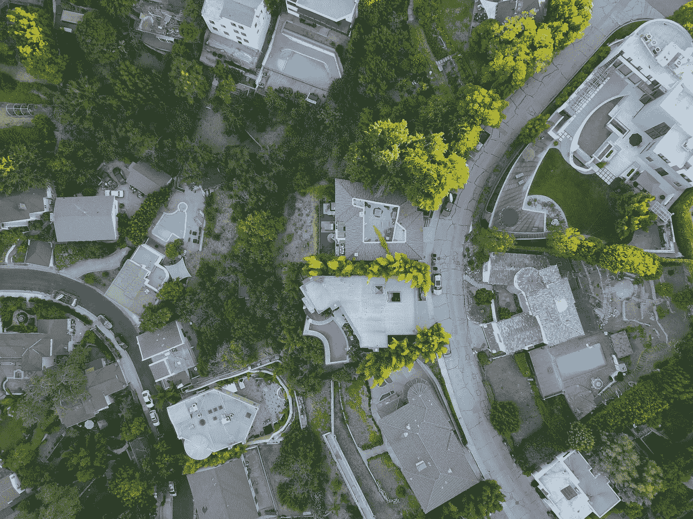

# 用特权抚养孩子

> 原文：<https://medium.com/swlh/raising-kids-with-privilege-72d3e3a176d8>

Photo by Bart Jaillet on Unsplash

## 好学校和好城镇并不总是让养育孩子变得更容易

我在一个风景如画的滑雪和大学城抚养我的三个儿子，那里有“好学校”我们是中产阶级，生活在一个和我们差不多或者更富裕的群体中。这不正是大多数父母渴望的吗:在更好的社区里抚养孩子，拥有比我们更多的机会？