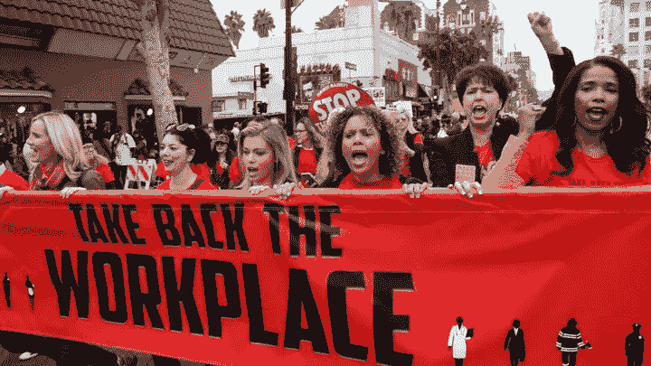

# 猖獗的报复正在摧毁工作场所

> 原文：<https://medium.com/swlh/rampant-retaliation-is-ruining-workplace-d38c0ff09886>

## 长达十年的歧视趋势仍在继续…

[*Photo Credit: Associated Press via Damian Dovarganes*](https://www.theatlantic.com/business/archive/2017/12/low-wage-workers-sexual-harassment/549158/)

美国正迅速成为一个报复的国家。只需看看工作场所——社会的缩影——报复指控达到历史最高水平。

如果你没有注意到，恶意的经理越来越多地抨击员工。为什么？因为一些陷入困境的员工有…