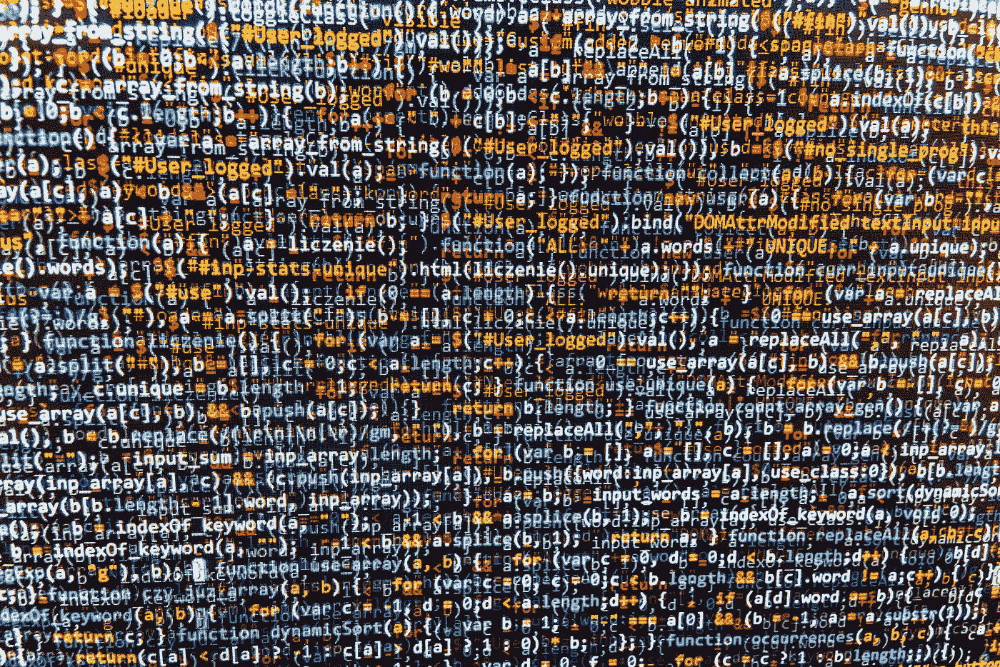

# 真随机数发生器函数？

> 原文：<https://medium.com/swlh/random-functions-a4f36b1dfd8f>

“当然，任何考虑用算术方法产生随机数的人都是有罪的。”—约翰·冯·诺依曼 T3

Random 的意思是不熟悉或不明确的。我们用这个词来形容身份不明的人，意外事件等。随机数序列在许多科学领域扮演着重要的角色。谈随机数序列，什么才是真正的随机？我们真的不能预测…