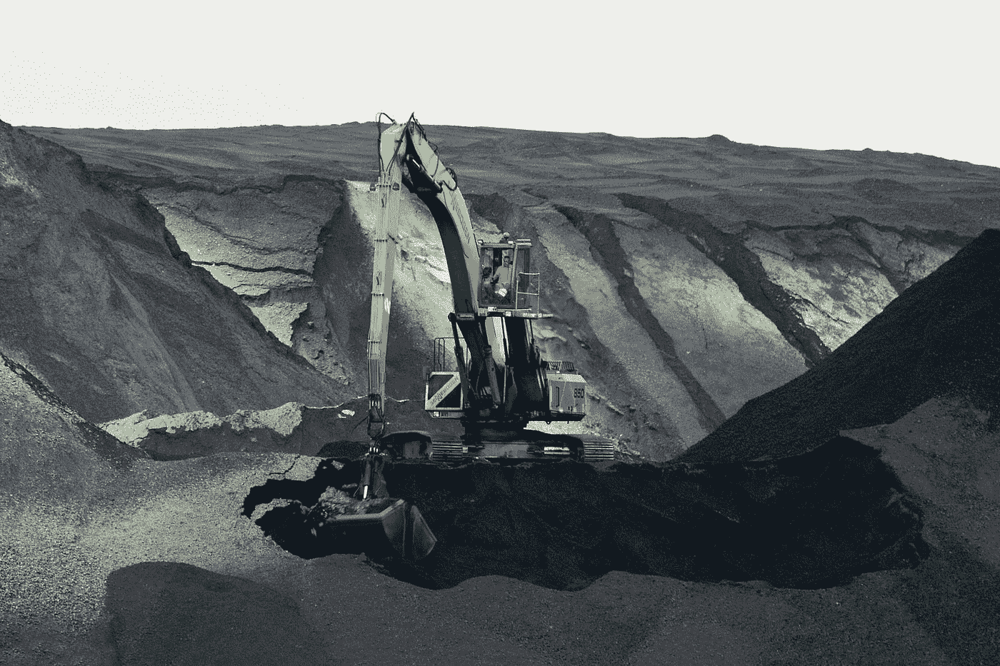

# 稀土出口

> 原文：<https://medium.com/swlh/rare-earth-exports-e939e2b60dd>

贸易战中中国的王牌？

Photo by [Bart van Dijk](https://unsplash.com/@bart_van_dijk?utm_source=medium&utm_medium=referral) on [Unsplash](https://unsplash.com?utm_source=medium&utm_medium=referral)

> 美中贸易战正在升温，中国已经不再示好。

在[之后](/goods-services/is-a-grand-trade-deal-with-china-possible-2b9844ee130f)特朗普政府在正在进行的谈判中最近增加了拟议的关税，这标志着中美之间的紧张局势明显加剧。美国办公室发布了一份官方公告…