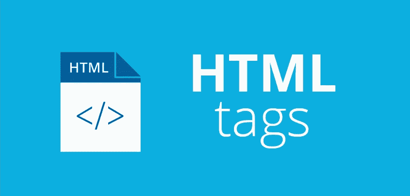

# 很少使用但很方便的 HTML 标签

> 原文：<https://medium.com/swlh/rarely-used-but-handy-html-tags-d000cd3050b3>

html tags

作为一名 web 开发人员，你应该精通多种语言和框架。几乎不可能学会一门语言提供的所有东西，并且很容易发现自己没有利用这门语言的全部潜力。大多数编程语言的功能通常不被开发人员探索。

HTML 通常是大多数 web 开发人员学习的第一门语言，但是你很少…