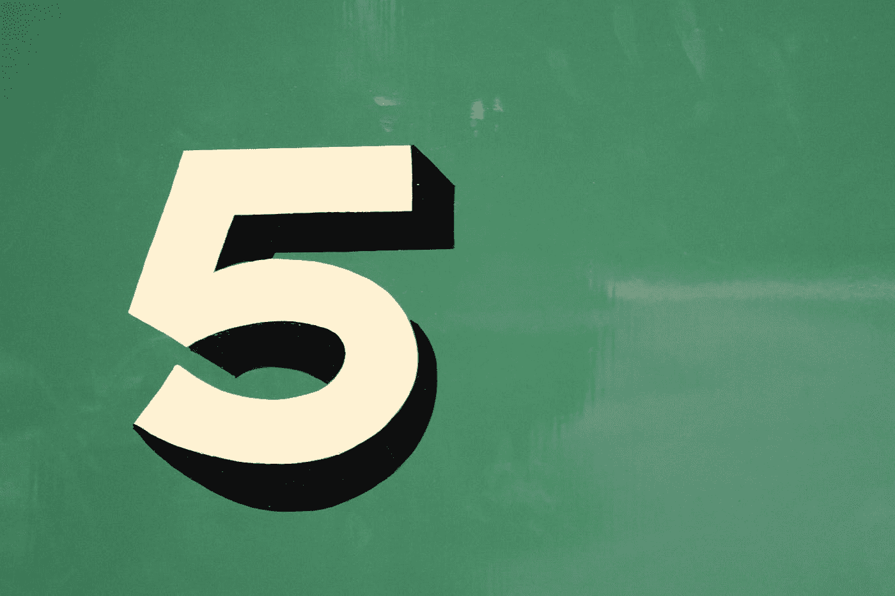

# 评级系统和我们对五星的痴迷

> 原文：<https://medium.com/swlh/rating-systems-and-our-obsession-with-five-stars-f30405604f2f>

## 今天评价产品、服务和业务，明天*互相评价。*

Photo by [Tony Hand](https://unsplash.com/@mr_t55?utm_source=medium&utm_medium=referral) on [Unsplash](https://unsplash.com?utm_source=medium&utm_medium=referral)

B 在拼车成为通勤者的主流之前，在 Yelp 评论优先于价格之前，曾经有一段时间，一个朋友会简单地问:“从一到十，你觉得怎么样？”