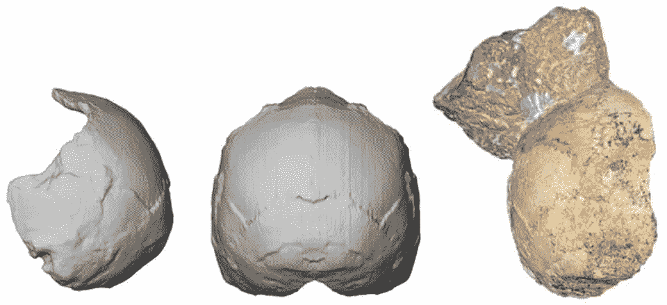

# 重新学习历史

> 原文：<https://medium.com/swlh/re-learning-history-8e0db5ed8724>

在希腊发现 210，000 年前的人类头骨凸显了人类起源时间线的改变

Photo Credit: The Apidima 1 partial cranium (right) and its reconstruction from posterior view (middle) and side view (left). The rounded shape of the Apidima 1 cranium a unique feature of modern humans and contrasts sharply with Neanderthals and their ancestors. KATERINA HARVATI, UNIVERSITY OF TÜBINGEN. July 10, 2019.

你知道吗，我们现在对古代人类的了解与我们大多数人在学校里所学的非常不同*？这并不是因为远古外星人或者失落的文明，或者任何其他疯狂的推测，理论上的想象。这是科学——近年来，我们简单地了解了*更多关于我们人类起源的知识。**