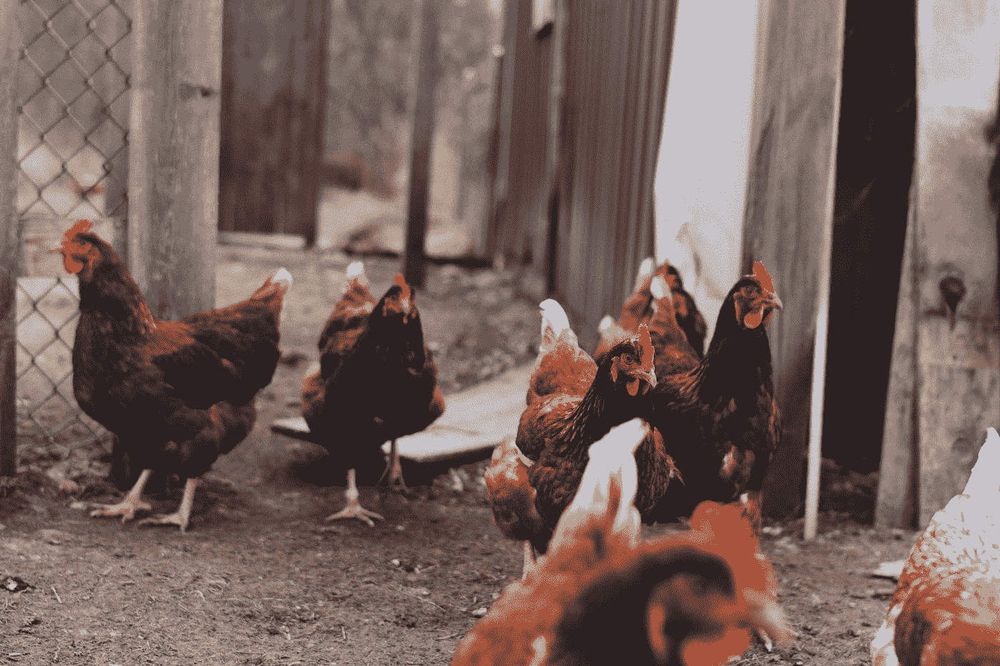

# 重访“超级鸡”研究——工作场所如何改变模式以消除明星员工的概念

> 原文：<https://medium.com/swlh/re-visiting-the-super-chicken-study-how-workplaces-have-changed-models-to-eliminate-the-concept-cb4bbca8eaa9>

Photo by [Brianna Santellan](https://unsplash.com/@brianna_santellan?utm_source=medium&utm_medium=referral) on [Unsplash](https://unsplash.com?utm_source=medium&utm_medium=referral)

我爱[*TED Talk*](https://www.ted.com/talks)*s .我看过的每一个都给了我新的知识、新的想法和顿悟的时刻。我已经看过这个特别的演讲几次了，但是这一次我在工作和写作中与它有很好的联系。*