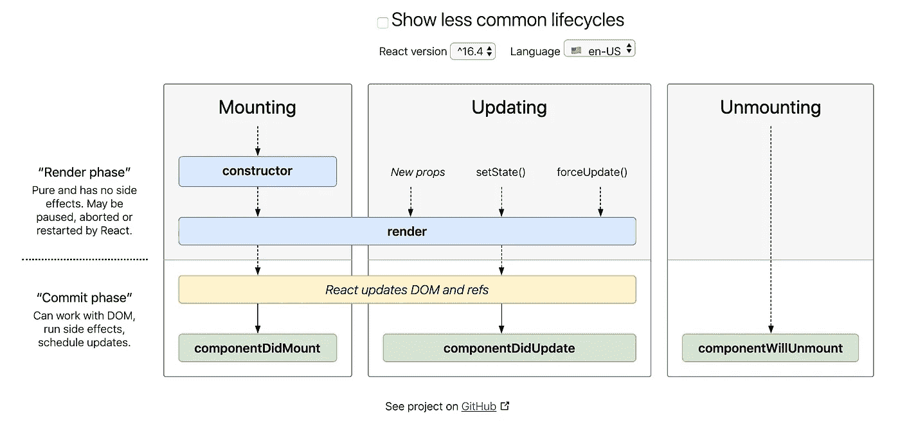

# 反应生命周期和挂钩

> 原文：<https://medium.com/swlh/react-lifecycle-hooks-71547ef4e7a8>

我最近几周才开始学习 React，但我已经爱上了它。它很快，是模块化的，遵循一个清晰的结构，我很喜欢。到目前为止，学习 React 我最喜欢的部分之一是理解 React 组件的生命周期(见下文)。您可以使用这些方法来控制组件随时间推移的行为，这种方式非常棒。



React lifecycle diagram — [http://projects.wojtekmaj.pl/react-lifecycle-methods-diagram/](http://projects.wojtekmaj.pl/react-lifecycle-methods-diagram/)

定义 React 组件有两种主要方式:

*   功能组件
*   类别组件

最初，函数组件不如类组件强大。他们缺乏使用“状态”(可以从类组件内部控制的可变属性)的能力，并且他们不能充分利用 React 的生命周期方法。因此，我主要在我的 React 应用中使用类组件(尽管功能组件的性能优势较小)。我也更喜欢类组件的更明确的语法。

今天，我试图通过自学 React Hooks 来打破我的课堂组件习惯。钩子是在 2018 年 10 月引入 React 的，作为将状态和生命周期概念纳入功能组件的一种方式。关于它们的博客已经写了无数次了，但是它们在实际应用中仍然相对较新。在我的以 JavaScript/React 为中心的训练营中，仍然没有教授它们，尽管它们很明显是 React 开发者所设想的 React 的未来。我希望现在学习使用它们能在我开始开发生涯时助我一臂之力。

首先，我想把重点放在我在 React 类组件中最常用的两个方法(除了 render，它只是 main 函数的主体)——以及如何用 React 钩子编写它们的功能。

# 构造函数( )->使用状态()

实际上，我甚至不确定构造函数算不算组件生命周期方法，但它的功能很像。事实上，这只是普通 JavaScript 的一部分，用于在实例化时定义给定类的对象的属性。在 React 中，构造函数主要用于两个目的:

*   设置状态的初始值
*   在非生命周期方法中绑定关键字“this”来引用当前对象

构造函数是这两个函数的理想位置，因为它甚至在组件呈现之前就运行了。

```
import React, {Component} from 'react'class Message extends Component {
  constructor(props) {
    super(props)
    this.state = {
      message: ''
    }
  this.setMessage = this.setMessage.bind(this)
  } setMessage() {
    this.setState({message: 'Hello World!'})
  } render() {
    return (
      <main>
        <button onClick={this.setMessage}>Click</button>
        <p>{this.state.message}<p>
      </main>
    )
  }
}
```

在上面的示例中，消息组件有三个方法(函数),它们按以下顺序运行:

*   constructor() —设置初始“消息”状态，并在 setMessage 方法的上下文中将引用绑定到“this”
*   render() —确定该组件显示或“返回”什么内容；最初只呈现一个按钮(带有一个事件侦听器)和一个空段落(基于构造函数中为 this.state.message 设置的空字符串)

如果用户单击该按钮:

*   setMessage() —将消息状态从空字符串更新为“Hello World！”，导致组件重新呈现并到处触发陈词滥调警报
*   render() —再次运行，现在显示“Hello World！”代替前面的空字符串

这是一个非常简单的例子，但我认为它涵盖了 React 中构造函数方法的两个主要用例。我仍然喜欢将所有这些分离出来，使其更加模块化，但我知道这并不吸引所有人。现在用 React 挂钩构建相同的组件:

```
import React, {useState} from 'react'function Message() {
  const [message, setMessage] = useState('')
  return (
    <main>
      <button onClick={() => setMessage('Hello World!')}>
        Click
      </button>
      <p>{message}</p>
    </main>
  )
}
```

如您所见，这是非常少的代码，并且构造函数是完全不必要的。使用“useState()”，可以同时为“message”设置一个初始值，并创建“setMessage”函数以在将来更新状态。因为 setMessage 是一个函数而不是一个方法，并且它是用 arrow 函数内联调用的，所以没有必要定义“this”或者将它绑定到任何东西。

# componentidmount()-> use effect()

我最常用的生命周期方法之一是 componentDidMount。首次成功装载和呈现组件后，会自动触发此方法。我使用它有几个目的，但最常见的是我用它为我的应用程序获取数据。

```
import React, {Component} from 'react'class List extends Component {
  constructor(props) {
    super(props)
    this.state = {
      data: null
    }
  }

  render() {
    let listItems   
    if (this.state.data) {
      listItems = this.state.data.map((item, i) => {
        <p key={i}>{item.name}</p>
      }
    } else {
      listItems = <p>Loading...</p>
    }
    return {listItems}
  } componentDidMount() {
    fetch('http://imaginaryurl.com/api/listItems').then((res) => {
      res.json()).then((json) => {
        this.setState({data: json})
      }
    }
  }
}
```

上面的代码遵循这种模式:

*   构造器/呈现—以不完整的状态装载和呈现组件(通常带有某种装载指示符)
*   componentDidMount —从虚构的 API 获取数据，并使用该数据更新组件的状态，从而触发组件重新呈现
*   render —组件再次呈现，这一次使用 componentDidMount 中提取的数据来完全满足其预期目的

在准备这篇博客的过程中，似乎有一个更好的方法来做这件事，那就是使用 [React.lazy 和悬念](https://reactjs.org/docs/code-splitting.html)，但是我还是要用它作为 useEffect 钩子的例子(使用我们的好朋友 useState 的另一个例子):

```
import React, {useState, useEffect} from 'react'
import axios from 'axios'function List() {
  const [data, loadData] = useState(null)
  useEffect(async () => {
    let listItems = await axios(
      'http://imaginaryurl.com/api/listItems'
    )
    loadData(listItems.data)
  }, [])
  let listItems   
  if (data) {
    listItems = data.map((item, i) => {
      <p key={i}>{item.name}</p>
    }
  } else {
   listItems = <p>Loading...</p>
  }
  return {listItems}
}
```

我希望这有所帮助！正如我所说的，我仍然在学习 React，我仍然喜欢类组件，但是钩子确实很有用。这仅仅是对钩子功能的皮毛，但这是我需要的入门知识，让我对使用它们感到舒服。希望很快我会设计自己的钩子，并在我的[代码](https://www.adamgrider.dev)中实现它们。