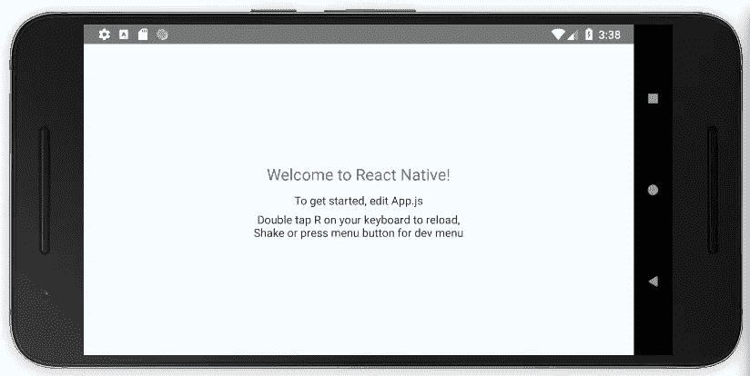

# React Native 和 Android Studio:Linux 入门所需的一切

> 原文：<https://medium.com/swlh/react-native-and-android-studio-everything-you-need-to-get-started-in-linux-b47154e78f9e>

该指南假设您正在全新安装 Linux，并提供了如何使用虚拟设备开始使用 React Native 和 Android Studio 的详细信息。如有疑问，请查阅官方 [React 本地文档](https://facebook.github.io/react-native/docs/getting-started)。

What you will get at the end of this guideline, a running android app on a virtual device

> 注:我不会使用[博览会](https://expo.io/)，因为在我的项目中，我需要使用一些具体和先进的节点…