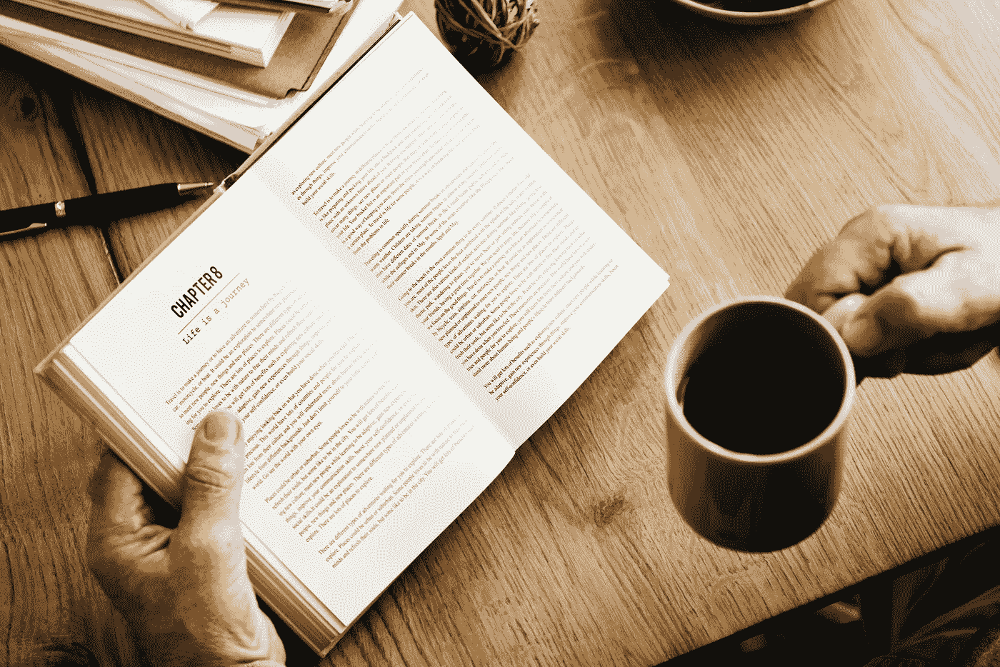

# 读书会让你更有魅力，成为一个更好的爱人

> 原文：<https://medium.com/swlh/reading-books-will-make-you-more-attractive-and-a-better-lover-1a36fc9be82e>

阅读可以减轻压力，提高记忆力，增强注意力，让你……更有魅力？是的，至少在网恋平台上是这样！根据 [eHarmony](https://www.eharmony.co.uk/dating-advice/dating/books-online-dating?.WPiUXVPyvUJ?aid=78888&cid=53999&utm_source=affiliate&utm_medium=78888&utm_campaign=Skimlinks&aid=78888&cid=53999&utm_source=affiliate&utm_medium=78888&utm_campaign=Skimlinks&aid=201309&cid=53999&utm_source=affiliate&utm_medium=201309&utm_campaign=http%3A%2F%2Fwww.independent.co.uk%2F#.Wj-YVVS7927) 的一项调查，成为一个热心的读者会让你对异性更有吸引力。阅读暗示了诚实、雄心和智慧等性格特征。简单地在你的个人资料中列出具体的头衔可以增加或…