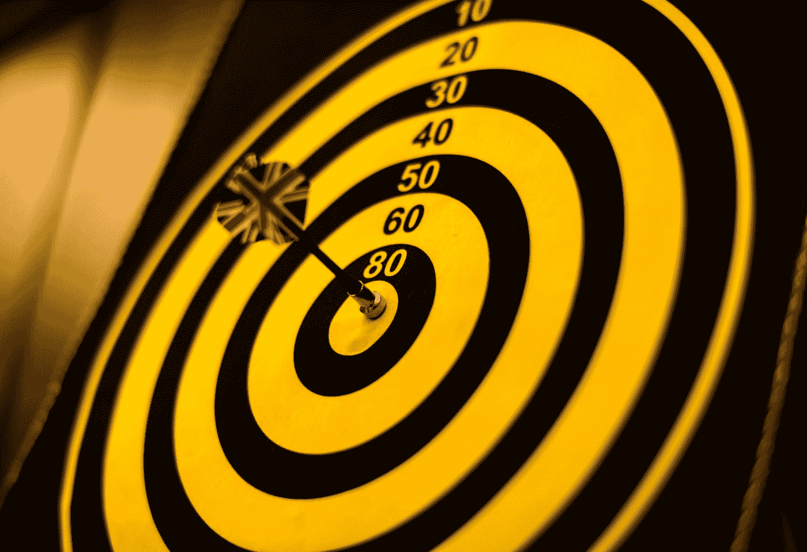

# 准备好了。着火了。瞄准。

> 原文：<https://medium.com/swlh/ready-fire-aim-489591dc679b>

这种创造性的技术对我来说非常有用！

Photo by [rawpixel](https://unsplash.com/@rawpixel?utm_source=medium&utm_medium=referral) on [Unsplash](https://unsplash.com?utm_source=medium&utm_medium=referral)

读完斯蒂芬·普雷斯菲尔德的精彩著作《艺术的战争》后，这句话**准备好了。着火了。瞄准**。最让我感动的是。我喜欢它。他谈到许多有创造力的人如何花费太多时间试图*完善他们的目标*，以至于他们忘记了更重要的是**开火！**